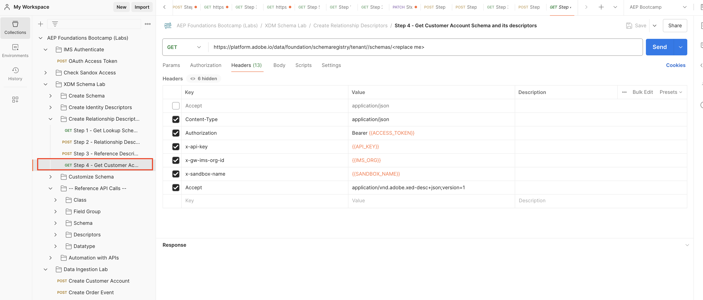
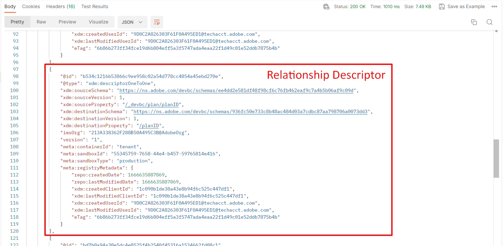
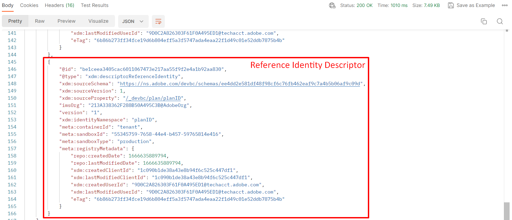

# View Schema

## View via the UI

1. Open your browser and navigate back to the `Schema -> Browse` section.
1. Search for the schema `Sample Customer Schema - <your sandbox number>`
1. Notice that the relationship to the `dep: Plan [Lookup]` is defined

## View via the API

1. Select the `Step 4 - Get Customer Account Schema and its descriptors` API by clicking on it

   

2. In the URL of the request replace the `<replace me>` with the `$meta:altId` you saved from the previous section [Create Schema](../build-schema/create-schema.md) as shown below

   

3. Save the request using the `Save` button

4. Execute the request by clicking the `Send` button

You should now see a `200 OK` response and you should be able to browse to the end of the schema you created to see the Identity through the lens of the XDM JSON structure

