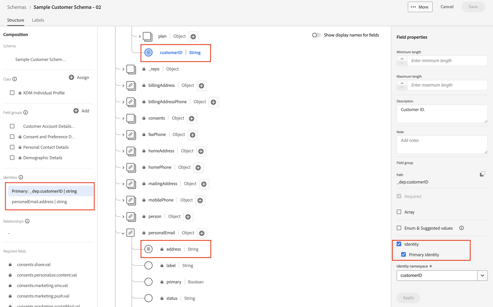

# Mark identity fields

## Identity descriptors

In order to mark a field as an identity you need to create an Identity Descriptor in the schema registry. A sample schema descriptor body looks like the following:

```json
{
  "@type": "xdm:descriptorIdentity",
  "xdm:sourceSchema": "https://ns.adobe.com/devbc/schemas/8415ac18dd8943e35d12caf0c24b57b4a5a9ab7fd637245e",
  "xdm:sourceVersion": 1,
  "xdm:sourceProperty": "/_devbc/customerID",
  "xdm:namespace": "customerID",
  "xdm:property": "xdm:code",
  "xdm:isPrimary": true
}
```

- **@type** -> always set to `xdm:descriptorIdentity`
- **xdm\:sourceSchema** -> the `$id` of the schema where the field exists
- **xdm\:sourceVersion** -> always 1
- **xdm\:sourceProperty** -> path of the field within the schema
- **xdm\:namespace** -> the identity namespace code where the field should be stored
- **xdm\:property** -> always `xdm:code`
- **xdm\:isPrimary** -> if a primary identity then `true` else it is `false`


## Your objective

Create both primary and non-primary identities for the Customer Account Schema. After performing the steps in the next section, your schema should look like below.


