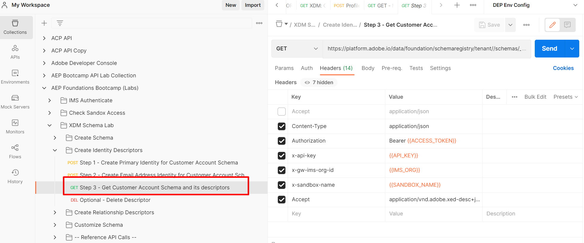
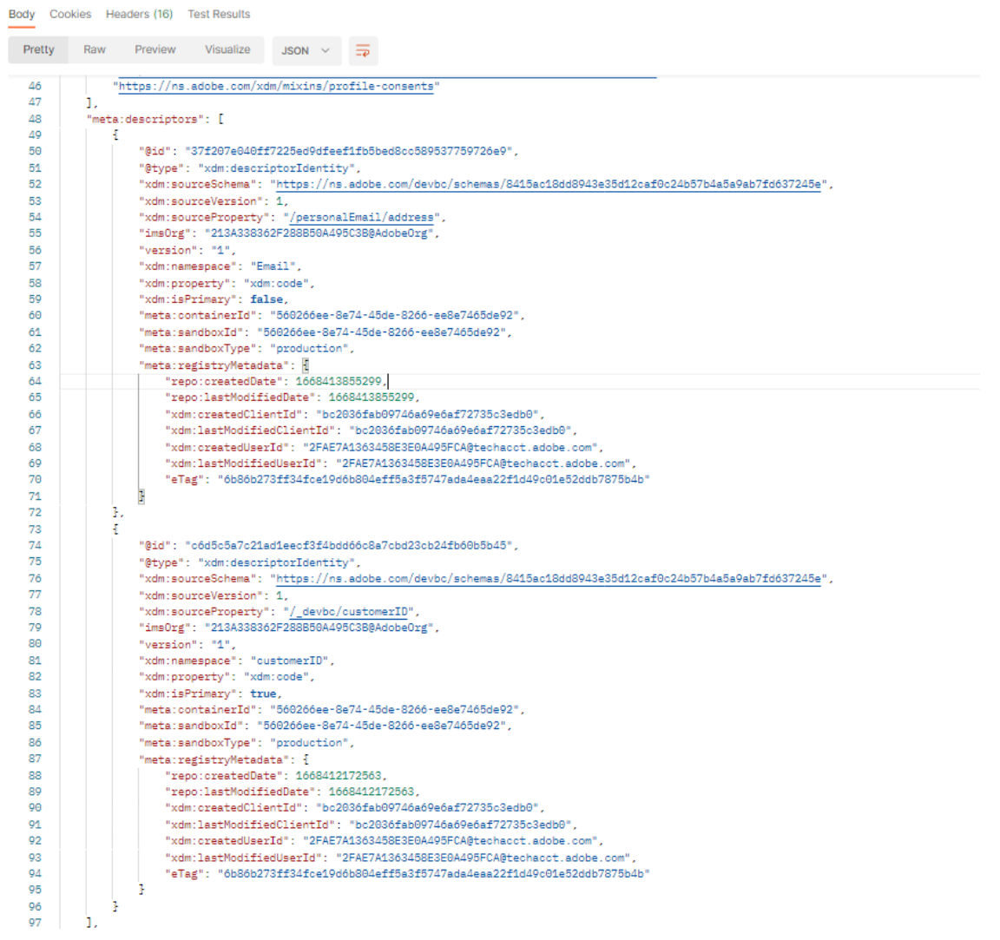
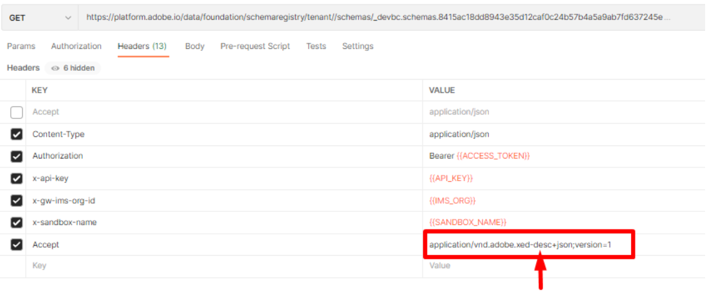

# View schema

## View via the UI

1. Open your browser and navigate back to the `Schema -> Browse` section.
1. Search for the **Customer Account** schema
1. Notice that the identities are added to the schema

## View via the API

1. Select the `Step 3 - Get Customer Account Schema and its descriptors` API by clicking on it.

1. In the URL of the request replace the `<replace me>` with the `$meta:altId` you saved from the previous section (Create Your Schema) to the end of the call like shown below

1. Save the edits you've made the request

1. Execute the request by clicking the `Send` button

You should now see a `200 OK` response and you should be able to browse the schema you created through the lens of the XDM JSON structure

Browse further down in the API response to see the identity descriptors you created

## Accept headers

Note the **Accept** header used in the request. This header tells the XDM schema registry to return the schema's `$refs` unresolved (i.e. show the bare minimum amount of information) along with its associated descriptors in the API response.  Adobe provides other **Accept** headers you can utilize to get various degrees of detail about the schema.

>[!NOTE]
>
>You can read more about the various Accept headers here ->  [Experience League Schema API Endpoint](https://experienceleague.adobe.com/docs/experience-platform/xdm/api/schemas.html?lang=en#lookup)

To see this in action, change the **Accept** header to tell the schema registry to respond with all the `$ref` and `allOf` fully resolved (i.e. exploded out) and any associated descriptors

1. Update the `Accept` header value to the following:
   `application/vnd.adobe.xed-full-desc+json; version=1`
1. Save your request using the `Save` button
1. Execute your request using the `Send` button

You should see a response now that looks like this:

>[!NOTE]
>
>Notice how all the properties of the schema are now fully displayed in the response whereas in the previous call you only were shown the `$ref` values of the schema (i.e. what field groups it was referencing) and nothing was fully resolved down to each individual field/property.

>[!NOTE]
>
>This is important to understand because when working with APIs you do not always need the fully resolved response if all you are doing is getting the `$id` of the schema or simply checking its composition
