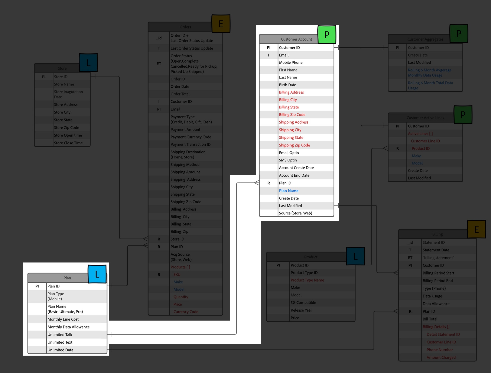

# Configure for Profile

## Overview

In order to utilize a schema for the Real-Time Customer Profile you need to first ensure its configured appropriately. This means taking what you identified during the LID lab as primary/person identities, relationship identities, etc. and ensuring those configurations are made to each schema. When everything is done you can then "flip the switch" and enable a schema for use with profile.

Looking at the XDM on paper Connection 5G ERD you'll see the following information about the Customer Account schema.  This is the work that remains to utilize the schema within the Real-Time Customer Profile.

## Mark the Primary Identity Field

Every schema requires a primary identity field if its to be used with the Real-Time Customer Profile. Follow the steps below to mark a field as a primary identity.

1. Open the **Customer Account** schema you created
1. Select the **\_\<tenant-name>.customerID** field by clicking on the field in the schema
1. In the right rail check both the **Identity** and **Primary identity** checkboxes
1. Select the **customerID** namespace from the dropdown
1. When done click the **Apply** button in the right rail and then **Save** your changes. 

>[!NOTE]
>
>Validate that a thumbprint shows on your field after you click apply like below
>
>
>
>

>[!NOTE]
>
>Also note that in the left rail you should now see the following items appear.  Identities (primary or non-primary) will appear here and **primary** identities will also be marked as required fields.
>
>
>
>

## Mark the Person Identity Field(s)

Remember that every schema that is to be used with the Real-Time Customer profile **optionally can contain** other person identity fields. To mark a field as a person identity perform the following actions on the Customer Account schema you created previously.

1. Select the **personalEmail.address** field
1. Check the **Identity** checkbox found in the right rail
1. Select the **Email** identity namespace from the dropdown
1. **Apply & Save** your changes

>[!NOTE]
>
>Validate that a thumbprint shows on your field after you click apply

## Create the Schema Relationship

In order to relate the Plan schema to the Customer Account schema as outlined in the ERD you need to define a relationship. Follow the below steps to create a schema relationship between the Customer Account and Plan (lookup) schemas.

## Add Relationship

1. Select the **planID** field within the Plan object as shown below
1. In the right rail click on the **Add relationship** icon

## Define Relationship

1. In the Type select box select the **One-to-one** option
1. In the Reference schema select box choose the schema named **dep: Plan \[Lookup]** (this was pre-created for you)
1. Click **Apply** and **Save**

## Confirm Relationship

When you are done you should see the relationship you created display as seen in the screenshot below.

## Configure Schema for Profile

The Real-time Customer Profile merges data from disparate sources to construct a complete view of each individual customer. If you want the data captured by a schema to participate in this process, you must configure the schema for use in Profile. To do so you will need to perform the following steps:

1. Open your newly created **Customer Account - \[your initials]** schema
1. Click on the title of your schema from within the left rail
1. Configure your schema for profile by toggling **ON** the Profile toggle in the right rail
1. In the modal that appears click on the **Enable** button
1. Don't forget to **Save** your schema when you are done!

>[!TIP]
>
>Congratulations!  You just created a schema to use with the Real-Time Customer Profile.

## Review the Profile Union Schema

As mentioned previously the power of XDM + the Real-Time Customer Profile is the ability to assemble a variety of fragments of an individual and their behaviors together.  This is referred to as the "Union View" of the customer.  In the steps below you'll see how you can preview what this union will look like for each XDM class that is configured for the Real-Time Customer Profile

1. Navigate to **Profiles** in the left rail
1. Select the **Union Schema** tab on the top menu
1. Select the **XDM Individual Profile** class from the drop down

Browse the XDM Individual Profile class and then take a few moments to review other classes such as XDM ExperienceEvent or Plan classes.

>[!NOTE]
>
>Notice the schema shown is an aggregate merged view of all profile-enabled schemas in your sandbox. Similar fields within the hierarchal XDM structure will merge together whereas fields with different names and/or hierarchies will be added to the overall view.

>[!WARNING]
>
>Only the XDM Individual Profile based class performs merges between similarly named fields.
