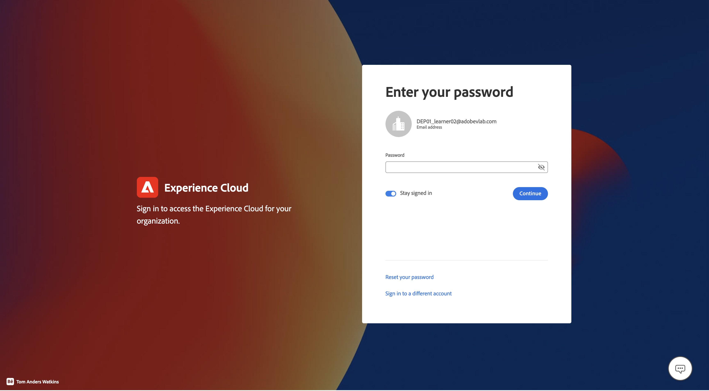
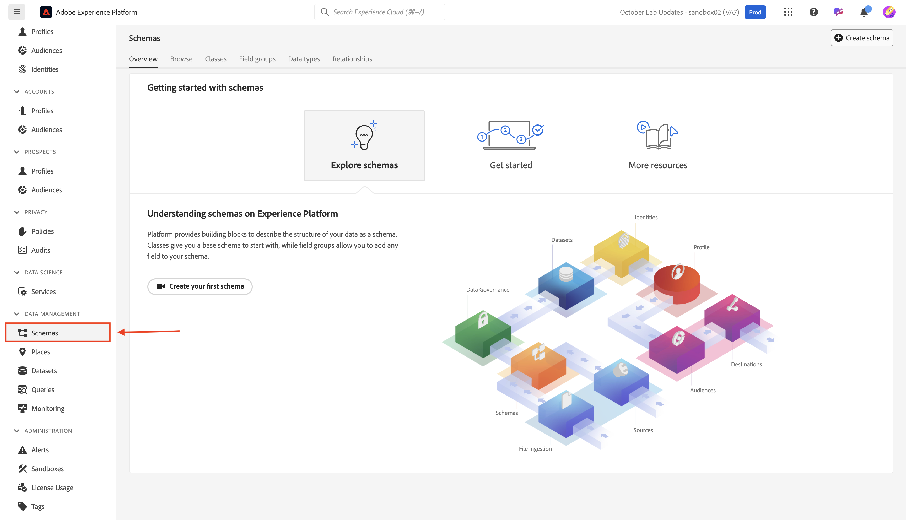

# Login & browse

## Login via UI

1. Navigate to [https://experience.adobe.com](https://experience.adobe.com/) in your browser.
1. Login using the Adobe ID that has developer access to your sandbox — the same one you used to complete [Developer Console Setup](../../sandbox-setup/developer-console-setup.md).
1. On the **Select an account** screen choose the **Company or School Account**.

## Launch Experience Platform

Click on the Experience Platform icon from the quick access panel to access your bootcamp sandbox

>[!NOTE]
>
>You may not see this screen and be launched directly into the Experience Platform.  If so skip this step.

## Navigate to schemas

1. Click on the **Schemas** tab in the left rail

1. In the top navigation you see options to browse existing schemas as well as view field groups and data types that are currently in the XDM registry. 

>[!NOTE]
>
>You notice there are already schemas that are pre-created in your sandbox. These include schemas that were pre-created as part of this bootcamp (they are prefixed with `dep`), as well as system generated schemas for both Adobe Real-Time CDP and Adobe Journey Optimizer.

>[!TIP]
>
>Start building some schemas!
