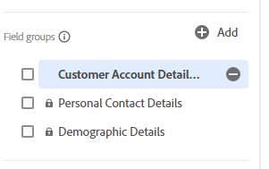
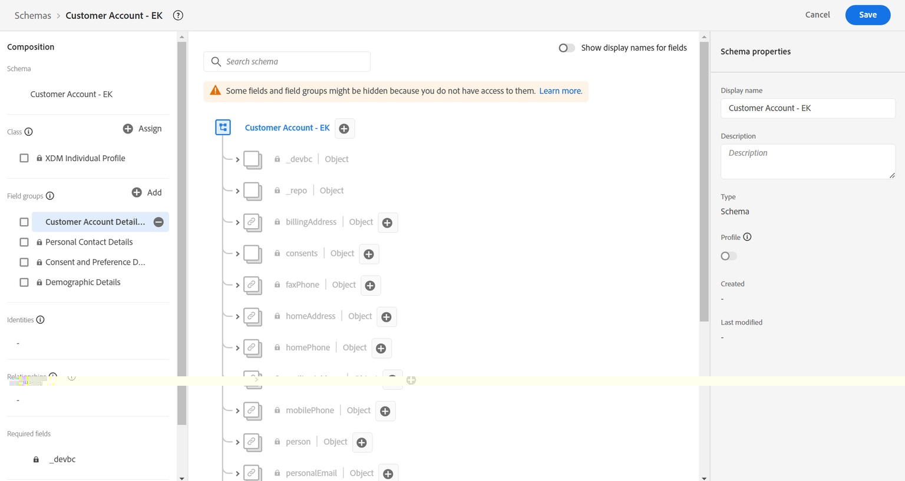

# Model custom objects

## Adding custom fields

As discussed in the lecture, there are no standard prebuilt field groups or data types that model the Customer Account custom fields.  The below fields currently are considered custom and must be modeled within the XDM schema.

- \_\<tenant-name>.account.createDate
- \_\<tenant-name>.account.endDate
- \_\<tenant-name>.account.acqSource
- \_\<tenant-name>.plan.planID
- \_\<tenant-name>.plan.name
- \_\<tenant-name>.customerID

>[!NOTE]
>
>Note the \<tenant-name> is specific to the environment you are working in

## Account object creation

1. Add a new field by clicking the **+ (add)** button at the top of your schema

   

   >[!NOTE]
   >
   >Notice the right rail opens with some fields for you to fill out

 

1. Create the account object by using the below details. When done click the **Apply** button in the right rail to see the change in the schema workspace

| Field Name | Display Name | Type     | Assign to a New Field Group                                                                                                   |
| ---------- | ------------ | -------- | ----------------------------------------------------------------------------------------------------------------------------- |
| *account*  | *Account*    | *Object* | *Customer Account Details - \[Your Initials]* *(type this in and select the dropdown or press enter)* |

>[!WARNING]
>
>Your field names need to follow a specific casing. The reason is that the same schema you are building has already been pre-created. If your casing is off, it causes a conflict with the field paths from the pre-existing schema in your sandbox

>[!NOTE]
>
>Notice the custom field you created automatically is placed under a tenant namespace, denoted by `_devbc` in the screenshot. Your tenant namespace may be different. Tenant namespaces are used to differentiate custom objects from Adobe standard ones and ensure future additions/updates to Adobe standards do not conflict with custom created ones.

>[!NOTE]
>
>Notice that your new custom field group appears in the left rail under the `Field groups` without a lock icon.  This missing lock icon denotes it's a custom-created field group.

>[!WARNING]
>
>You cannot save your schema at this point. If you do, an error occurs because you cannot create an empty object in JSON schema as it does not describe what its contents are

 

1. Add the following fields shown below under the Account object you just created.

   | Field Name   | Display Name  | Type       |
   | ------------ | ------------- | ---------- |
   | *createDate* | *Create Date* | *DateTime* |
   | *endDate*    | *End Date*    | *DateTime* |

   >[!NOTE]
   >
   >You notice while adding the new fields the **Assign to** option is already filled in and references the field group you used for the account object.

1. When done, your schema's account object looks like below. **Save** your schema!

   

 

1. Add one more custom field to the account object. Click the  **+ (add)** button next to the account object.  Create the following field:

   | Field Name  | Display Name      | Type     | Enumerations                            |
   | ----------- | ----------------- | -------- | --------------------------------------- |
   | *acqSource* | *Acquired Source* | *String* | *web :: Web* *inStore :: In Store* |

   This field needs standardized values, so use the **Enum & Suggested values** option within the field's properties. Select **Enum** radio button to add validation for this field at ingestion, as well as friendly labels. Add the enum values as shown below:

   - *web :: Web*
   - *inStore :: In Store*

   

   >[!NOTE]
   >
   >The goal of Enum & Suggested values is make segmentation easier for the end user. Enums enforce validation at time of data ingestion whereas Suggested values do not. To learn more about this feature, read more in the documentation here -> [https://experienceleague.adobe.com/docs/experience-platform/xdm/ui/fields/enum.html?lang=en#enums-and-suggested-values](https://experienceleague.adobe.com/docs/experience-platform/xdm/ui/fields/enum.html?lang=en#enums-and-suggested-values)

 

1. When done click the **Apply** button to add the new field to the schema.

1.  **Save** your schema

>[!SUCCESS]
>
>You have successfully created your first custom object and fields within the XDM schema registry!

## Plan object creation

Repeat the steps you performed above and add the **Plan** object and associated fields. All new fields should be added under the Customer Account Details - \[your initials] field group.

Use the metadata in the below table to create the plan object and its associated fields.

| Field Name | Display Name   | Type     | Enum & Suggested Values                                                               |
| ---------- | -------------- | -------- | ------------------------------------------------------------------------------------- |
| *plan*     | *Plan Details* | *Object* | -                                                                                     |
| *planID*   | *Plan ID*      | *String* | -                                                                                     |
| *name*     | *Plan Name*    | *String* | Enum  *basic :: Basic* *ultimate :: Ultimate* *pro :: Pro* |
| *type*     | *Type*         | *String* | -                                                                                     |

>[!WARNING]
>
>Ensure that you are adding the new fields you create to the Customer Account Details - \[your initials] field group.  A quick way to ensure they are auto-added to that field group is to select the field group in the left rail before adding a custom field.
>
>
>
>
>
>

When done validate your schema matches the below screenshot. If it looks good **Save** your schema

>[!TIP]
>
>Nice!  You added your own custom object and fields with no help!

## Customer ID field creation

Adding the **customerID** field as this field is critical because it serves as the primary identity for the schema as well as a general field to hold data in.

Perform the same steps as you have done previously and use the table below for referencing the metadata for the field.

| Field Name   | Display Name  | Type     | Field Group                                   |
| ------------ | ------------- | -------- | --------------------------------------------- |
| *customerID* | *Customer ID* | *String* | *Customer Account Details - \[Your Initials]* |

>[!NOTE]
>
>The `customerID` could be put anywhere in the schema from a hierarchical perspective. In this lab, the customerID field stays at the root and isn't nested within one of the custom objects you previously created.  This placement is where data architecture has opinions 
>
>😄

Your final result looks like the screenshot below when you are complete

## Final schema result

>[!SUCCESS]
>
>You have built your first XDM schema! In the next section, you configure the schema for use with the Real-Time Customer Profile.
