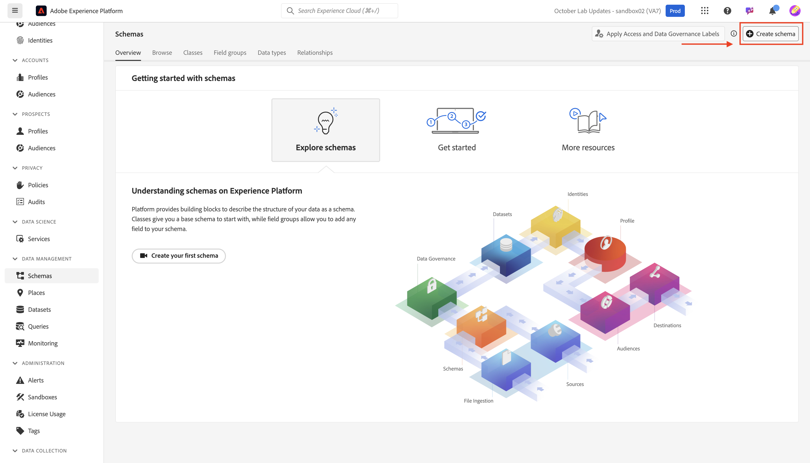
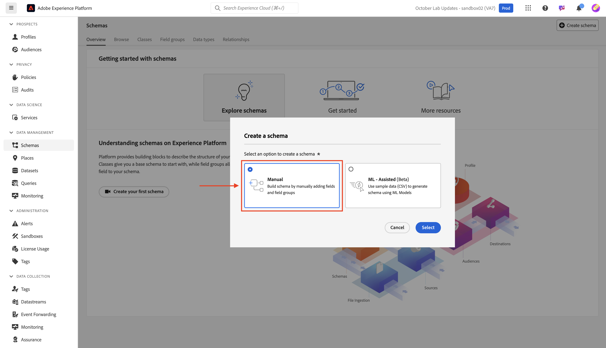
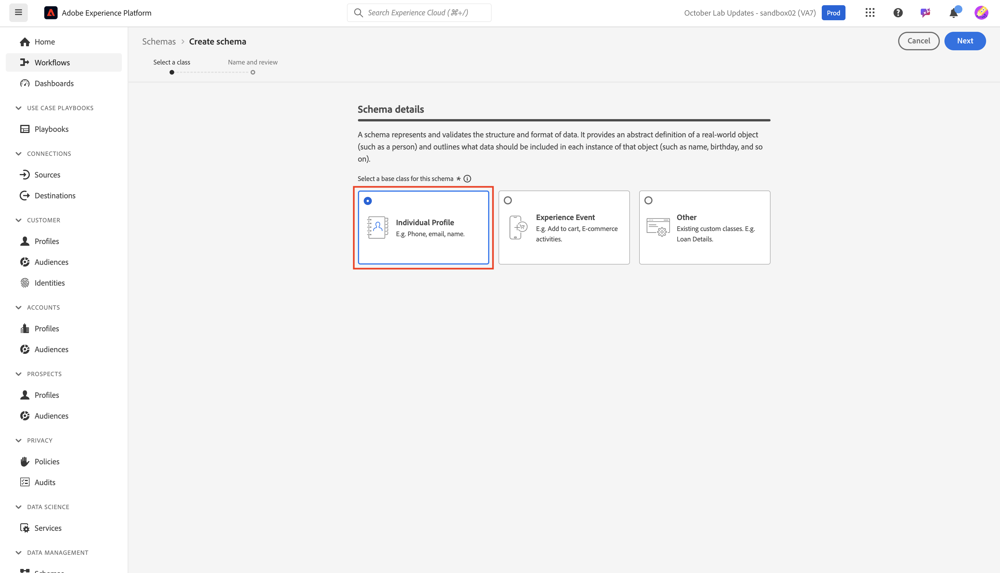
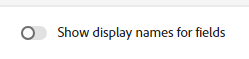

# Model standard objects

## Navigate to schemas

1. Click on the **Schemas** tab in the left rail 

   

1. In the top navigation you see options to browse existing schemas as well as view Field Groups and Data Types that are currently in the XDM registry. 

>[!NOTE]
>
>You notice there are already schemas that are pre-created in your sandbox. These include schemas that were pre-created as part of this bootcamp (they are prefixed with `dep`), as well as system generated schemas for both Adobe Real-Time CDP and Adobe Journey Optimizer.

## Create Individual Profile schema

1. Start by clicking **Create schema**

   

1. Select **Manual**

   

   

1. Select **Individual Profile**

## Name your schema

The XDM Individual Profile class-based schemas allow you to collect attributes about an individual that will be stitched to the profile. The class itself contains fields that are not editable such as *modifiedByBatchID*, *PersonID*, etc.

1. Give your schema a name and description.
   - **Schema Display Name** --> *Customer Account – \[Your Initials]*
   - **Description** --> This schema collects identities, plan information, demographic details, and contact details of an individual.
1. Save your schema using the **Finish** button on the top right.

## Add Demographic Details field group

There are many field groups that exist as standard XDM in Adobe Experience Platform for you to add to your schema and customize. 

1. Click the **+ (add)** on the left rail in the field group section.

   

   

1. Search for **Demographic Details**, or find it by browsing the list. 

   - When you find the field group click on the magnifying glass to the right of the field group to view its structure.  This is a useful way to preview what you are about to add to your schema without actually adding it.
   - Close the preview when done reviewing

   

   

3. **Check** the checkbox next to the field group and then click the **Add field groups** button

## Add other standard field groups

You need to add additional standard field groups to your schema. Repeat the previous steps to add the two additional field groups to your schema:

- Personal Contact Details
- Consent and Preference Details

When you are done your schema should look like the below image when done. Be sure to click the **Save** button and save your work!

>[!NOTE]
>
>Notice that the field groups you selected and added now appear in your schema and display in the left rail. Note that not all the fields in each field group you added are necessarily needed.  The next step removes the extraneous fields.

>[!WARNING]
>
>Be sure to save your schema before continuing!

## Customize standard field groups

### Demographic Details field group

The Demographic Details field group brought in many fields, but based on your schema design from the LID methodology, you only need the following fields:

- person.name.firstName
- person.name.lastName
- person.birthDayAndMonth
- person.birthYear

To remove fields from any Adobe standard field group you can utilize the **Manage related fields** option. Manage related fields allows you to remove standard fields from your schema, so you are only left with the fields you need.

1. Select the **person** object in your schema
1. Click on the **Manage related fields** in the right rail

   

   

1. Expand the person object by clicking the chevron to the left of person and expand the full name object by clicking the chevron to the left of the name object. Keep only the following fields:

   - person.name.firstName
   - person.name.lastName
   - person.birthDayAndMonth
   - person.birthYear

   When you are done click the **Confirm** button in the upper right corner.

   

   >[!NOTE]
   >
   >You can click the top-most checkbox for **Demographic Details** to auto-deselect all child objects and then reselect only those that you need!

1. When done you should see the person object in your schema as shown below. If everything looks good click the **Save** button to save your schema.

### Consent and Preferences field group

Perform the same set of steps as you did previously but this time for the Consent and Preferences field group.

1. Click on the **Consent and Preferences** field group name in the left rail to highlight its fields in your schema.
1. Select the **consents** object and then use the **Manage related fields** process to remove fields not needed from the consent object. Keep only the following fields:

- consents.marketing.email.val
- consents.marketing.sms.val

>[!NOTE]
>
>Ensure that you have the toggle turned off for **Show display names for fields** in the upper right corner of the schema workspace
>
>

When you are done your final schema should now look like this.  Be sure to click **Save** before continuing on.

>[!TIP]
>
>You are now finished with adding standard components to your schema. Great job! Move on to building some custom attributes for your schema.
