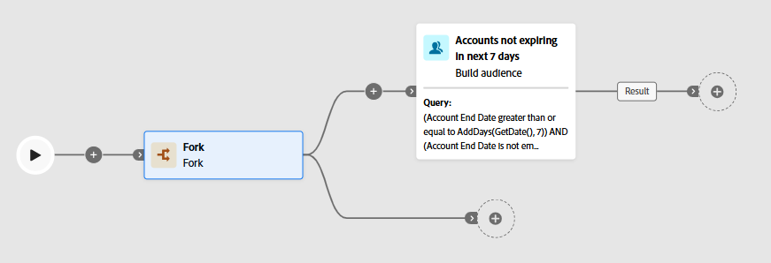
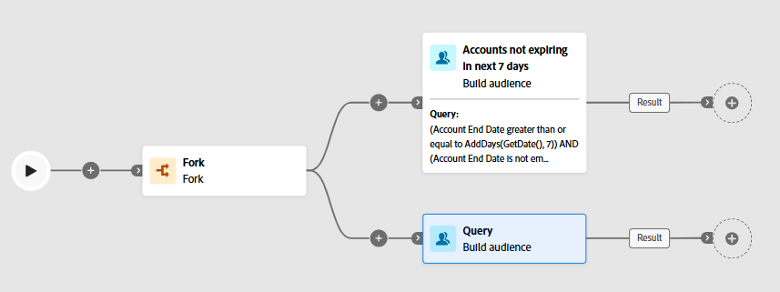

For the second audience you have the goal of finding all the active lines on the customers account that meet the criteria for the flagship phone being launched.

>[!WARNING]
>
>Oh noes! You need to add another Build Audience activity but you cannot chain two Build Audience activities in sequence so what do you do?  Introducing the Fork activity.

# Add Fork Activity

On the canvas click the **+ **icon before the 1st audience you created and add the **Fork **activity to the canvas

## Add Build Audience Activity

On the second branch of the Fork, click the **+** icon to open the activity list, then choose the **Build Audience **activity to add it to the canvas

## Configure Audience

1. Since you've already had some practice with building an audience this time around you only get a set of instructions and final screenshot. Here is what you need to configure:
   - **Label:**  `Active customer lines using apple devices`
   - **Targeting dimension:**  `dep-rel: Customer Line`
   - **Condition #1:  **`Active Line = true`
   - **Condition #2:  **`Make = Apple`

>[!NOTE]
>
>Not all the data will be present in the *dep-rel: Customer* *Line *table

>[!WARNING]
>
>Make sure both conditions use an AND operator

>[!TIP]
>
>Success means you will see 78 profiles that are targeted. If you see more or less you did something wrong

1. When you are done building your audience your final canvas should look like the below screenshot.  Click the **Save **button in the upper right before continuing to the next step.

