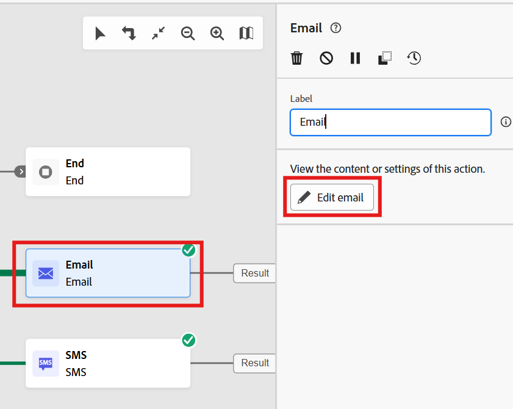
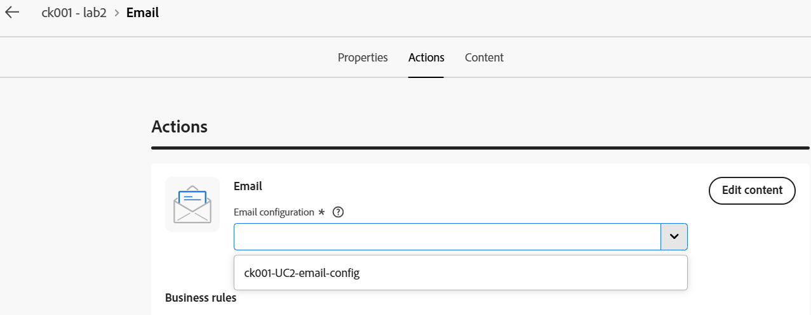
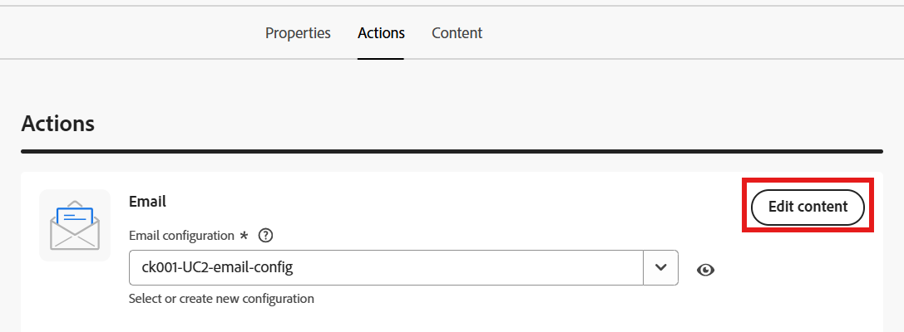
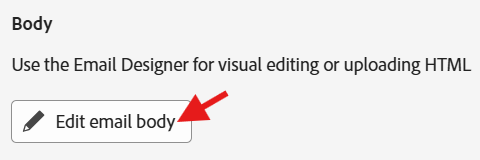
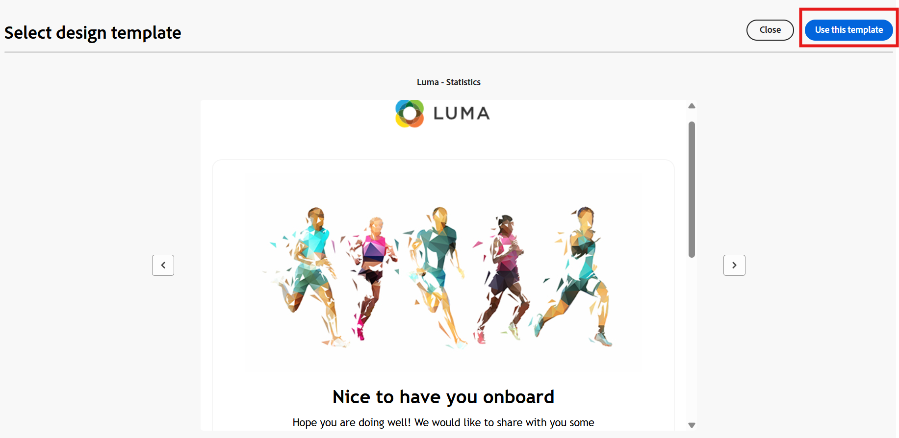
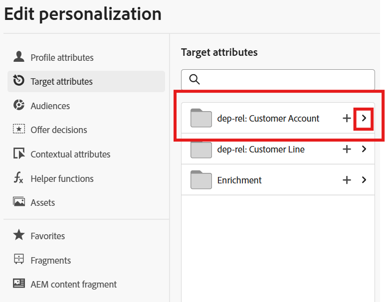
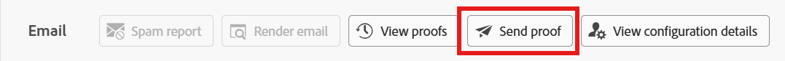
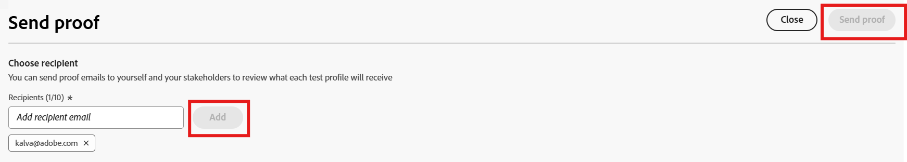

---
title: Configure Email Message
description: Configure Email Message
doc-type: article
exl-id: 52439979-6e80-4cb2-803d-f21ae9b0b7d2
---

# Add an Email Treatment

1. On the canvas, to one node of **Split **add **Email **activity
2. Click **Create**/**Edit email** on the Email activity.

# Set the Email Properties

1. Set the email properties

- Under **Actions **tab, select email configuration (Mandatory) from the dropdown: **Relational-Email.**

>[!NOTE]
>**Prerequisite Step**: Make sure to complete the [Configure Email Channel for Relational](../../data-stores/configure-email-channels/configure-for-relational.md) prior to continuing with the following steps.

- Action tracking (Optional), leave the defaults.
- Experimentation (Optional), leave the defaults.

2. Click** Edit Content** to add Content. 

3. On the content tab, add **subject line (Optional)**
4. Click** Edit email body** 

5. Select the template of your choice.

# Personalize the Content

1. Click personalization icon by selecting desired text on the template to add personalization. 

2. Add the personalization fields from the Target attribute list. Something like the following. 

>Example:
>Hi \{\{target.dep\_rel\_customer\_account.first\_name}
>Your Apple \{\{target.dep\_rel\_customer\_account.plan\_lookup.plan\_name}} is up for renewal on \{\{target.dep\_rel\_customer\_account.account\_end\_date}}.

3. Click **Save.**

# Simulate Content

1. Click **Simulate Content.**

2. Add a test profile by clicking **Manage test Profiles**.
3. Select the Identity namespace and value to add the test profile. 
4. Navigate back and click **Send Proof**.

# Send a Proof

1. Enter your **Email ID** (personal) and click **Add**.
2. Click Send Proof to receive a proof on the Test Profile to the email added. 

3. Click **Close **a couple of times and navigate back to the workflow canvas. 
