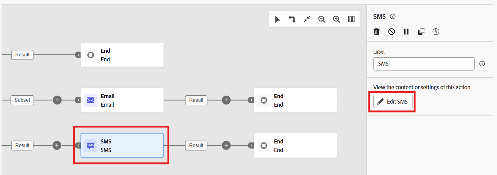
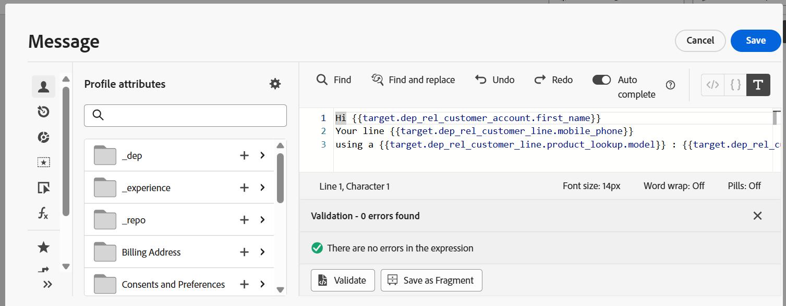
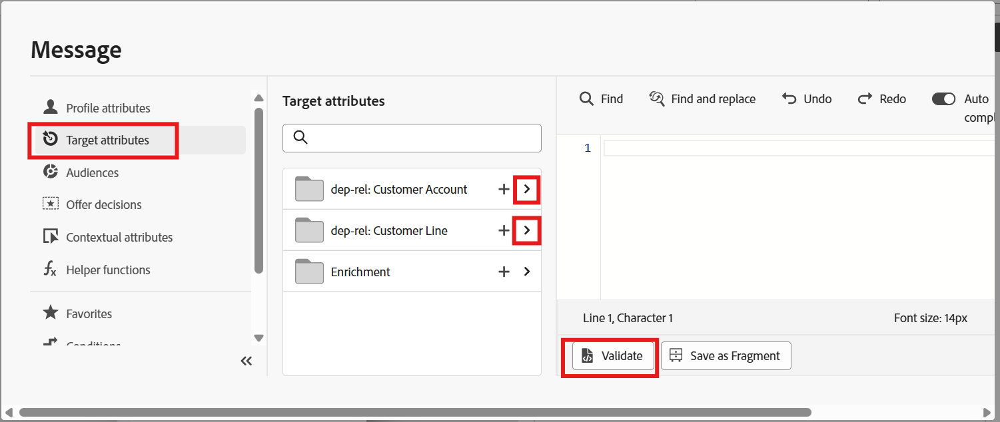
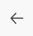

---
title: Configure SMS Message
description: Configure SMS Message
doc-type: article
exl-id: e6673838-958b-41da-b725-8fc8378a59a5
---

# Add SMS Activity

The goal of adding SMS message step is to target opt-in users who have multiple active lines on their account, while intentionally excluding the primary line. The activity identifies accounts with two or more active lines and delivers the SMS only to the secondary lines (such as dependent or kids’ lines). This approach is commonly used for:

- Device upgrade reminders 
- Usage or threshold alerts 
- Add-on or accessory promotions 
- Messages specifically intended for dependent lines 

This ensures relevant communication reaches the right users and prevents over-messaging the primary account holder, who typically already receives account-level notifications.

On the canvas, add an **SMS **activity to the **second branch **of the **Split **activity.

****

# **Configure the SMS Activity**

1. Click **Create/Edit SMS** on the activity card to begin configuring the message.

2. On the **Actions** tab, select an SMS configuration from the dropdown. (**Note:** This is the same configuration completed in the previous exercise). 

>[!NOTE]
>If no configuration is available, make sure to complete the [Configure SMS Message](../../orchestrated-campaigns/flagship-phone-launch/configure-sms-channel.md) lab to see the required configuration under this option. 

# **Compose SMS Message**

Create your message and add personalization fields.

1. Click the **Edit content **button, or navigate directly to the **Content **tab. 

2. Use the **Personalization** button to insert attribute fields.. 

3. If preferred, you can add personalization by navigating through **Target attributes**:
   - Expand entities under the **Target Dimension** 
   - Select the fields to include in the message or simply paste the following text. 

>Hi 
>\{\{ target.dep\_rel\_customer\_account.first\_name}}
>Your line \{\{target.dep\_rel\_customer\_line.mobile\_phone}}
>using a \{\{target.dep\_rel\_customer\_line.product\_lookup.model}} : \{\{target.dep\_rel\_customer\_line.product\_lookup.make}} is eligible for an upgrade.

4. Click **validate **on the editor and make sure there are no validation errors. 

5. Click **Save**.(Might have to scroll to the right view this button). 

# Preview SMS Content

After saving, you will return to the activity view where the **SMS preview** displays your configured message as below. 

# Save Orchestration. 

- Navigate back to the Canvas using the back button on the top left button and click **Save**. 

