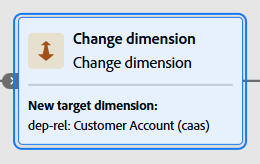
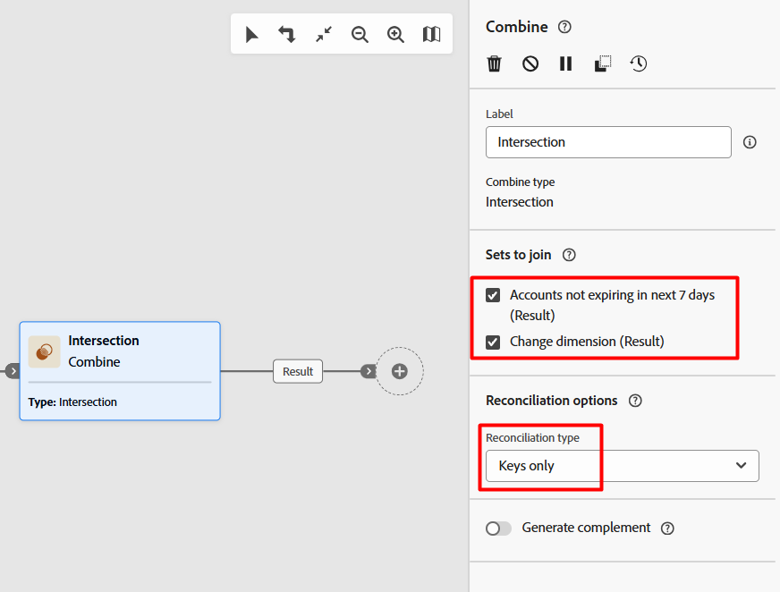
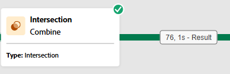

---
title: Option #1 - Change Dimension
description: Option #1 - Change Dimension
doc-type: article
exl-id: dd463d0a-6b26-4940-84e7-c5a69329ecd3
---

# Add the Change Dimension Activity

1. On the workflow canvas, click the **+**** icon** after the Active customer lines audience you just created
2. From the list of activities, select the **Change Dimension **activity

# Configure the Change Dimension

1. In the Change dimensions configuration panel update the label and targeting dimension as so:
   - **Label:  **`Convert Customer Line to Customer Account`
   - **Target Dimension:  **`Customer Account`

>[!NOTE]
>Note that after configuring the change dimension you'll see the actual schema name display on the activity. The selection screen for the targeting dimension shows the link name in case you were wondering why its different.

2. Click the **Save **button in the upper right**.**

# Add the Combine Activity

Now that both branches share the same targeting dimension (Customer Account) you can combine both branches.  To do so perform the following steps: 

## Choose Combine Option

1. Click the **+** **icon **on either of the branches
2. Select **Combine **from the activity list to add it to the canvas
3. Under the Combine options menu select the **Intersection **option and then click the **Continue **button

## Configure Sets to Join

Next you need to choose what sets (i.e. branches of your workflow) that you want to join together.  Since the branches/sets to join share the same targeting dimension this is straightforward.

1. Under the menu *Sets to join* ensure that both check boxes are **checked**
2. Under the menu *Reconcilation options* make the sure the *Reconcilation type* is set to **Keys only**

>[!NOTE]
>**Reflection Question: **We aligned the targeting dimension by converting the Customer Line branch to Customer Account. Why is this the preferred approach in this workflow, instead of converting Customer Account to Customer Line?

2. Click the **Save **button in the upper right**.**

# Run the Workflow

Moment of truth!  Did you configure everything correctly so far?

1. In the upper right click on the **Start **button to run the workflow
2. The resulting number should be 76, regardless of which option you selected to combine your two audiences

>[!TIP]
>Success means you will see **76** profiles in the result

****

If successful jump ahead to the next step -> [Save Audience](<././Save Audience.md>)
