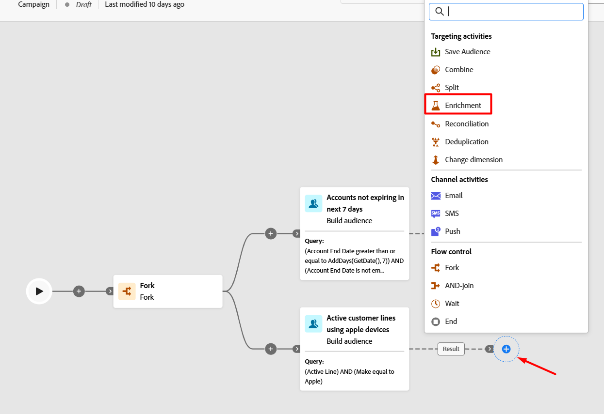
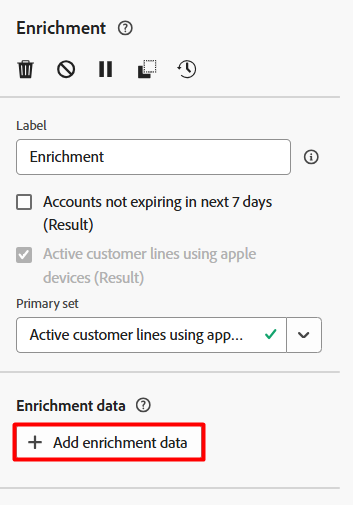
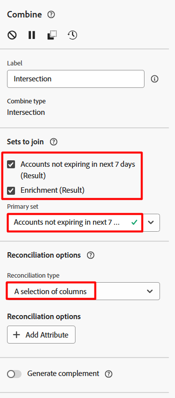
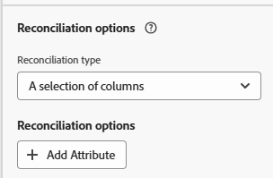
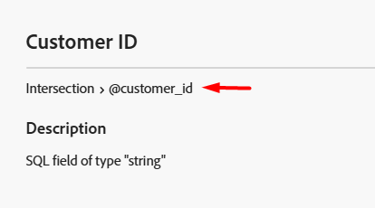
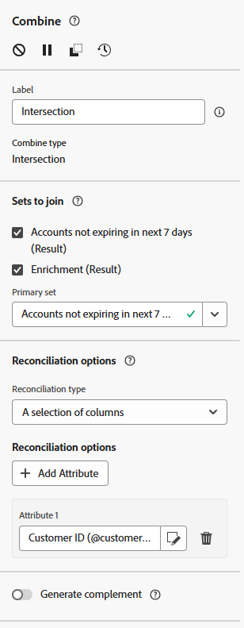

---
title: Option #2 - Enrichment
description: Option #2 - Enrichment
doc-type: article
exl-id: 226d2df3-b5b7-4b7d-b844-d037da8cb03d
---

>[!NOTE]
>The **Enrichment** activity is used to bring additional fields such as attributes from related profiles, accounts, subscriptions, or lookup tables into the workflow context so that they can be used later for personalization, conditions, or routing.
>
>**📌 When Do You Use Enrichment?**
>
>- Additional attributes that are **not** in the current targeting dimension 
>- Fields needed for **personalization** in messages 
>- Data needed for **branching logic** or **audience splits** 

# Add the Enrichment Activity

1. On the workflow canvas, click the **+**** icon** after the Active customer lines audience you just created
2. From the list of activities, select the **Enrichment **activity. 

# Configure the Enrichment

1. Click on the **Add enrichment data** button under the *Enrichment data* menu

2. Select the **Customer ID **attribute from the Targeting dimension and then click the **Confirm **button.

>[!NOTE]
>The alias field is used to provide the SQL engine with a different field name to use when referencing the field during the campaign. A best practice is to always ensure you add the @ symbol to beginning of any alias

>[!WARNING]
>When joining mulitple results together from different branches in a workflow using a combine activity there must be a commonly named field across all of them to work. This is where aliasing can come in handy.

5. Click the **Save **button to save your work.

# Add the Combine Activity

Okay now both branches have a common attribute in Customer ID that can be used to join the two result sets together.  To do so perform the following steps: 

## Choose Combine Option

1. Click the **+** **icon **on either of the branches
2. Select **Combine **from the activity list to add it to the canvas
3. Under the Combine options menu select the **Intersection **option and then click the **Continue **button

## Configure Sets to Join

Next you need to choose what sets (i.e. branches of your workflow) that you want to join together and how they will reconcile together.

Update the Combine activity such that the following options are set:

- Under the *Sets to join *menu ensure that both checkboxes are **checked**
- Under the *Primary set* menu ensure that **Accounts not expiring in the next 7 days **is selected
- Under the *Reconilation type* menu ensure that you select **A selection of columns**

>[!NOTE]
>**Note:**  Whatever primary set you select will be the targeting dimension of the result.

# Add Attributes to Join

In this step you need to add the attribute you want to use that is common across all the join sets to create your intersection.

1. Click on the **Add Attribute** button under the *Reconcilliation options *menu

2. On the modal you will select the **Customer ID **field and then click the **Confirm **button

>[!NOTE]
>You can use the 🛈 icon to see the alias name of the attribute
>
>

>[!NOTE]
>Notice how the select attribute modal only shows one field called Customer ID even though you have it present in both audiences. 
>
>Why is this?  Remember a combine activity first does a union of all the results you select. If two fields exist between any of the join sets with the exact same alias name only field is actually kept.

4. Your final combine activity configuration should like the below screenshot. If everything looks good click the **Save **button.

# Run the Workflow

Moment of truth!  Did you configure everything correctly so far?

1. In the upper right click on the **Start **button to run the workflow
2. The resulting number should be 76, regardless of which option you selected to combine your two audiences

>[!TIP]
>Success means you will see **76** profiles in the result.

