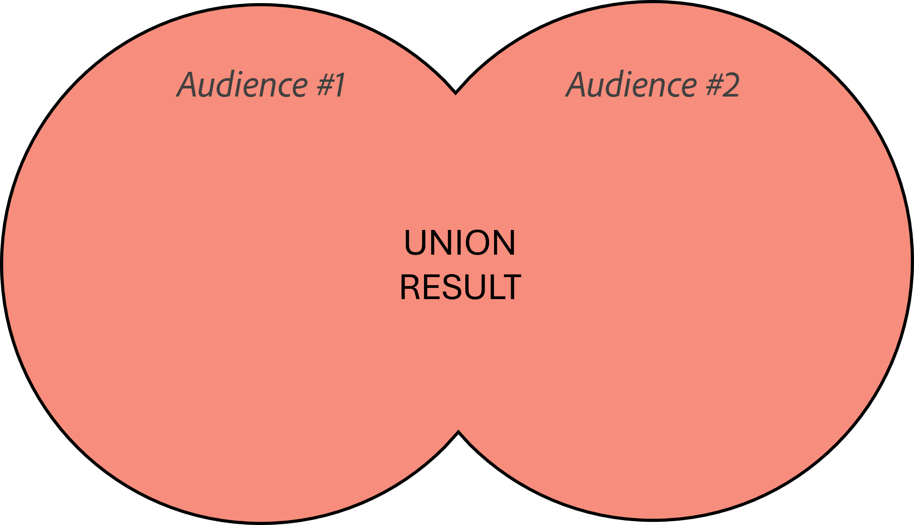

# Combine Activity Intro

In this step, you’ll combine the two audiences by intersecting them into a single audience. This ensures the final audience includes only customers who have active accounts that are not expiring in the next 7 days and who currently have active lines that are using Apple devices.

This involves using the Combine activity which provides three options to you:

> **Union**
Union means you keep all the results from both audiences. For those of you who are visual it would look like this

> **Intersection**
Intersection means you only keep what matches between both audiences.  The visual looks like this...

> **Exclusion**
Exclusion means you only keep the result of one audience after subtracting the other audience from it. A visual looks like this...

>[!WARNING]
>
>In order to combine two different workflow branches together into a single result they must share the same targeting dimension or have a common key between.
>
>What is a targeting dimension?  This is SUPER important to understand as its the basis of everything in Orchestrated Campaigns. The targeting dimension simply tells you what schema the result can be joined back to in the relational store.  It ALWAYS contains the primary key from that schema.

## Choose Your Adventure

If you look at the each build audience activity you created you should note that each audience is using a different targeting dimension:

| **Audience**                             | **Targeting Dimension**   | **Primary Key**  |
| ---------------------------------------- | ------------------------- | ---------------- |
| Accounts not expiring in the next 7 days | dep-rel: Customer Account | Customer ID      |
| Active Customer Lines Using Apple        | dep-rel: Customer Line    | Customer Line ID |

You have two options at this point to address the targeting dimension issue. Pick one of the options from below that you want to puruse and have fun 😁

- [Option #1 - Change Dimension](./option-1-change-dimension.md) --> Change the dimension of one of the audiences to match the other
- [Option #2 - Enrichment](./option-2-enrichment.md) --> Add the primary key of the other audiences targeting dimension to one of the audiences result

>[!NOTE]
>
>**Note:** Option #2 is more difficult so if you want a challenge pick that one.

