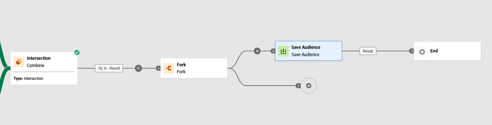
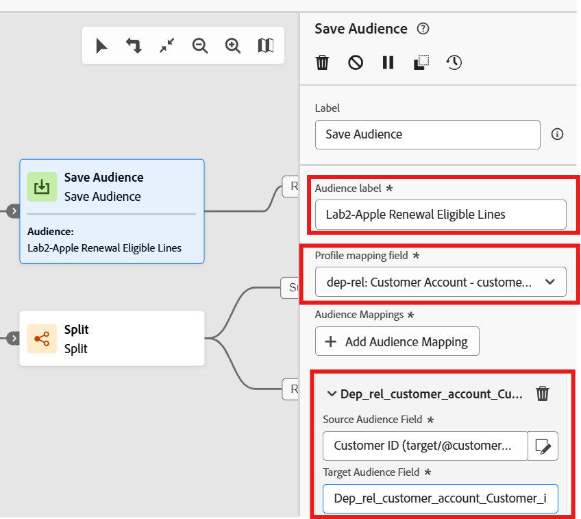

---
title: Save Audience
description: Save Audience
doc-type: article
exl-id: 6d2c78cb-a94b-4929-9ba4-fca3cb17753d
---

At this point of the workflow you have an audience of customer accounts and their associated lines that you could re-use for targeting in social media, advertising destinations and potentially in-the-moment journeys. What's cool is you can save this audience you created back to the Audience Portal in the Real-Time Customer Profile so others can benefit from your hard work. 

# Add Fork & Save Audience Activities

Once again we'll add the Fork activity into our canvas because we need to keep a copy of the result for our actual campaign. So do the following:

1. Add a **Fork** Activity after the Combine activity
2. Ensure it has two transitions available
3. On the top transition **Click **+ to add the **Save Audience activity**

>[!TIP]
>If your image looks like the above you are getting the hang of this thing!

# Configure **Save Audience**

1. If not already selected, click on the **Save Audience activity** on the canvas 
2. Update the following information in the activity
   - **Label****:**  `Apple Flagship Phone Launch`
   - **Profile mapping field:  **`dep-rel: Customer Account - customer_id`

>[!NOTE]
>Once you select the Profile mapping field the Audience mapping is automatically created as shown below

>[!NOTE]
>**Note:** The attribute that is added is what you previously set in the Orchestrated Campaign Profile Target Dimension configuration screen

3. Click the **Save **button on the workflow.

# Fun Fact!

If you run the workflow again (i.e. click the start button) it will execute the Save Audience activity but you will not see the audience in the Audience Portal.

**Why not you ask?**
Audiences are only saved to the Audience Portal when an Orchestrated Campaign is published 🙃

## ****

