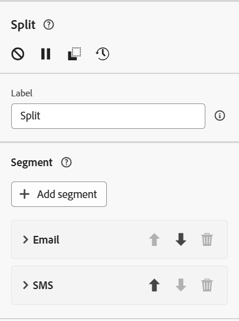
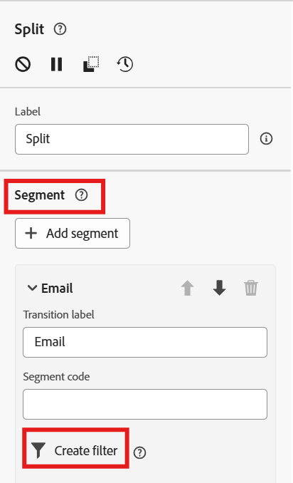
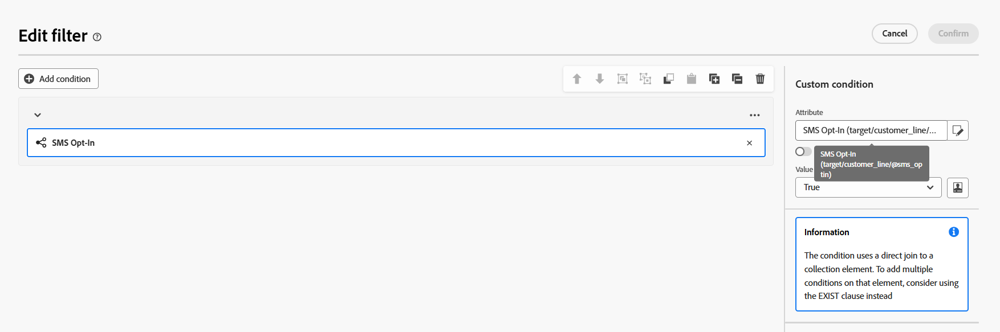

---
title: Split for Email & SMS
description: Split for Email & SMS
doc-type: article
exl-id: 87782045-cfa6-4962-bcb7-046125e7bc14
---

# Add Split activity

1. Click the **+** icon after the second transition of the Fork activity and select **Split** activity on the popup. 
2. Rename the segment titled Subset to **Email** and then create a new segment titled **SMS**
3. When done your Split activity should look like the below screenshot 

# Configure the Email Filter

For each filter in each of the segments you will now add a condition where the channel opt-in is True for each respective segment you just created.

1. Expand the Email segment and click on the **Create filter** button

2. Click on the **Add Condition **button
3. Select the field **Email Opt-in **from within the Target Dimension

4. Set **Email Opt In** value to **True.**
5. Click **Confirm**

6. The final Email segment filter should look like so:

>[!TIP]
>You've succesfully created your first split fliter. Woot woot!

# Configure the SMS Filter

In this step you want to only keep the customer lines that are opt-in to SMS and are not the primary lines of the accounts.  We are already sending the account owner an email so no need to also bombard them with an SMS as well.

## SMS Opt-in Filter

1. Use the attribute **SMS Opt-in** from the Customer Line table by navigating to the **Targeting Dimension --> Customer Line --> SMS Opt-in**
2. The full path of your attribute should read like this on the screenshot below:
   `SMS Opt-In (target/customer_line/@sms_optin)`

>[!WARNING]
>Make sure you selected the SMS Opt-in value from the Customer Line schema otherwise in future steps your counts will look different.

## Primary Line Exclusion

1. Select the **Primary Line** attribute by navigating to **Target Dimension -> Customer Line -> Primary Line**

2. Set the condition to **False **and make sure the logical operator is **AND **between the two conditions.

5. Click **Confirm**.
6. Navigate back to the canvas and Click **Save**

****

# Run the Workflow

1. Click the **Start **button in the upper right to run the workflow

>[!NOTE]
>If you didn't stop your workflow from a prevoius run click the Stop button first and then click Start

2.

