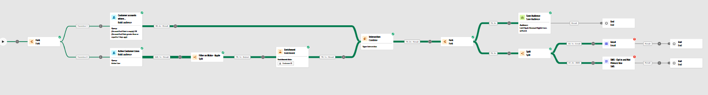

---
title: Test & Publish
description: Test & Publish
doc-type: article
exl-id: d0e0a93f-8d3b-4543-ab0f-368126fe22bf
---

# Confirm the Complete Workflow

End of the above step, the complete workflow should look something like the following. 

**Option#1: **

**Option#2: **

**Verify that:**

- All activities are connected correctly 
- Audience logic and filters are set as intended 
- Branches (e.g., Split) reflect the designed logic 
- Channel treatments (Email/SMS) are configured and saved

# Start the Workflow

On the canvas, click the **Start **button to execute and test the workflow.

# Review Node Counts and Results

After the workflow executes:

- Hover over or select each node to review **audience counts** 
- Confirm that the **split logic**, **filters**, and **treatments** behave as expected 
- Validate that users flow correctly through: 
  - Fork/Split logic paths 
  - Target Dimension selections 
  - Secondary Dimension logic (if used) 
  - SMS/Email treatments 

This ensures your workflow logic and configurations are correct before using it in a production/publish scenario. 

# Publish the Workflow

Once you have validated the workflow and confirmed all configuration steps are complete, click the **Publish **button.

>[!NOTE]
>This finalizes your orchestration and prepares it for execution based on the defined schedule.

 

# What Happens When You Publish

## **Audience Creation**

- The system automatically creates the **Audience** associated with your workflow using the name defined in your Build Audience activity. 
- This audience becomes visible in the **Audience Portal**, allowing you to monitor population, size, and future reusability. 

## **Message Execution**

Messages (Email/SMS) are delivered to **eligible users** based on: 

The targeting logic defined in the workflow 

The scheduled execution time 

Opt-in and channel eligibility 

Any primary/secondary dimension targeting rules 

Channel-specific treatments (such as SMS for secondary lines) follow the logic configured in the workflow.

>[!TIP]
>🚀 **Congratulations — You’ve Finished the Lab!**
> You’ve made it through every step, and you now have hands-on experience with:
>
>- Configuring the environment for orchestration (Data Models, Ingestion, Channels, etc) 
>- Building queries and shaping your audience 
>- Using workflow activities effectively 
>- Testing, validating, and publishing a complete Orchestrated Campaign
>
>You’re officially ready to take on more advanced scenarios!

