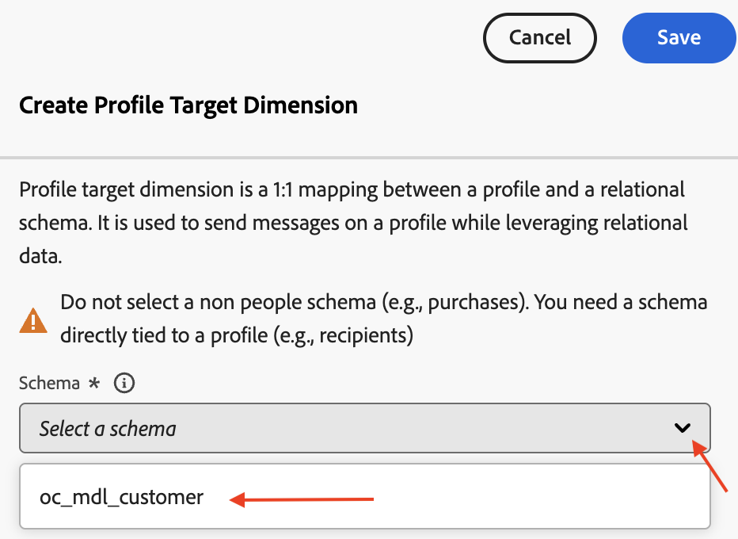
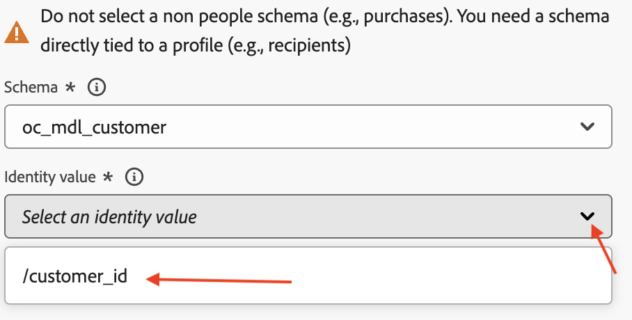
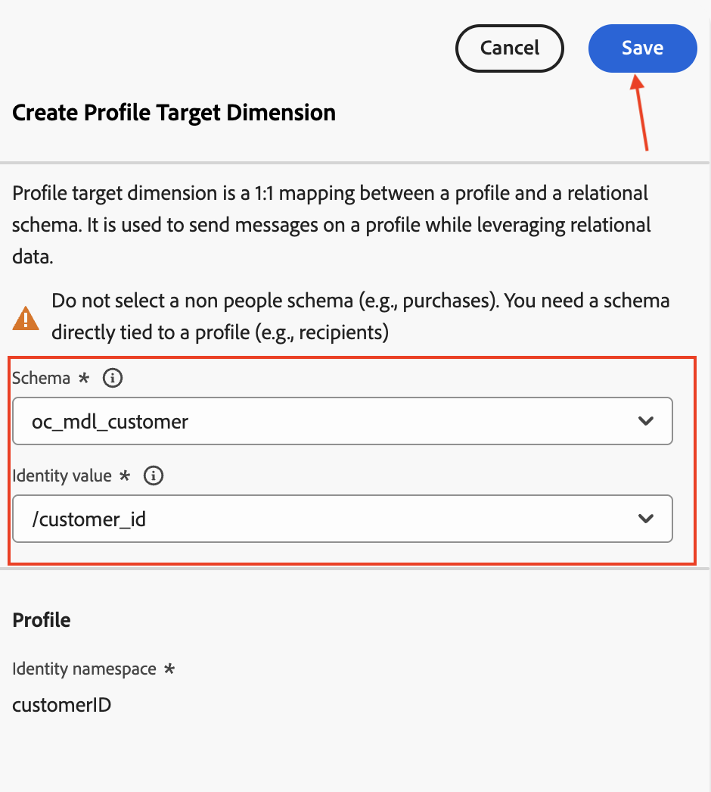

---
title: Create Campaign Target Dimension (cloned with children)
description: Create Campaign Target Dimension (cloned with children)
doc-type: article
exl-id: 957bfbe4-42c1-45fe-824e-11106ccc4b6b
---

This lab will cover configuring the Profile Target Dimension for the Relational schema created in the previous step.

The Profile Target Dimension in a relational schema is a configuration that enables targeting communications at the entity level. It leverages the relational schema capabilities of Adobe Experience Platform to define which schemas are eligible for targeting and how they are linked to the Real-Time Customer Profile schema.

# Configure Campaign Target Dimension

1. Click on the **Apps** icon and select **Journey Optimizer**

2. Click on **Configurations** under **Administration**

3. Select **Profile Target Dimension** and click on **Manage**

4. The Profile Target Dimension pane opens, click on **Create**

5. In the Create Profile Target Dimension section, select the recently created `oc_mdl_customer` schema from the drop down

6. For **Identity value** select the primary key, `customer_id`, for the `oc_mdl_customer` schema 

7. Click on **Save**

8. Wait for the confirmation message, the **Profile Target Dimension** for the `oc_mdl_customer` schema has been created

>[!TIP]
>The Profile Target Dimension has been created and will be used in the next lab.
>
>Congratulations! this concludes the Profile Target Dimension creation step in the lab.

# Reference

[https://experienceleague.adobe.com/en/docs/journey-optimizer/using/campaigns/orchestrated-campaigns/data-configuration/target-dimension](https://experienceleague.adobe.com/en/docs/journey-optimizer/using/campaigns/orchestrated-campaigns/data-configuration/target-dimension)
