This lab will cover validation and verification of data ingested in the previous section.

>[!WARNING]
>
>After data has been ingested into the dataset, it takes about 15 minutes for data to be synced to the relational store. 

# 1 - Verification of data in datalake

1. In the AEP UI, navigate to Datasets on the left rail

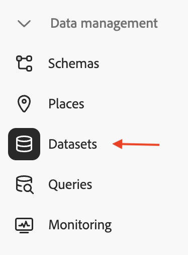

1. Search for `oc_mdl_customer` in the search box and click on the dataset

1. View the dataset details providing details on the records and time ingested. Click on **Preview dataset**

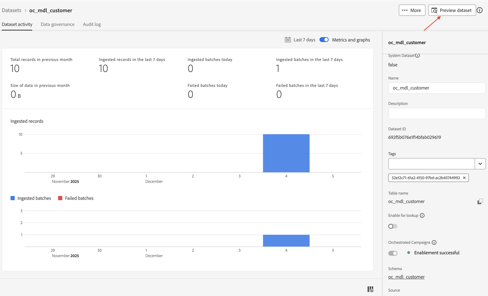

1. A preview of the data ingested into this dataset is shown along with the fields in the left pane

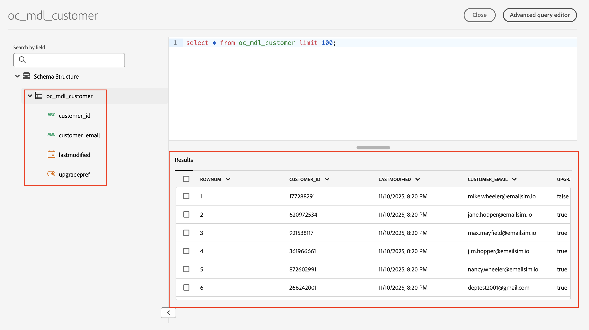

>[!TIP]
>
>The local file loaded in the previous lab has been successfully ingested into the dataset and resides in the datalake.

>[!WARNING]
>
>It takes about 15 minutes for data to be synced to the relational store. The next section will cover data verification in the relational store.

## 2 - Verification of data in relational store

1. Click on the **Apps** icon and select **Jour****ney Optimizer**

1. Click on **Campaigns**

1. Click on **Create campaign**

1. Select **Orchestration - Marketing**  and click on **Confirm**

1. Provide Campaign details:
   Name: **OC-RSL-MDL-Campaign-01**
   Description: **Relational Verification and Message Delivery Test**
   and click on **Save**

1. Wait for the confirmation message

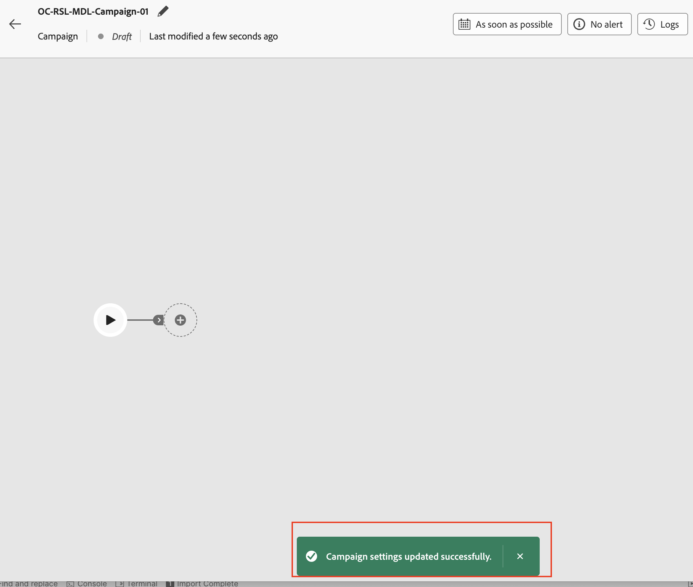

1. Click on the **+** within the canvas to open the options menu and then select **Build audience **from the **Targeting activities**

1. The **Build audience** activity opens the details pane on the right, click on the Search icon to select the **Targeting dimension**. The primary key from the relational schema `oc_mdl_customer` created earlier will be used

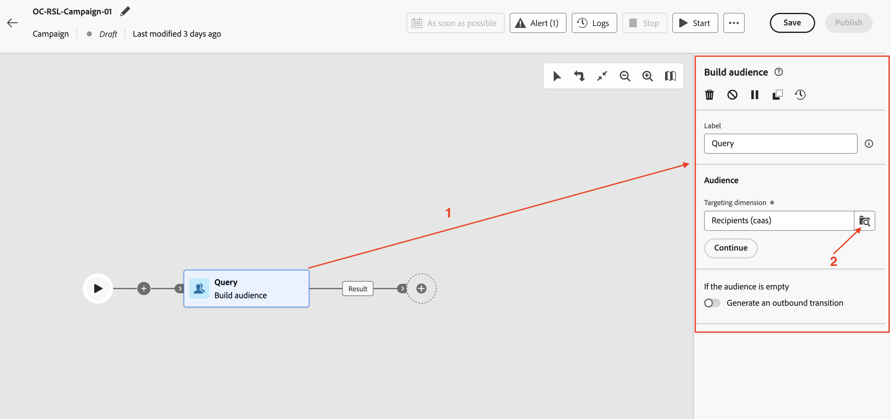

1. Search for the `oc_mdl_customer`Schema, select it and click on **Confirm**
10.

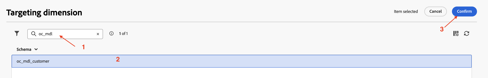

1. The `oc_mdl_customer`is selected, next click on **Create audience **button

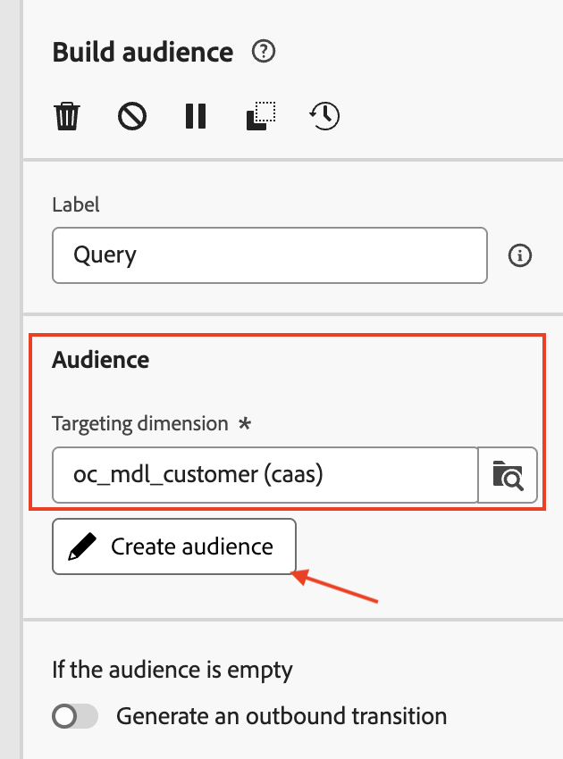

1. The Create audience details pane opens, click on **Add condition** 

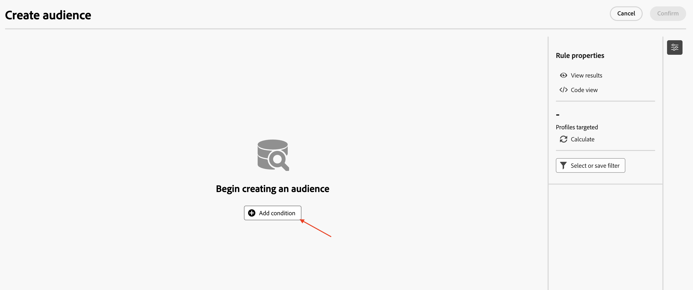

1. Select the `upgradepref` column for the `oc_mdl_customer` schema and click on **Confirm**

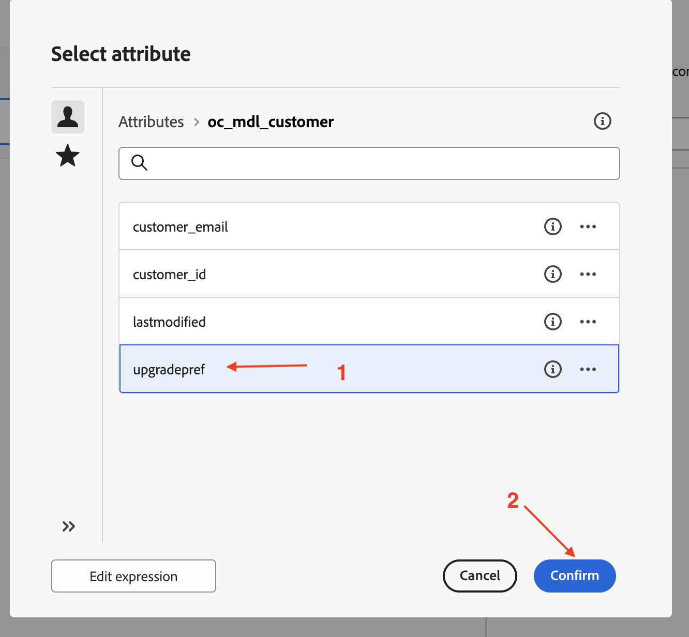

1. The `upgradepref` is selected, next for **Custom condition**, select **True** from the drop down. The test is to count

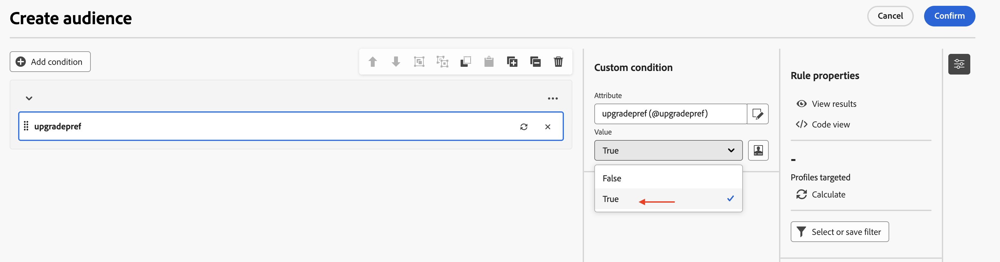

1. Click on the refresh icon to calculate and view the count results. There are two locations to help with calculating the results

1. The count (=7)  shows up for the number of rows in the relational schema that matched the `upgradepref = True` condition

1. To view the results (list of primary keys) which matched the above condition, click on **View results**

1. The list of primary keys are presented, click on **Close** to close the pane

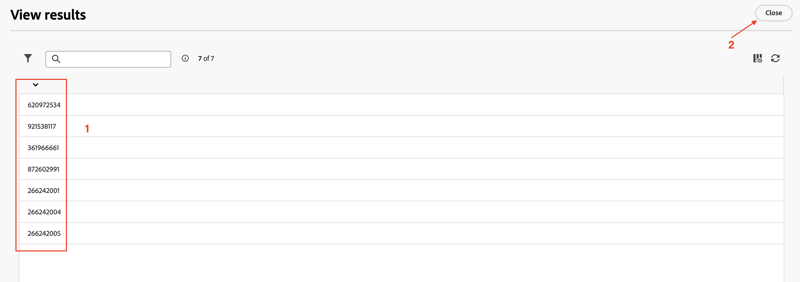

1. To familiarize with the query being executed, click on Code view. Then click on **Close** to close the pane

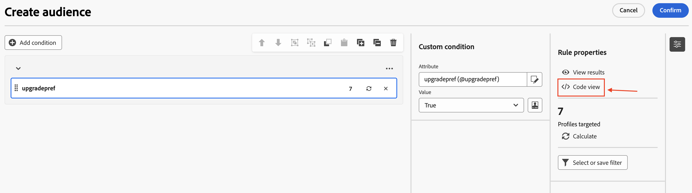

1. Click on **Confirm** to exit the **Create audience** pane

1. The canvas with the configured **Build audience** is presented. Click on **Start** at the top to run the campaign in **Test** **mode**

1. The **Test mode** executes the activities and presents the results without publishing the campaign. The **Result** node confirms the expected result (=7) from the audience . Click on the Result node to view the options available

1. Click on **Preview results** to view the results.  Click **Close** to close the pane

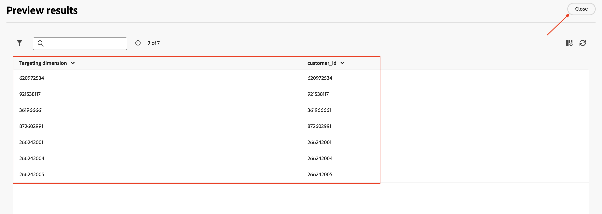

1. Click on **Stop** to stop the Test mode of the campaign

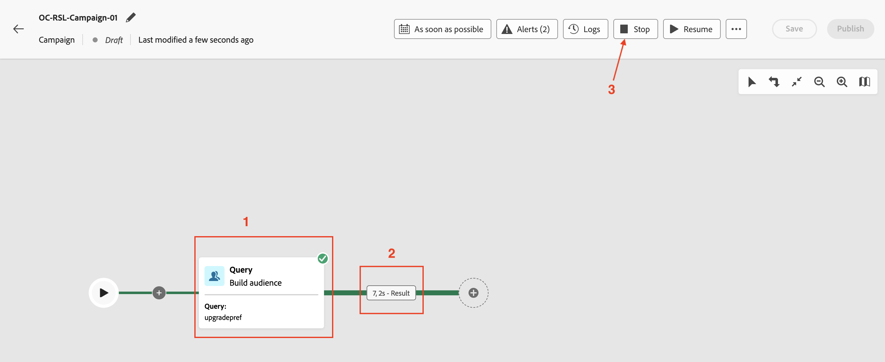

1. **Save** the campaign, if not saved already (Test mode typically, auto saves the campaign). The campaign will be used again in the Message Delivery in Action Lab. Click on **Campaigns** on the left side rail or the left arrow at the top of the canvas to exit out of the campaign

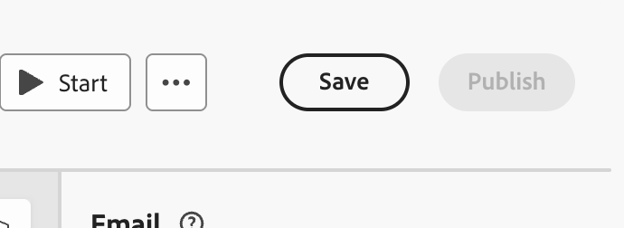

1. Click on **Campaigns** on the left side rail or the left arrow at the top of the canvas to exit out of the campaign

>[!NOTE]
>
>Note: The campaign created above will be re-used in the Message Delivery in Action Lab.

>[!TIP]
>
>The verification of the data in the  relational store is complete.
>
>Congratulations! this concludes the Relational data verification step in the lab.

