---
title: Read audience activity and Relational schema
description: Read audience activity and Relational schema
doc-type: article
exl-id: 293d6a9f-5dfd-49fa-b46d-ead2e3b9cc1b
---

This lab will cover using Relational schema with the Read audience activity. Orchestrated Campaign uses the  Relational schema for all the activities. When using the Read audience, which reads the audience from AEP, a corresponding Entity (Target Dimension) has to be configured to reconcile the audience with the Campaign Target Dimension. 

# Configure Read audience activity

1. In the left hand rail, click on **Campaigns**

2. Click on **Create campaign**

3. Select **Orchestration - Marketing**  and click on **Confirm**

4. Provide Campaign details:
   Name: **OC-RSL-ReadAudience-Test**
   Description: **RSL-Read Audience Test**
   ****
   and click on **Save**

5. Wait for the confirmation message

6. Click on the **+** inside the canvas to open the options menu and then select **Read audience** from the **Targeting activities**

7. In the **Read audienc**e details pane, click on the Search icon for **Audience**

8. Select the **dep: Basic Plan Members** audience with Profile Count of **9**

9. Next click on the drop down for **Entity** and select the `oc_mdl_customer - customer_id `for Campaign Target Dimension

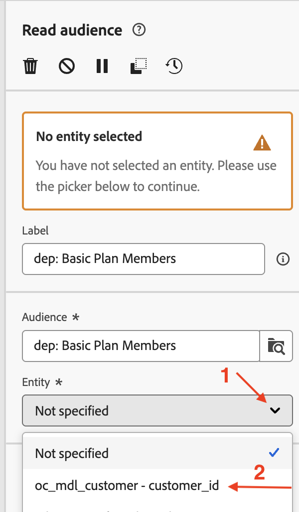

>[!NOTE]
>Other attributes can also be extracted from the AEP Profile for use in the canvas, using the **Add attribute **button. But for this lab, extra attributes are not required so that step is skipped.

10. The settings for the **Read Audience** activity are filled in. Click on **Start** to run the campaign in **Test mode**

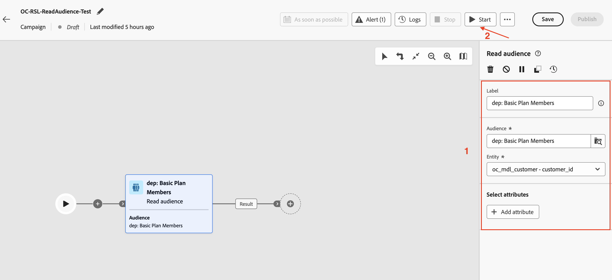

11. The test execution starts and the results are displayed when completed. Click on the **Result** node

12. In the details pane of the **Result** node, click on the **Preview results** button to see the results

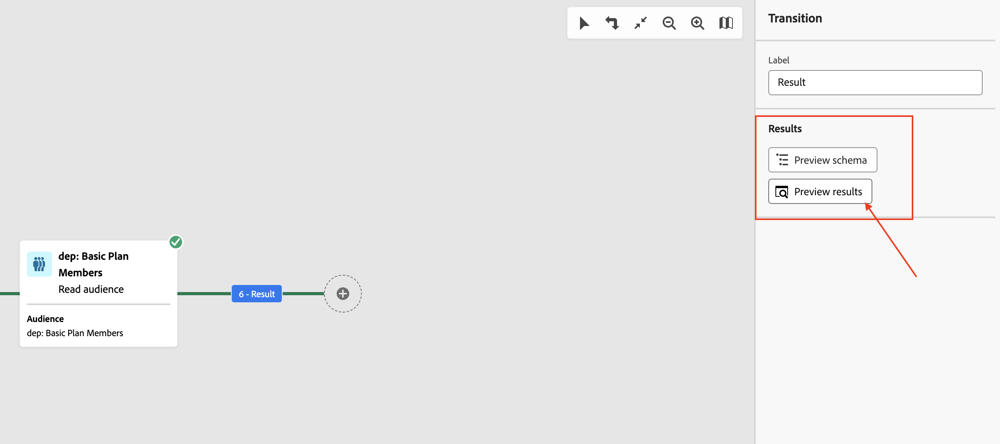

13. Notice that **2** profiles from the **Read audience** do not have a corresponding matching **Target dimension** from the relational schema. And since Orchestrated Campaign works off the Relational schema, the unmatched `customer_id` from the **Read audience** will be dropped and only the matched ones (**4** in this case), will be usable in subsequent activites that leverages relational data in the campaign.

14. Click on **Stop** to stop the **Test mode** of the campaign

15. Click on the **+** at the end of the flow and add **Split** from the **Targeting activities**

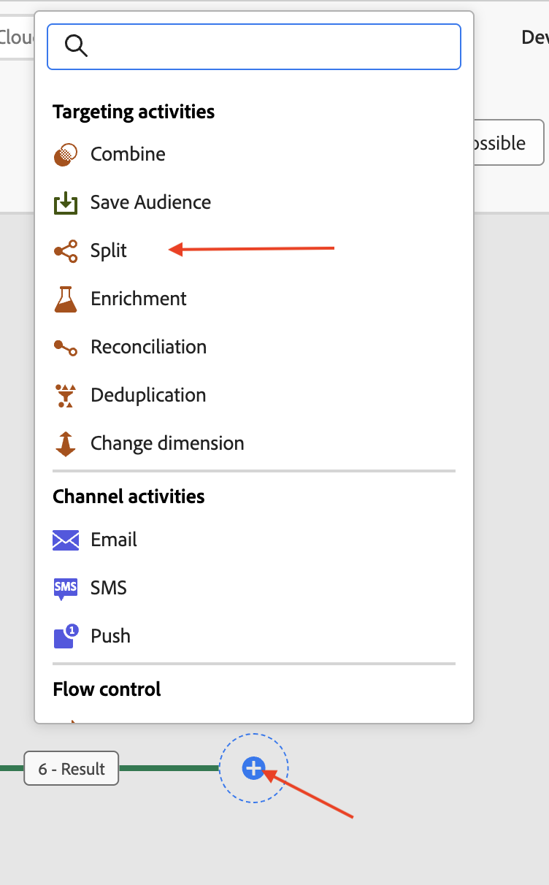

17. In the details pane of the **Split** activity, expand the first split called **Subset**

18. Rename it to "**Upgrade True**" and click on **Create filter **to set the filter condition

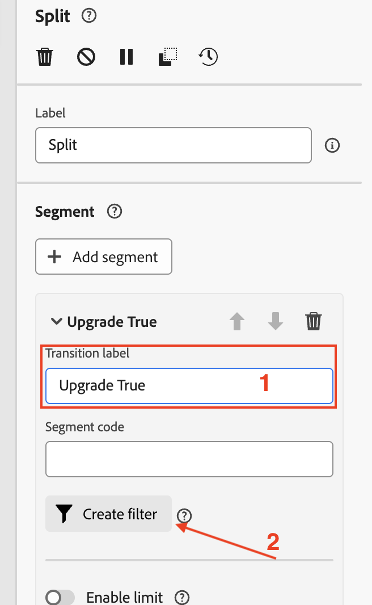

19. In the **Create filte**r pane, click on **Add condition**

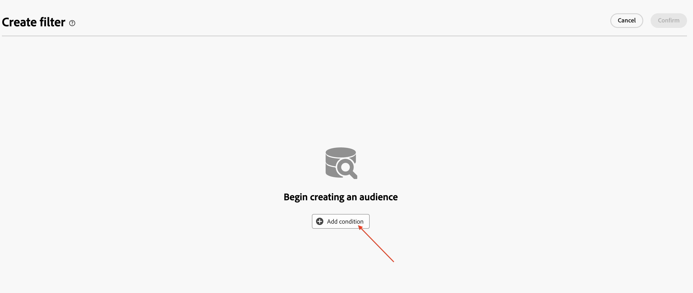

20. Since no other attributes were extracted from the AEP Profile, the only AEP Profile attribute available (reason ?) here is the `customer_id`. However, since there are matching Targeting dimension from the relational schema, all of the columns from the Relational schema are available for setting up the filter condition. Expand the **Targeting dimension** by clicking on  **>** 

21. Select `upgradepref` from the list and click on **Confirm**

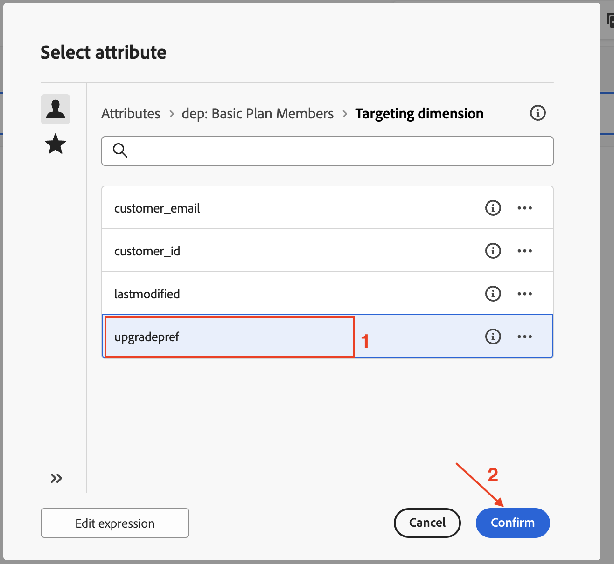

22. Since `upgradepref` is of Boolean type, for the **Custom condition**, select **True** from the drop down. Click on **Confirm** to exit

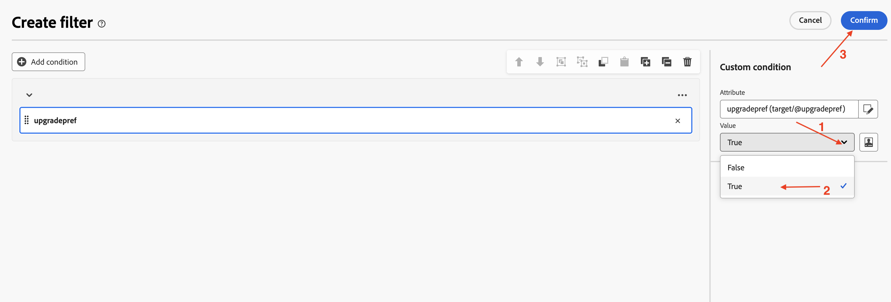

23. Back in the details pane of the **Split** activity, the settings for the first Split are complete. Click on **Add segment** to the second split

24. Rename it to "**Upgrade False**" and click on **Create filter **to set the filter condition

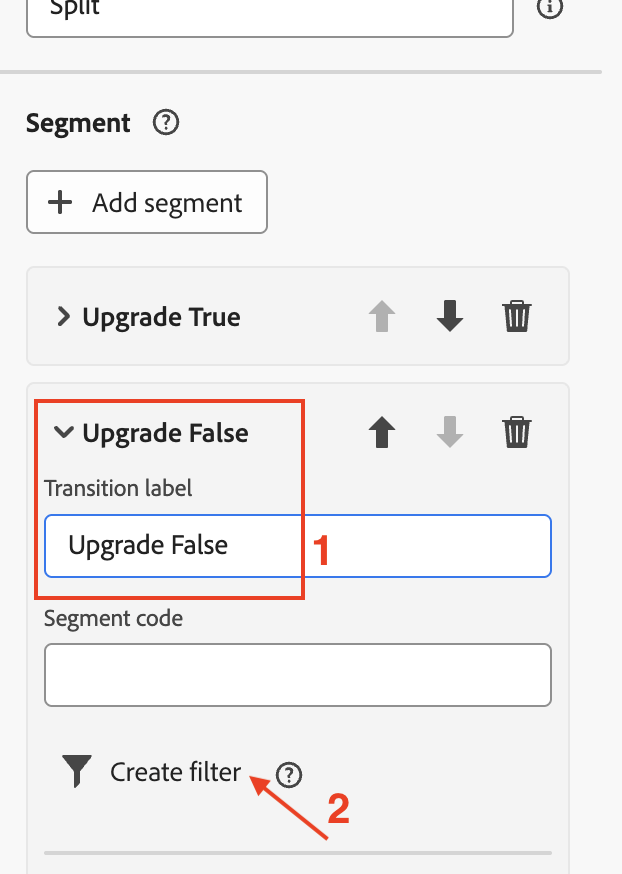

25. In the **Create filte**r pane, click on **Add condition**

26. Expand the **Targeting dimension** by clicking on  **>**

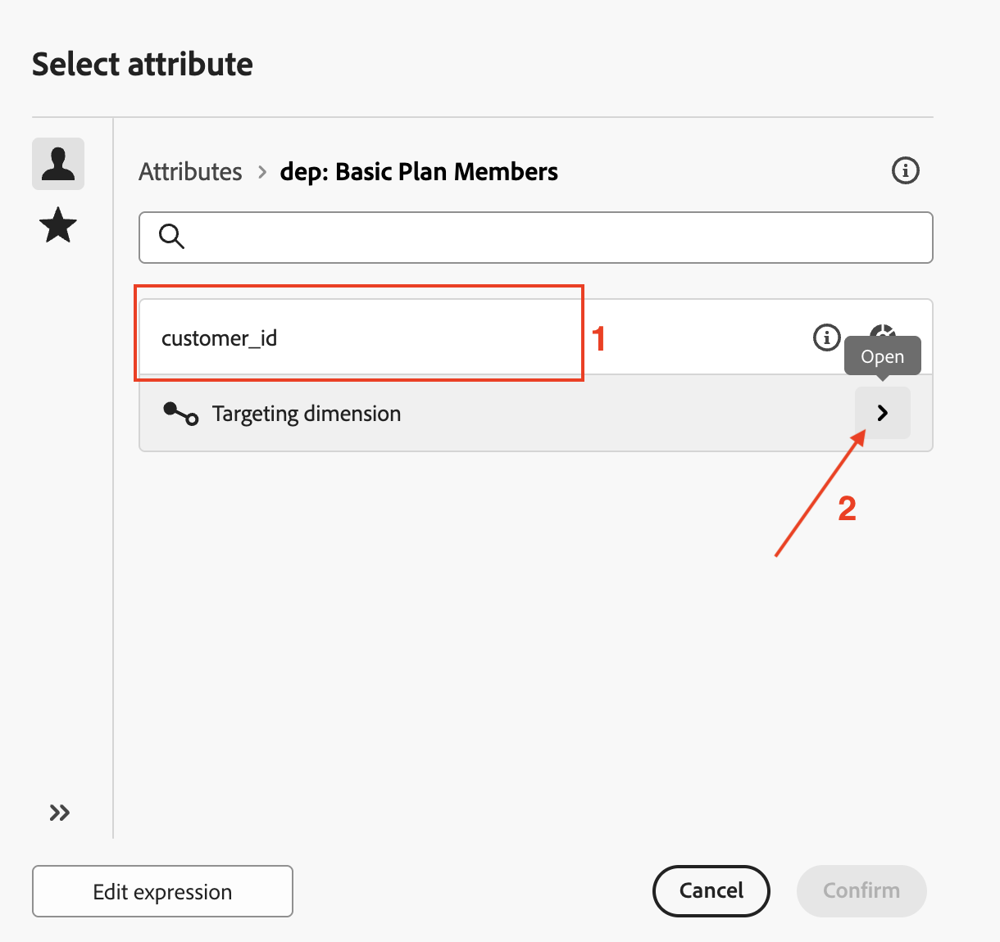

27. Select `upgradepref` from the list and click on **Confirm**

28. For the **Custom condition**, select **False** from the drop down. Click on **Confirm** to exit

29. Back in the details pane of the **Split** activity, the settings for the two Splits are complete. Click on **Start** to run the campaign in **Test mode**

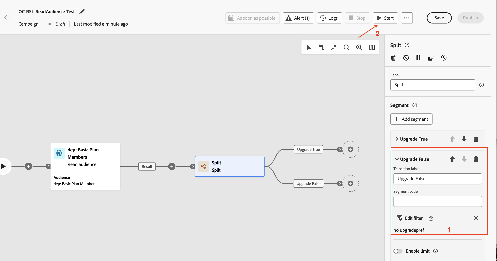

30. The test execution starts and the results are displayed when completed. As mentioned above, the activities in the campaign works off the Relational schema. And since only 4 matching targeting dimension were found in the Relational schema, the same count is observed in the Split operation (**3**  and **1**) as well.  Click on **Stop** to stop the **Test mode** of the campaign

>[!NOTE]
>While the Read audience showed 6 profiles, when it was joined with the Relational schema, via the Campaign Target Dimension, only a total of 4 profiles matched. These 4 matched customer ids are available for use in the following activities. Out of the 4 customer id matches, 3 customer ids had `upgradepref` set to **true** and 1 had it to **false**, which was evident via the Split flows.

>[!TIP]
>Congratulations, this completes the lab on using the Read Audience activity with Relational schema.

# Reference

[https://experienceleague.adobe.com/en/docs/journey-optimizer/using/campaigns/orchestrated-campaigns/design-campaigns/read-audience](https://experienceleague.adobe.com/en/docs/journey-optimizer/using/campaigns/orchestrated-campaigns/design-campaigns/read-audience)

