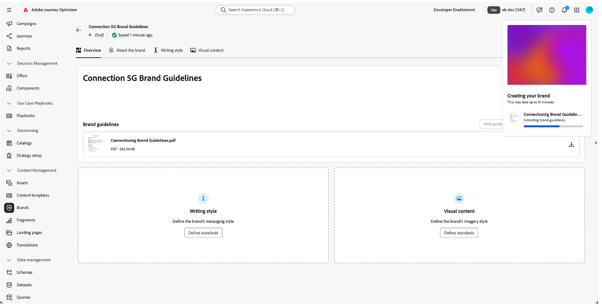
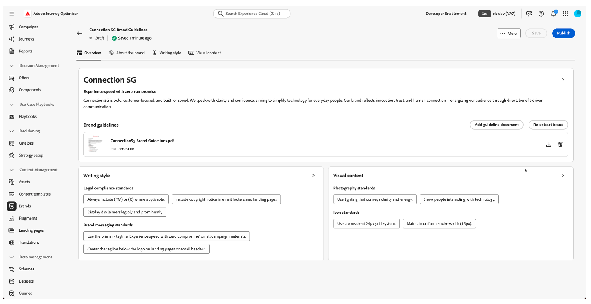
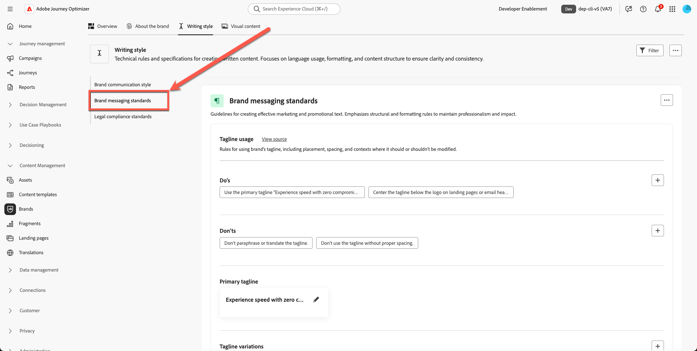
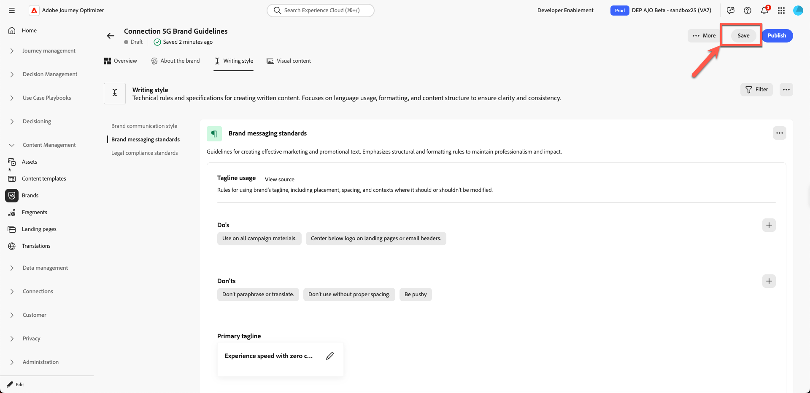
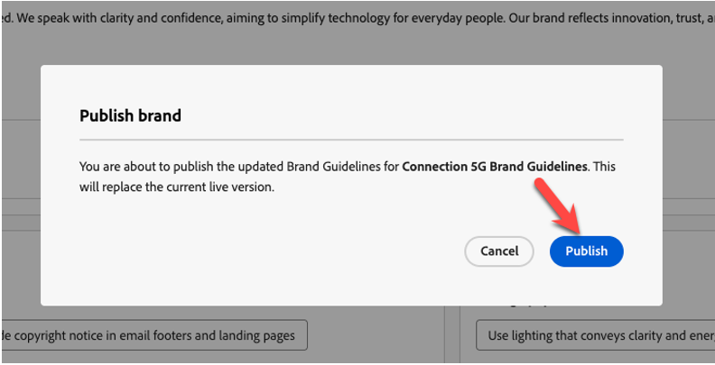

# Brand management

**Purpose:** Configure, refine, and publish the Connection 5G Brand Guidelines inside Adobe Journey Optimizer (AJO), so that all content and AI features stay aligned to the brand.

## Learning objectives

By the end of this module, you will be able to:

- Create a new brand in Adobe Journey Optimizer.
- Upload and extract brand guideline information from a PDF.
- Review and refine brand details across About the Brand, Writing Style, and Visual Content tabs.
- Add an exclusion rule to avoid pushy email button copy.
- Publish the brand so it is available to templates, fragments, AI Assistant, and Brand Alignment. 

Download File — [toolkit.zip](assets/toolkit.zip)

>[!NOTE]
>
>Before starting the hands-on labs, make sure to download the toolkit file (see below toolkit.zip). Unzip the file to access the images and supporting files required for the exercises. Keep these assets somewhere easy to access, as you will reference them throughout the lab.

## Introduction

In this module, you will build the **Connection 5G** brand inside AJO using a prepared brand guideline PDF.

Adobe Journey Optimizer’s **Brands** feature helps you define and maintain a consistent identity across all marketing efforts. From logos and colours to tone of voice and messaging style, creating a brand ensures that every email, campaign, and content piece reflects a unified personality.

We will be using pattern 1 from the lecture (AJO only) for this lab. Note that the assets are stored using **Assets Essentials**. 

You will start with the Connection 5G Brand Guideline document, upload it, let AJO extract key information, then refine and publish the result.

## Prepare the brand guideline

1. Open the **Connection 5G Brand Guideline** PDF from the toolkit folder (make sure you unzip it first). 

2. Review the document to understand content used for Connection 5G:
   - Tone of voice
   - Colours and visual style
   - Writing style and messaging examples
   - Imagery guidance
   - Legal and compliance notes

## Create a new brand in AJO

1. In Adobe Journey Optimizer, go to the left navigation and click **Brands**.
2. Click **Create Brand**.

3. In the **Name** field, enter `Connection 5G Brand Guidelines`
4. In the upload area, drag and drop the **Connection5g Brand Guidelines.pdf** file (or click **Select files** and choose it from your computer).

5. Click **Create brand** to begin the extraction.

A progress screen appears while AJO analyses your file. This may take several minutes depending on the size of the document.

6. Once extraction is complete:
   - A green confirmation bar appears at the top.
   - You are automatically redirected to the brand configuration screen.
   - Content and visual creation standards are now automatically populated based on the Brand Guidelines file uploaded.

7. Click on **Publish** button to publish the brand guidelines. 

8. Confirm by pressing "Publish" button to confirm. 

A green confirmation bar appears at the bottom of the page indicating that your brand is successfully published.

9. Click back on the main brand page and you see your brand is now live (this should be shown by a green dot with the label **"Live"**).

## Review the brand tabs

You will now review and understand the three key tabs that have been populated for Connection 5G.

### About the brand

This tab defines the brand’s identity at a high level. It typically includes:

- Brand name
- Core values
- Guiding principles
- Brand purpose and promises
- The feeling the brand wants to create

Everything else in the system builds from this foundation, so it is important that this tab reflects the true DNA of Connection 5G.

Spend a moment browsing the extracted fields and checking that they match the original PDF.

### Writing style

The **Writing Style** tab defines how the brand communicates. It includes:

- Tone guidelines
- Dos and Don’ts
- Example phrases and key messages
- Taglines and slogans
- Legal rules such as when to include trademarks

You can add and refine rules in natural language and even apply them only to specific channels, such as email or SMS. This gives you flexible but precise control over how AI Assistant and content authors should write.

### Visual content

The **Visual Content** tab outlines how the brand should look. It covers:

- Photography standards
- Illustration style
- Iconography rules
- Visual Dos and Don’ts

This ensures everything from images to icons feels consistent and aligned with Connection 5G’s core values.

## Add missing vision and market positioning

In the extracted content, some guiding principles may be incomplete. Now complete them using the official wording from the PDF.

1. Click on the brand you just created

2. Click **Edit Brand**. A confirmation tab appears; click **Edit Brand** again to confirm.

3. Go to the **About the Brand** tab.

4. Locate the section for **Guiding principles**, **Vision**, or similar high-level description.

5. Add the following text:

**Vision:**

>Empower every individual with instant, reliable connectivity that enhances life, work, and play, no matter where they are.

**Market positioning:**

>Connection 5G delivers premium-speed mobile service designed for digital lifestyles, standing out with unmatched reliability, simplicity, and future-ready innovation.

6. Click **Save**. (If you do not see the **Save** button, click the **Overview** tab first, then click **Save**.)

>[!TIP]
>
>You have now ensured that the brand’s purpose, vision, and market positioning are clearly represented in AJO.

## Add an email button exclusion rule

Next, enhance the brand by adding a rule that ensures email buttons are never written in a pushy way.

1. Go to the **Writing Style** tab.

2. Make sure you are in the **Brand communication style** section.

3. Under the **Don’ts** area, click the **plus** icon to add a new rule.

4. Configure the rule as follows:
   - **Exclusion:** `Be pushy` 

>[!NOTE]
>
>This is added as a Don’t rule, meaning the brand does not want pushy CTAs

**Channel:** Email

**Element:** Button

5. Click **Add**.

6. Confirm that the new Don’t rule appears as `Be pushy` in the list.

7. Click **Save**.

This rule applies wherever AI Assistant or authors work on email button copy, keeping CTAs aligned with the Connection 5G tone.

>[!NOTE]
>
>You may see other 'don't' rules listed that don't match the screenshot exactly. Ignore this as it is expected behaviour. 

## Publish the brand guidelines

Once you are satisfied with the configuration:

1. Go back to the **Overview** tab. Click **Save**. 
2. In the top right corner, click **Publish**.

3. A confirmation dialog appears explaining that you are about to publish the updated Brand Guidelines for Connection 5G. Click **Publish** again to confirm.

4. Wait for the green confirmation bar to appear.
5. Click **Back** to return to the Brands list.
6. Verify that a new card appears for **Connection 5G Brand Guidelines** with a status showing it is Live and available.

Your brand is now live and ready to be used throughout Adobe Journey Optimizer.

## Recap

In this module, you:

- Reviewed the Connection 5G Brand Guideline PDF.
- Created a new brand for Connection 5G inside Adobe Journey Optimizer.
- Uploaded the brand guideline file and allowed AJO to extract key information.
- Reviewed and refined the About the Brand, Writing Style, and Visual Content tabs.
- Added a specific exclusion rule so email buttons are never pushy.
- Published the brand so it can power AI Assistant, Brand Alignment, templates, and fragments.

You now have a fully configured and published **Connection 5G** brand profile that will be used across the rest of the lab to keep all content on-brand.
