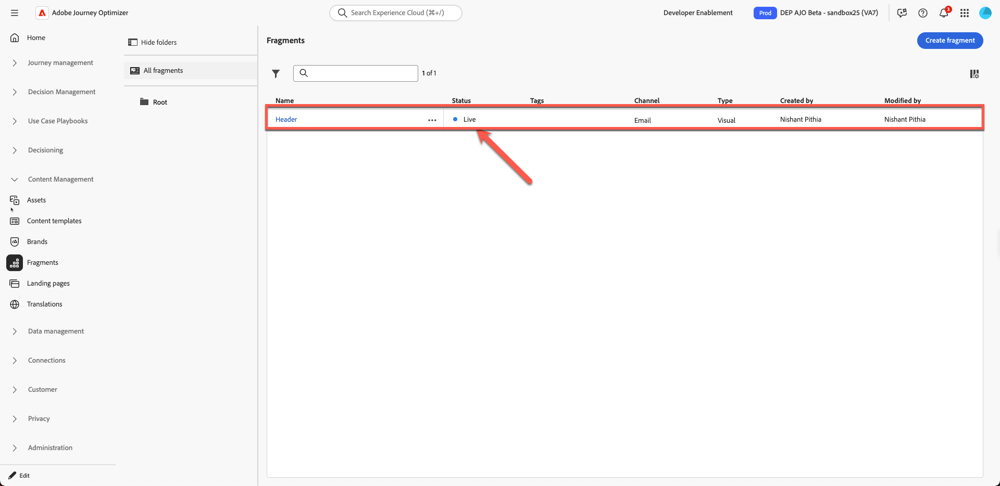

# Building content fragments

## Content creation with templates & fragments

**Purpose:** Learn how to create reusable fragments in Adobe Journey Optimizer, then apply them inside a real email within a journey.

## Learning objectives

By the end of this module, you will be able to:

1. Break down an email design into reusable fragments.
1. Create header, footer, banner, body, and CTA fragments.

## Why fragments matter

Fragments allow you to create consistent, brand‑aligned content that can be reused across emails, campaigns, and journeys.

### Fragments

Reusable building blocks such as:

- Headers
- Footers
- CTAs
- Banners
- Legal disclaimers

Whenever a fragment is updated, all emails using it update automatically.

## How this fits into email creation

- **Create fragments** for elements that rarely change.
- **Build a template** that uses those fragments.
- **Use the template** in your campaign email and customise its content.

Below is the final email you will create from this lab.

But the design team normally provides you with templates such as this:

## Step 1: Create content fragments

The below template is a generic design template and our goal is to break this down into repeatable content blocks. In Adobe journey optimizer this is called **Fragments**. 

The first step is to identify how many fragments do we need to create. In this template it makes sense to use 5 fragments as shown below. 

We have identified the templates requires 5 fragments as follows. 

- Header
- Banner
- CTA
- Body
- Footer    

>[!NOTE]
>
>For this exercise, you create only one header fragment to save time. 

Create a header fragment to start with. However, before creating the fragment, set up an asset folder since the assets environment is shared. To do this, first create your own folder. 

1. From the left-hand navigation, locate the **Content Management** section and click on **Assets**.

   

2. Click on **Assets** under Assets Management section.

   

3. Create a folder by clicking **"Create Folder"** button. 

   

4. Give a name like your first and last name. eg. Nish\_Pithia\_LabAssets (Something you can remember)

   

5. **Create a new fragment:** Under Content Management click on **Fragments** and create new fragment.

   

   Give a friendly name as shown below. Add all details as follows:

   **Name:** Header

   **Description:** Fragment Header for the template

   **Type:** Select Visual fragment

   

6. Click on **Create button** on your top right.

   

   This opens a blank fragment creator screen. 

7. Click on 1:1 Columns under Structures and drag on the canvas as shown below. (Please click on the image below to see animated graphic)

   

8. Next, drag "**image**" on the 1:1 row which we just added

   

9. Upload the logo image that you have been provided. Click on **"Import media button"**

   

10. **Upload the logo:** Upload the logo (*C5G-Logo.png*) from the toolkit folder of images and click next.

   

   

11. Select the **asset folder** that you have created, then click **Import**. The file is saved in your folder.

   

12. The logo is placed correctly, but it is too large and needs to be resized. To resize the logo, update its properties. Click the **Style tab** and set the width to 40% by dragging the slider, as shown below. 

   >[!NOTE]
   >
   >Note that when the toggle button is on, the 40 number represents % and not pixels. If you want an absolute pixel-perfect value, toggle the button to px. 

   

13. Click **“Save”** and your fragment is saved. You get a green bar notification on the confirmation. 

   

14. The fragment saved is in a draft mode. Before you use it, you need to publish it. Click on the **back** button. 

   

15. Click "**Publish**" button. You see a message "Publishing fragment, this may take some time. We will notify once done." on confirmation. Your fragment is ready to be used for template creation. 

You see the status change to **"Live"**. At this point, you have completed building a header fragment, which is used in the next step. 

>[!NOTE]
>
>Note that in this exercise, you created only one fragment. In practice, architects may choose to create multiple fragments, such as headers, footers, or other reusable components.

## Recap

In this module, you successfully:

- Broke down an email into reusable header fragment
- Created a header content blocks

You are now ready to move on to the next module - **Building content template**, where you will use fragment you created to generate new template.
