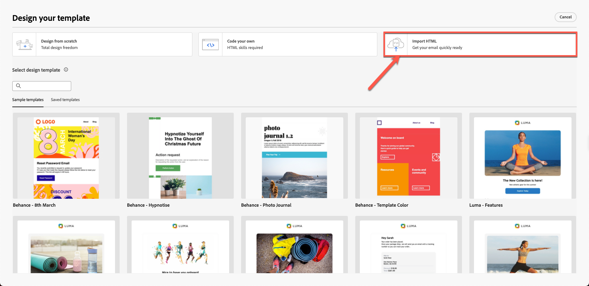
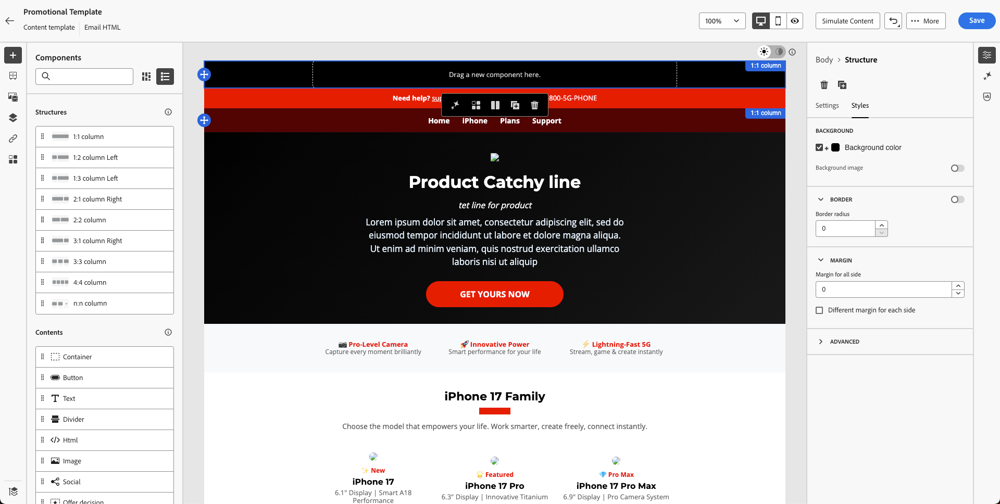

# Building content template

## Content creation with templates & fragments

**Purpose:** Learn how to create reusable templates in Adobe Journey Optimizer

## Learning objectives

By the end of this module, you will be able to:

1. Build a full email template using imported HTML and fragments.

## Why templates matter

Templates allow you to create consistent, brand‑aligned content that can be reused across emails, campaigns, and journeys.

### Templates

Blueprints that structure:

- Header placement
- Body content area
- Footer area
- Standard layout styling

Templates ensure brand consistency across teams and save significant creation time.

## Create a new template using fragments

Templates help users reuse full layouts across campaigns. Content templates in Adobe Journey Optimizer are powerful tools designed to simplify and streamline the way you create reusable content for campaigns and journeys. Whether you’re crafting an email, SMS, or push notification, templates help you save time by providing pre-designed structures that can be easily customized and shared across projects.

For an accelerated and improved design process, create standalone templates to reuse custom content easily across Journey Optimizer campaigns and journeys.

This functionality allows content-oriented users to work on templates outside campaigns or journeys. Marketing users can then reuse and adapt these standalone content templates inside their own journeys or campaigns.

## Create template

1. Go to **Content Management → Content Templates**.

2. Click **Create Template** and then fill in the following:
   - **Name:** `Promotional Template`
   - **Description:** `Promotional Template for phone products`
   - **Channel:** `Email`

3. Click **Create**.

## Add subject line & open email designer

1. Add subject line: `Promotional Template` and click **on the email body** to open it to edit

2. You see three options: 
   1. Design from scratch
   2. Code your own
   3. Import HTML

Select the third option. Click **Import HTML**

## Import provided HTML template

1. Upload the template html file from the toolkit folder `promotional-template-final.html`

2. Click on Import button to **import** the template. 

3. Wait for the layout to render. You notice issues like broken image links and missing branding. (This is expected behaviour as we have placeholder assets)

## Explore template structure

### Left panel

The "**Structures**" and "**Contents**" components in Adobe Journey Optimizer (AJO) are essential elements used when designing emails, landing pages, and content fragments. Structures define the layout framework, while Contents provide the actual building blocks placed inside those layouts.

The body section in Adobe Journey Optimizer is the main container for your email or page content. It serves as the root of the visual design space, where all structure components (columns, layouts) and content components (text, images, buttons, etc.) are nested.

### Right panel

The "**Settings**" and "**Style**" options under the body section in Adobe Journey Optimizer allow you to define the foundational look and layout of your email or page. These controls affect the entire design since the body is the parent of all components.

On your left hand rail bar you find sections for: 

- Fragments
- Files
- Body structure 
- Tracked URLs

You see the header fragment that you created in the previous exercise appear here as shown below. Make sure your header fragment shows as live with a blue dot and not in draft mode. Spend time checking the rest of the sections. 

> [!NOTE]
>
>If you do not see your fragment here it means that you did not save it properly and need to re-upload it.

## Insert header fragments

Now improve the template. You have already created the header and footer. 

1. Drag a **1:1 Column** above the existing content.

You see something like this. 

2. Your background uses the template background color, which is currently black. Set its **background colour to white. Click** in the Style tab on the right rail and use white colour from the colour picker. 

3. Open **Fragments** and drag in your **Header** fragment.

4. Notice that the header fragment is neatly aligned to your template as shown below.

5. Click the **Save** button to save your template and then click **Back**.

>[!NOTE]
>
>Note that you may see some broken images. We will fix that later. 

## Recap

In this module, you successfully:

- Imported HTML to build a full promotional template

You are now ready to move on to the next module - **Creating the email**
