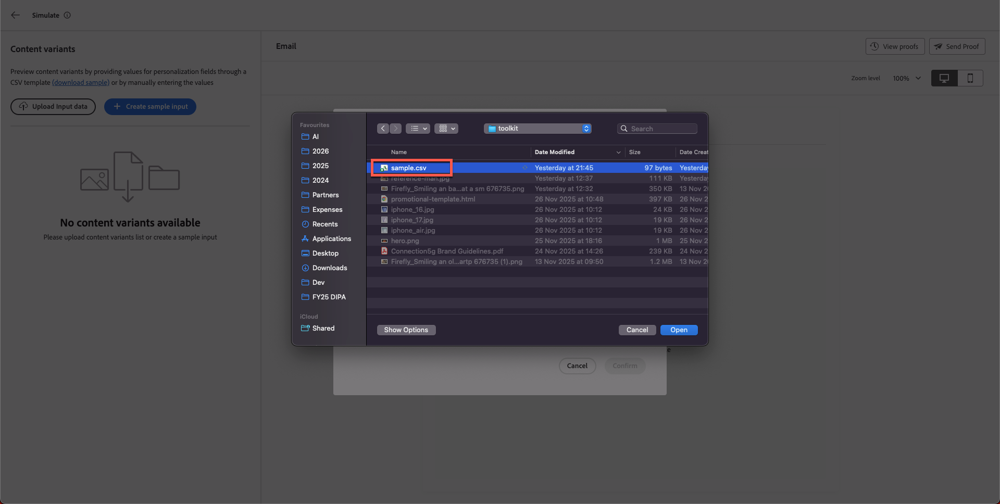

# Content simulation

**Purpose:** Validate personalisation, conditional logic, and content variants using Adobe Journey Optimizer’s Simulation and Proof tools.

## Learning objectives

By the end of this module, you will be able to:

1. Upload and use test profile data for simulation.
1. Validate personalised fields and variant logic.
1. Test fallback behaviour for missing or unmatched data.

## Introduction

In this final module, you will test your email with **two conditional variants** using the Simulation tool in Adobe Journey Optimizer.
This allows you to preview how different customers will experience your personalised message, ensuring accuracy before launching the campaign. 

You will use the sample test profile file **sample.csv** from your toolkit.

## Open the simulation tool

1. Open your completed email.
1. Click **Simulate Content**.
1. Select **Simulate content variation**.

A simulation panel opens after few seconds.

## Upload the test profile data

1. Open **sample.csv** from your toolkit folder.
   - **Alex** → Above 40 years old 
   - **Jason** → Below 40 years old 
2. Click **Upload Input Data**.

   

3. Choose **sample.csv** and click **Continue**.

AJO processes the file and prepares previews.

## Review variant rendering

AJO shows both variants side by side based on the uploaded profiles.

**Expected outcomes:**

- **Alex** → Sees **Variant 1** (Age above 40)

If you scroll up you also see personalised fields with the name now, as you can see below. 

- **Jason** → Sees **Variant 2** (Age below 40)

With Jason's full name as well. How cool is that!

## Validate fallback behaviour

**Fallbacks and Defaults:** Check that your email handles any missing data or no-match scenarios gracefully. For example, simulate a profile with an empty birth year field or one that doesn’t qualify for any targeted offer. The preview should either show a default content block or a sensible placeholder instead of broken or empty content. If your simulation shows an empty section where content should be, that indicates you may need to configure a fallback offer or default text in your design.

## Recap

In this module, you successfully:

- Simulated personalised content using sample profiles
- Validated variant switching logic
- Confirmed personalised fields populate correctly

You are now ready for the next module - **Brand alignment**,
where you will evaluate your email against Connection 5G brand guidelines using AI.
