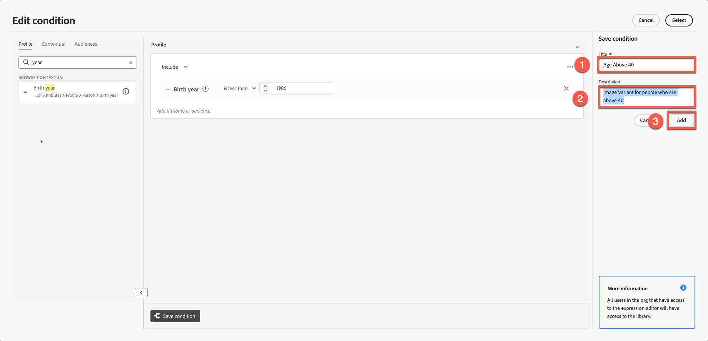
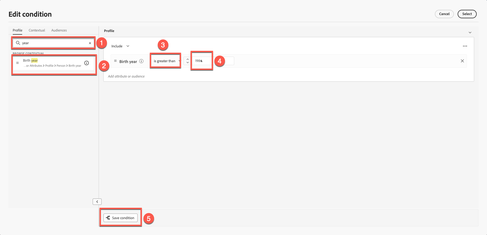

# Personalization and content experimentation

**Purpose:** Learn how to personalise email content using profile attributes, build dynamic content variants, and apply conditional logic in Adobe Journey Optimizer.

## Learning objectives

By the end of this module, you will be able to:

1. Add personalisation fields using profile attributes.
1. Use the Personalisation Editor and Handlebars syntax.
1. Build dynamic content variants based on profile logic.
1. Create conditional rules for personalised content blocks.
1. Test variant switching based on attributes such as birth year.

## Introduction

Personalisation in Adobe Journey Optimizer enables one-to-one experiences at scale.
In this module you will:

- Insert personalised text (first and last name)
- Build age-based content variants
- Apply conditional logic using profile attributes
- Prepare content for simulation in Module 7

Personalization in Adobe Journey Optimizer empowers you to craft tailored, impactful customer experiences by dynamically customizing content based on individual profiles, behaviors, and contextual data. Whether you’re creating personalized emails, notifications, or offers, the tools and techniques provided make it easy to connect the right message to the right person at the right time. Learn how the Personalization Editor, Handlebars syntax, and Adobe Experience Platform data work together to bring your ideas to life, explore reusable content blocks with expression fragments, and dive into advanced helper functions to unlock deeper possibilities. Each topic builds your skills step-by-step, ensuring you’re ready to design personalized journeys with confidence.

## Add basic personalisation

This part of the exercise keeps personalisation simple. Add the first and last name to the email based on the profile. Personalization is based on the profile data that are managed by the XDM Individual Profile schema which you have defined. The XDM Individual Profile schema is the only schema you can use to personalize content in Journey Optimizer.

1. Open your email created in earlier modules.
2. Add a text block above the hero title with the content: **Hi,**
3. Click the **Personalisation** icon.

4. Search for **F****irst Name**.

5. Click **+** to add it to the expression area. 
6. Add a **space** after the **First name** field.

7. Repeat the process above but this time search and add **Last Name**.

Your final syntax shows first and last name variables clearly separated.

8. Validate the fragment. Note that there is an option to save the content as fragment. This is a great opportunity to do if you're using Full name for other email content creation. Skip this and go to the next step. 
9. Click **Save** 

Your view looks like this. Curly brackets consist of variables, and each individual receives an email with their name. 

At this point, you know how you can add personalisation for individual profiles. 

## Introduction to dynamic content

Dynamic content in Adobe Journey Optimizer empowers you to create personalized messages that adapt seamlessly to your audience. By using conditional rules, you can tailor emails, SMS, and push notifications based on profile attributes, audience membership, or real-time events. Whether you’re crafting a fallback message for when specific criteria aren’t met or saving reusable rules for consistency, the personalization editor and Email Designer offer intuitive tools to bring your ideas to life.

This is a perfect use case for adding some conditional content to the email and personalizing it based on the user's age. 

Refer back to your schema: You have **"person.birthYear"** as birth year. This attribute can come in handy. Target and set up a campaign based on age. 

For this exercise, you will create two variants based on age. One variant targets users above 40 years old, and the other targets users below 40 (perhaps in mid 20s and 30s). Anyone born before the year 1986 is considered above 40, while anyone born in 1986 or later is considered below 40.

**Age Logic**

You will use the profile attribute `person.birthYear`.

| Target Group | Condition         |
| ------------ | ----------------- |
| Above 40     | birthYear \< 1986 |
| Below 40     | birthYear >= 1986 |

## Create two image variants

Remember this block we created in our previous module? Your image is different from mine. 

Create another image for those aged below 40 (remember, you created a Firefly image of a person in their mid-40s) and use that for this exercise.

1. Select the existing image block. (Click on the image) and click **Conditional Block**.
2. Click **Add Variant**.

3. Rename the first variant to **Age above 40**.

4. Create a new Variant by clicking on **"Add Variant"** button and Rename it to **Age below 40.**

5. You could potentially create an image using Firefly by using a prompt such as “mid-20-year-old.” However, to save time, we already have an image in the toolkit called “**variant-age-below-40.jpg**. 
6. Click on the image and Import Media.

7. Select **variant-age-below-40.jpg** image. Import it by clicking **Next** and finally press **Import** in your folder (you should already be in your folder by default).

8. Try to toggle between variants and you see a different image applied. 

So far, you've built the design but haven't applied the logic yet. The next step applies the logic. 

## Apply conditional logic to variants

Both of the variants are ready but you have not yet applied conditional logic. 

## Logic for “Age above 40”

1. Select and hover the **Age above 40** variant.
2. Click the **Conditional Logic** icon.

3. Create a new condition.

4. Search for **year** in the attribute list.
5. Drag **Birth Year** into the canvas.
6. Set condition to:
   - **birthYear \< 1986**

7. Name the condition: **Age above 40**
8. Add a description - "**Image Variant for people who are above 40**"
9. Click **Add → Select**.

## Logic for “Age below 40”

1. Select and hover **Age below 40** section. 
2. Repeat the steps but change the logic to:
   - **birthYear >= 1986**

3. Name the condition: **Age below 40**
4. Add description. "**Image Variant for people who are below 40**"
5. Click **Add → Select**.

## Validate variant switching

Toggle between both variants to ensure:

- Correct images appear
- Logic is correctly applied
- No variant is showing as "No condition applied"

Variant: **Age above 40**

Variant: **Age below 40**

Click "**Save**" button to save the email. 

## Recap

In this module, you successfully learned how to:

- Add personalisation fields for one-to-one messaging
- Build dynamic image variants
- Apply conditional rules based on age

You are now ready for the next module - **Content simulation**, to test both variants.
