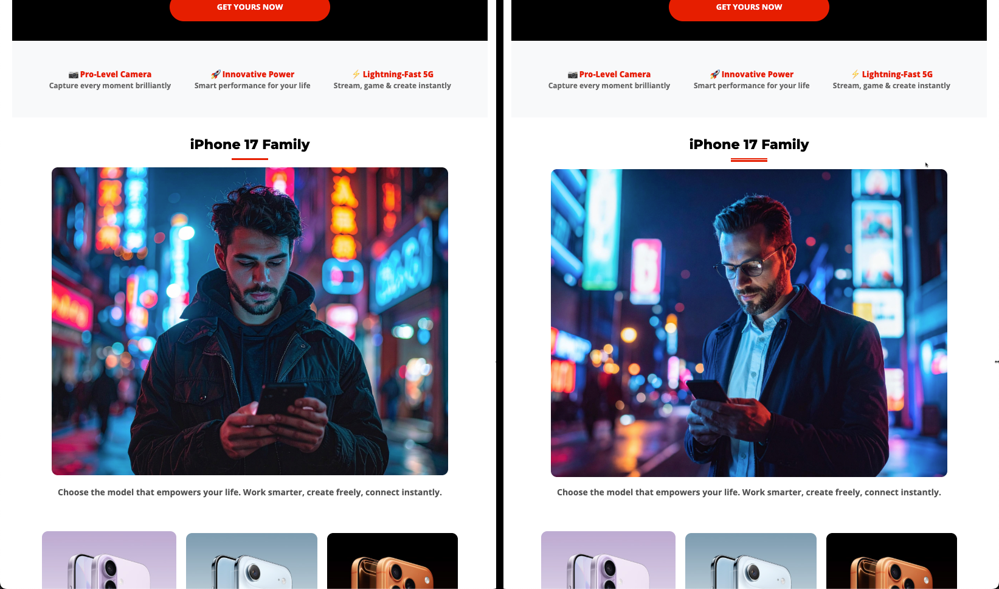

# Test the email

## Learning objectives

By the end of this module, you will be able to:

- Send proof emails from the Adobe Journey Optimizer email editor. 
- Validate personalized content and conditional variants using proof emails. 
- Verify proof email delivery in your inbox, including handling spam and clipped messages. 
- Review proof delivery logs, timestamps, and variants within Adobe Journey Optimizer. 
- Confirm that email content is accurate, personalized, and ready for activation.

## Send proof emails (optional, but recommended)

At this point, you have learned that we can not only personalize the profile attributes but also use attributes to create conditional logic that would determine the content you want to show. Adobe Journey Optimizer is extremely powerful and gives marketers a lot of flexibility. 

1. Click **Simulate Content**.
2. Select **Simulate content variation**.

A simulation panel opens.

3. Click **Send Proof**.

4. Add your own personal email address.

>[!NOTE]
>
>Note that at times your corporate email will block emails from the sandbox. I would recommend you to use your personal email. 

5. Select both variants.
6. Add Subject Line Prefix
   1. Variant 1: Above 40 
   2. Variant 2: Below 40 
7. Click **Send Proof**. You get a green confirmation message "**Proofs sent successfully**"

Verify that both emails have landed in your inbox.

>[!NOTE]
>
>Proof emails may land in **Spam** depending on filters. 

You may experience clipped message but it is fine, since some of the footer links are not real. If you click on the link you see both emails with variants have come through. 

### Verify proof delivery in AJO

Finally, you can also see proof delivery in Adobe Journey Optimizer.

1. Return to the email editor.
2. Go back to the email creation screen and click **View Proof**.
3. Review delivery logs, timestamps, and sent variants.

You notice your proof email details. 

## Recap

In this module, you successfully:

- Sent and verified proof emails in AJO

You have now completed the full Connection 5G AJO Lab Journey and validated that your email is accurate, personalised, and ready to activate.
