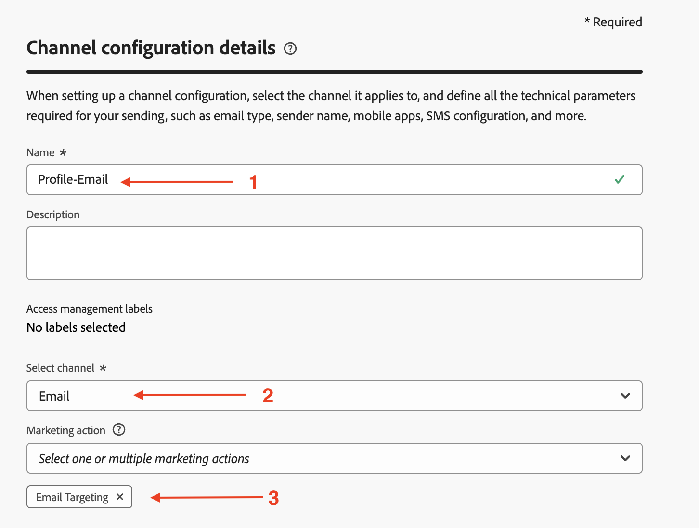
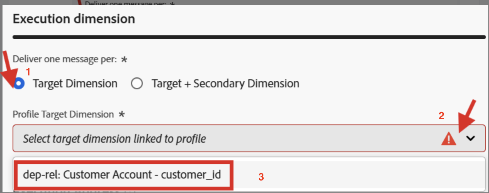

# Configure for Profile

## Objective

In the next set of steps you will create an Email Channel Configuration with both Journeys and Orchestrated Campaigns using the `personalEmail.address` AEP Profile attribute 

## Create channel configuration

1. Navigate to **Channel Configurations** found under the menu **Administration → Channels → General settings**
2. Click the **Create configuration** button

   

3. In the Create wizard set the following values:
   - **Name:**  `Profile-Email`
   - **Channel:**  `Email`
   - **Marketing action:**  `Email Targeting`

>[!NOTE]
>
>On selecting Email as the channel, a new section **Email settings** shows up.

## Configure email type

Set the **Email Type** to **Marketing**

## Configure subdomain

From the **Subdomain** dropdown, select **email.dep-labs.com**

>[!NOTE]
>
>If you're self-paced and don't have a pre-provisioned subdomain, select your own subdomain delegated to Adobe here instead of `email.dep-labs.com`. See [Setup](../../setup.md) for how to delegate one.

## Configure IP pool details

From the **IP pool** dropdown, select **marketing**

## Configure list unsubscribe

1. Ensure that the toggle is **enabled** for list-unsubscribe
1. Under the List unsubscribe preference area make sure all the checkboxes are **checked**
1. Under Link management make sure **Adobe managed** is selected
1. For the Consent level make sure this is set to **Channel**

## Configure header parameters

1. Set the following fields as follows:
   - **From name:**  `DEP Labs`
   - **From email prefix:** `dep`
   - **Reply to name:** `DEP Labs Support`
   - **Reply to email:** `reply@email.dep-labs.com`
   - **Error email prefix:**  `error`

## Configure BCC email

Leave this blank

>[!NOTE]
>
>You can keep a copy of sent emails by sending them to a BCC inbox. Enter the email address of your choice so that every email sent is blind-copied to this BCC address. Note that the BCC address domain must be different from any subdomain delegated to Adobe. This feature is optional. *How to use BCC for emails*

## Configure email retry parameters

Leave with the default settings of **Hours** set to **84**

## Configure URL tracking parameters

Leave with the default settings

## Execution details

1. Complete the **Execution details** section. Under the **Journey and Action** tab -> **Execution dimension**, select **Profile** as **Source** and click on the Edit icon for **Delivery address** under the **Execution Address** section

   

2. Click on the folder titled **Personal Email** to open it up

   

3. Click the **checkbox** on the `Address` field then click the **Select** button

   

4. For **Profile**, the `personalEmail.address` is now configured as the **Delivery address** under **Execution Address** section

   

5. Click on the Orchestrated campaign tab and **check** the Enabled checkbox.

   

6. Under the Execution dimension heading configure the following:
   - **Deliver one message per:**  `Target Dimension`
   - **Profile Target Dimension:**  `dep-rel: Customer Account - customer_id`

   

7. Under Execution Address configure the following:
   - **Source:** `Profile`
   - **Delivery address:** `click on the Edit icon`

   

8. Search for and click on the `Personal Email` folder to open it

   

9. Select the `Address` field within the Personal Email folder and click on **Select**

   

10. For **Orchestrated campaign**, the **dep-rel: Customer Account - customer\_id** is configured as **Profile Target Dimension** for **Execution dimension** with **Execution Address** having a **Source** of **Profile** and `personalEmail.address` as **Delivery address**

>[!NOTE]
>
>For Orchestrated Campaigns, you target the customer account with an email, so you only need to send *one message per Profile*.  The Execution address you use comes from the Profile itself (i.e. what is stored in AEP Profile under the **personalEmail.address** attribute)

## Review & save

1. Review all details again to ensure they match. 
1. Scroll up and click on **Submit**. 

>[!NOTE]
>
>The processing of the Email channel configuration has been observed to take up to 2hrs!  Yikes! 
>
>Continue on to the next exercise while you wait for this channel configuration to process.

>[!TIP]
>
>🚀 Once the Email channel configuration status is **Active**, it is ready and can now be selected directly inside **Email activities** within Orchestrated Campaigns.

## Recap

You have now seen how to create an Email Channel Configuration to use the AEP Profile attribute for both Journeys and Orchestrated Campaigns.
