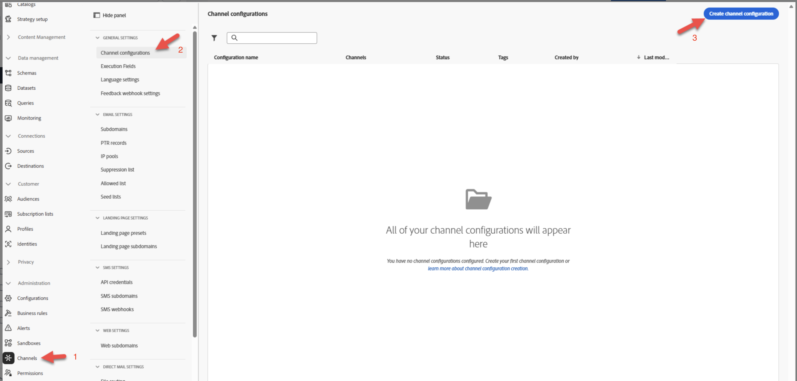
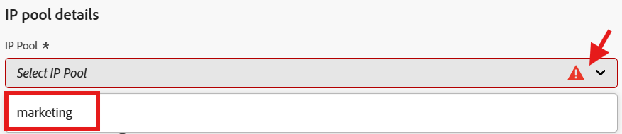
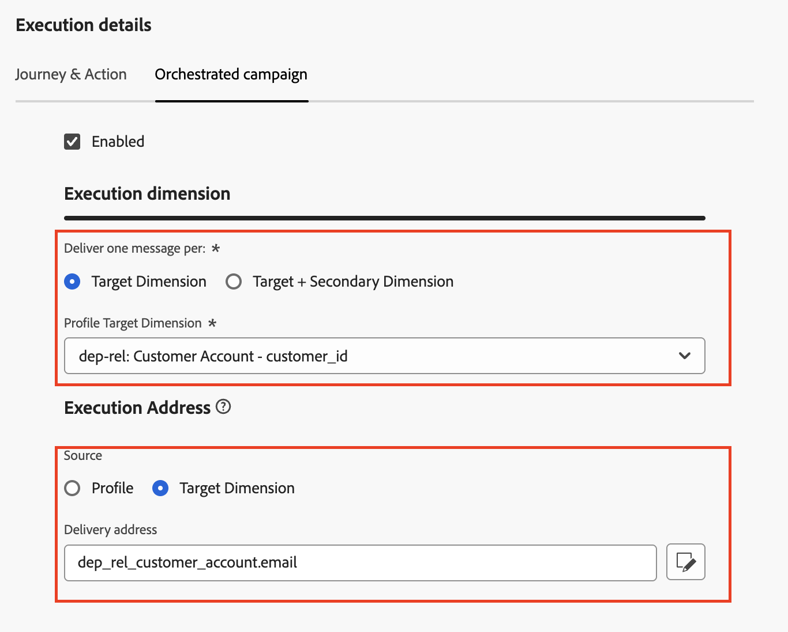

# Configure for Relational

## Objective

In the next set of steps you will create an Email Channel Configuration for use with only Orchestrated Campaigns, using the `email` attribute from the Relational schema `dep-rel: Customer Account` 

## Create channel configuration

1. Navigate to **Channel Configurations** found under the menu **Administration → Channels → General settings**
2. Click the **Create configuration** button

   

3. In the Create wizard set the following values:
   - **Name:**  `Relational-Email`
   - **Channel:**  `Email`
   - **Marketing action:**  `Email Targeting`

>[!NOTE]
>
>On selecting Email as the channel, a new section Email settings shows up.

## Configure email type

Set the **Email Type** to **Marketing**

## Configure subdomain

From the **Subdomain** dropdown, select **email.dep-labs.com**

## Configure IP pool details

From the **IP pool** dropdown, select **marketing**

## Configure list unsubscribe

1. Ensure that the toggle is **enabled** for list-unsubscribe
1. Under the List unsubscribe preference area make sure all the checkboxes are **checked**
1. Under Link management make sure **Adobe managed** is selected
1. For the Consent level make sure this is set to **Channel**

## Configure header parameters

1. Set the following fields as follows:
   - **From name:**  `DEP Labs`
   - **From email prefix:** `dep`
   - **Reply to name:** `DEP Labs Support`
   - **Reply to email:** `reply@email.dep-labs.com`
   - **Error email prefix:**  `error`

## Configure BCC email

Leave this blank

>[!NOTE]
>
>You can keep a copy of sent emails by sending them to a BCC inbox. Enter the email address of your choice so that every email sent is blind-copied to this BCC address. Note that the BCC address domain must be different from any subdomain delegated to Adobe. This feature is optional. *How to use BCC for emails*

## Configure email retry parameters

Leave with the default settings of **Hours** set to **84**

## Configure URL tracking parameters

Leave with the default settings

## Execution details

1. In the Orchestrated campaign tab and **check** the Enabled checkbox.

   

2. Under Execution dimension configure the following:
   - **Deliver one message per:**  `Target Dimension `
   - **Profile Target Dimension:** `dep-rel: Customer Account - customer_id`

   

3. Under Execution Address configure the following:
   - **Source:** `Target Dimension`
   - **Delivery address:**  `click on the Edit button`

   

4. In the pop-up, click into the folder **dep-rel: Customer Account**

   

5. Select **Email** and click on the **Select** button

   

6. When done, your final Execution details look like the screenshot below

>[!NOTE]
>
>For Orchestrated Campaigns, you target the customer account with an email, so you only need to send one message per Target Dimension.  The Execution address you use comes from the Target Dimension itself (i.e. what is stored in the **dep-rel: Customer Account** table for **email** address)

## Review & save

1. Review all details again to ensure they match. 
1. Scroll up and click **Submit**.
1. When you are done, you see two email channel configurations, both likely in a "processing" state.

>[!WARNING]
>
>The processing of the Email channel configuration has been observed to take up to 2hrs! 

## Recap

You have now seen how to create an Email Channel Configuration to use the Relational schema attribute for Orchestrated Campaigns.
