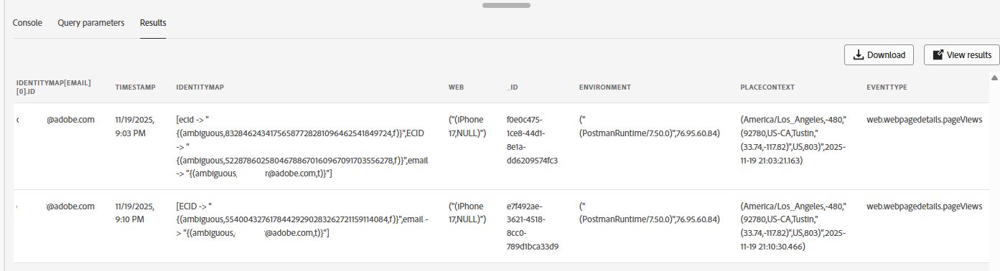

# Validate event on Data Lake

## Learning objective

Verify that the web event was written to the Experience Platform Data Lake.

## Validate event

> [!NOTE]
>
>Eventually the data will appear in the Data Lake.  **This could take up to 60 minutes**.  We know the dataset is enabled for profile and thus the event will create a profile fragment.
>
>You can find and query the Web dataset.

1. Go to **Queries** and **Create Query**


2. Copy this SQL and paste it into your query

```sql
SELECT identityMap['email'][0].id, * FROM dep_web
where identityMap['email'][0].id = 'henry.creel@emailsim.io'
```

3. **Run** Query

> [!NOTE]
>
>**Remember**: Eventually the data will appear in the Data Lake.  **This could take up to 60 minutes**.
>
>You do not need to wait for it to appear. Feel free to come back to this step and check later.




## Recap

The event record appears in the appropriate dataset.
