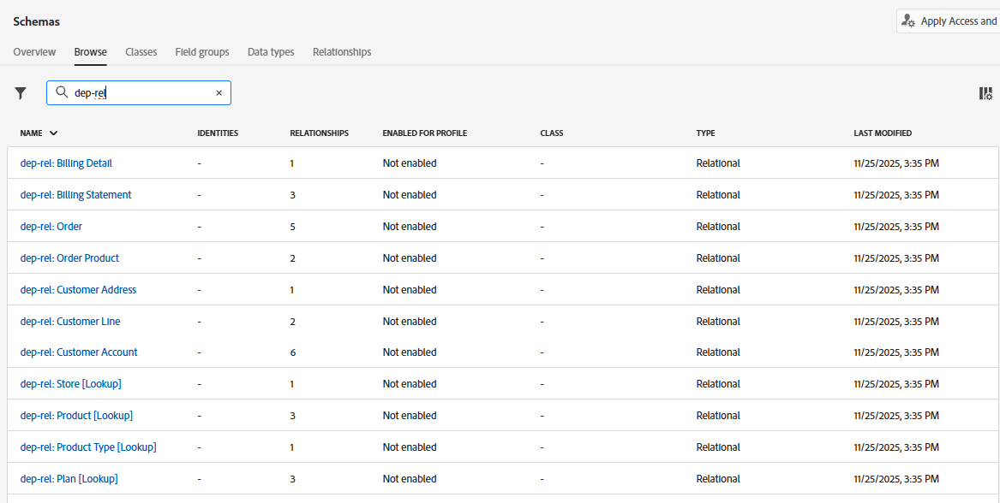

# Browse schemas

## Objective

In the next set of steps you will navigate the UI to view the Schemas and their relationships.  This is important to familiarize with the schemas and relationships available when you are building your campaign.

## View schemas

The Connection 5G relational data model has already been built for you. You can see the schemas for yourself by navigating to the **Schemas -> Browse** page in the UI.

In the search box enter `dep-rel` to see all the schemas.

>[!NOTE]
>
>Note the type of all the schemas is *Relational*

## View relationship diagram

With relational XDM schemas you can easily view the entity relationship diagram (ERD) by selecting any schema and clicking on the View relationship diagram button.  

Do the following:

1. Click on the **Relationships** tab and then click on the **View relationship diagram** button

2. Click **Select Schemas**
3. From the pop-up, select `dep-rel: Customer Account` and then click **Confirm**

4. On the ERD click the **3 dots** and select **Show related entities**

5. View the ERD with all tables directly related to dep-rel: Customer Account. Optionally you can download the ERD as a PNG file.

>[!TIP]
>
>Pretty cool eh?!

## Recap

You have now seen how easy it is to navigate the Schema and Relationships UI.  You can select a specific schema(s) and navigate to see the relationships to help understand and use the data in campaign orchestration.

You can read more [here](https://experienceleague.adobe.com/en/docs/journey-optimizer/using/data-management/get-started-schemas) if you are interested.
