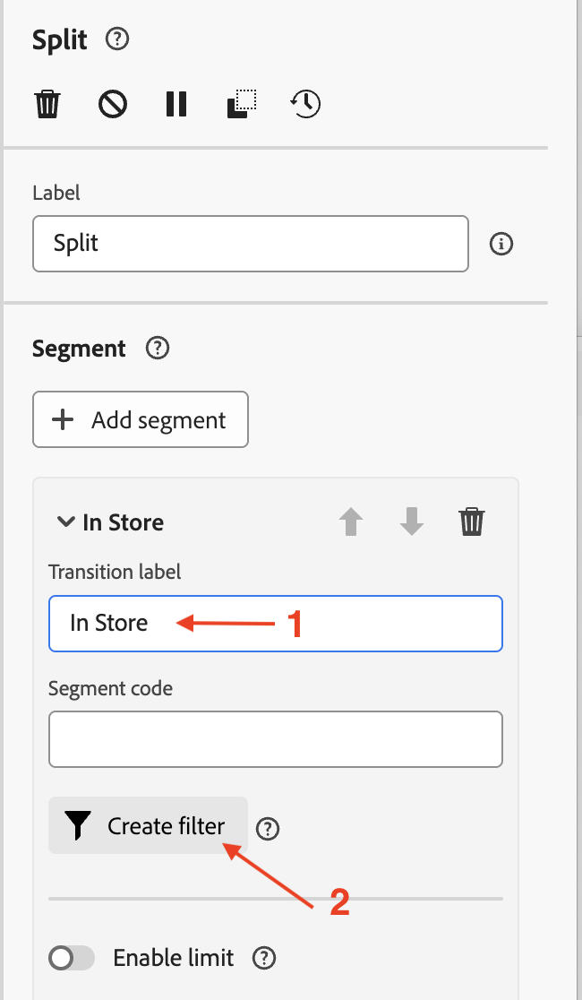
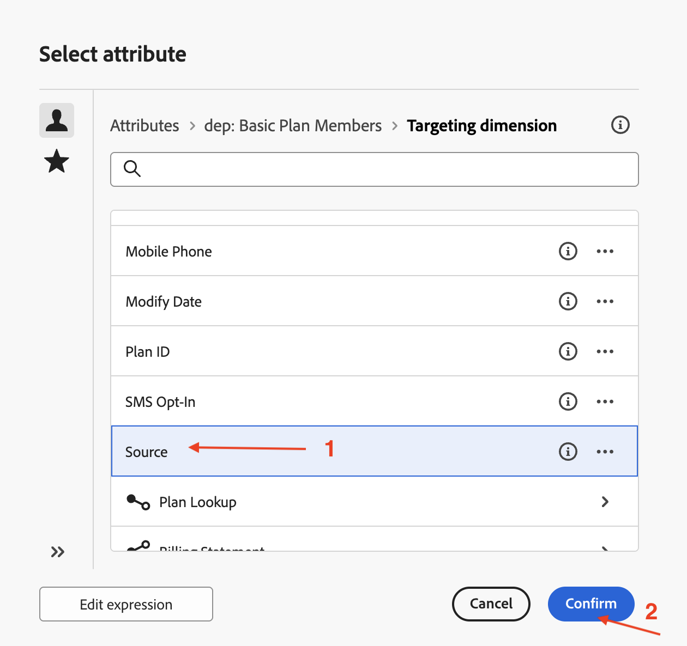
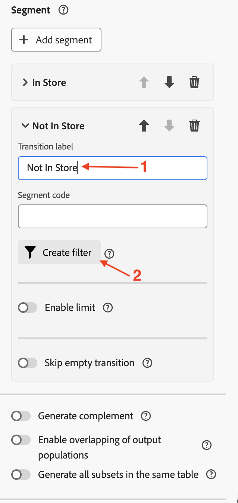

# Read an audience

## Objective

In the next set of steps you will create a campaign to read an audience from AEP and use it along with the Profile Target Dimension created earlier. Use the Split activity to split the data based on a condition. Finally test the campaign to understand how these audiences work when used with the Relational schema.

## Read audience

This lab covers using the Read audience activity in conjunction with the Relational schema for enrichment.

Orchestrated Campaign uses the Relational schema for all the activities. When using the Read audience activity, which reads the audience from AEP, a corresponding Entity (Target Dimension) should be configured to reconcile the audience with the Campaign Target Dimension. 

## Create a campaign

1. In the left side rail, click on **Campaigns**

   

2. Click on **Create campaign**

   

3. Select **Orchestration - Marketing**  and click on **Confirm**

   

4. Provide Campaign details as follows and then click the **Save button**
   - Name: **OC-RSL-ReadAudience-Test**
   - Description: **RSL-Read Audience Test**

   

5. Wait for the confirmation message

## Add Read audience activity

1. Click on the **+** inside the canvas to open the options menu and then select **Read audience** from the **Targeting activities**

   

2. In the **Read audience** details pane, click on the Search icon for **Audience**

   

3. Select the **dep: Basic Plan Members** audience with Profile Count of **9** and click on **Add audience**

   

4. Next click on the drop down for **Entity** and select the `dep-rel: Customer Account - customer_id` Campaign Target Dimension

>[!NOTE]
>
>Other attributes can also be extracted from the AEP Profile for use in the canvas using the **Add attribute** button. But for this lab, extra attributes are not required, so that step is skipped.

## Test the campaign

1. The settings for the **Read Audience** activity are filled in. Click on **Start** to run the campaign in **Test mode**

   

   >[!NOTE]
   >
   >This takes a few minutes to run.
   >
   >Test mode permits the execution of the campaign to verify and monitor its behavior along with the results from each activity. The activities get executed sequentially through to the end of the canvas.

2. The test execution starts and the results are displayed when completed. Click on the **Result** node and then Preview results to see the execution results

   

3. Notice that **2** (out of 9) profiles from the **Read audience** do not have a corresponding matching **Target dimension** from the relational schema (i.e. they exist in the Profile store but not the relational store). And since Orchestrated Campaign works off the Relational schema, the unmatched `customer_id` (**2**) from the **Read audience** is dropped and only the *matching* ones, **7** in this case, are usable in subsequent activities that leverage **relational data** in the campaign

   

   >[!NOTE]
   >
   >The following steps use the relational data to confirm the above statement of unmatched `customer_id` getting dropped.

4. Click on **Stop** to stop the **Test mode** of the campaign

   

5. Click on the **+** at the end of the flow and add **Split** from the **Targeting activities**

   

6. In the details pane of the **Split** activity, expand the first split called **Subset**

   

7. Rename it to "**In Store**" and click on **Create filter** to set the filter condition

   

8. In the **Create filte**r pane, click on **Add condition**

   

9. Since no other attributes were extracted from the AEP Profile, the only AEP Profile attribute available here is the `Customer ID`. However, columns from the relational store corresponding to the matching Target dimension are available for setting up the filter condition. Expand the **Targeting dimension** by clicking on  **>**

   

10. Select `Source` from the list and click on **Confirm**

   

11. The distinct values for the Source column are available in the drop down. For the **Custom condition**, select **"In Store"** from the drop down and click on **Confirm** to exit

   

12. Back in the details pane of the **Split** activity, the settings for the first Split are complete. Click on **Add segment** to the second split

   

   A new segment with the name **Result** is created

   

13. Rename "**Result**" to "**Not In Store**" and click on **Create filter** to set the filter condition

   

14. In the **Create filter** pane, click on **Add condition**. Follow the same approach as above, expand the **Targeting dimension** by clicking on **>**, then select `Source` from the list and click on **Confirm**

   

   

15. For the **Custom condition**, select **"In Store"** from the drop down and for the operator select "**not equal to**". Click on **Confirm** to exit

   

16. Back in the details pane of the **Split** activity, the settings for the two Splits are complete. Click on **Start** to run the campaign in **Test mode**

   

17. The test execution begins and the results are displayed upon completion. Since  only **7** matching Target dimension were found in the Relational schema, the same count is observed post the Split operations (**7** and **0**) as well

   

18. Click on each result box and **Preview results** to view the results

   

19. Click on **Stop** to stop the **Test mode** of the campaign

>[!NOTE]
>
>The Read audience showed **9** profiles. Because you built a filter on Source, and the Source field exists in the Relational store, you had to join the Profile store with the Relational store to check it. When joined with the Relational schema via the Campaign Target Dimension, only a total of **7** profiles matched. These **7** matched customer ids are available for use in the following activities that attempt to use relational data. All of the **7** customer ids had `Source` set to **"In Store"**, which was evident via the Split flows.
>
>Hence, maintaining data consistency is critical when using AEP Profiles along with their relational counterparts for enrichment.

>[!SUCCESS]
>
>Congratulations, this completes the lab on using the Read Audience activity with Relational schema.

## Recap

You have now seen how easy it is to create a Campaign, perform a Read Audience activity along with the Profile Target Dimension to use the relational schema. You used the Split activity to split the audience based on a condition. Finally, the test mode helped understand that it is important to have the data consistency between the Profile and the Relational schema.

You can read more [here](https://experienceleague.adobe.com/en/docs/journey-optimizer/using/campaigns/orchestrated-campaigns/design-campaigns/read-audience) if you are interested.
