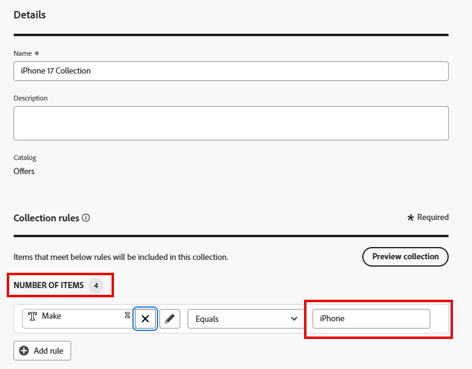

# Create offer collection

## Objective

Now that your offers have been created, they need to be organized into a collection. A collection has one or more offer items, and an offer item can be in more than one collection. 

## Create the iPhone offer collection

1. If necessary, expand **Decisioning** in the left rail, then click **Catalogs**. You see the four offers you created in the previous section.
2. Click on **Collections** just left of the offer name

   

3. Click the blue **Create collection** to create the new collection.
4. Name the collection **iPhone 17 Collection**
5. In the 'Collection rules' section, click on the text box that contains the text **_Click to create a decision item_**. Once clicked on, the options for creating the rule will appear.

   

6. Click the **Select attribute** button, then navigate through the offer item schema by clicking on **Device > Make**. Click **Save,** and you see that the 'Make' attribute is now in the decision rule.

   

   >[!NOTE]
   >
   >Notice that the options available to you are the same configurable fields you used when creating the offer items. Since a collection is a grouping of offer items, it makes sense that the rules to group them depend on their attributes. 

7. Leave the 'Equals' operator in place and enter the text **iPhone** in the value field, and you see that the number of items changes to 4, indicating that all of your offer items meet that criteria

   

   >[!NOTE]
   >
   >You can also click the **Preview Collection** button and see the offer items that meet the criteria.

8. With all four of the offer items selected, click the blue **Create** button. This takes you to a page that shows your newly created collection.

>[!NOTE]
>
>A collection is more than just a means of organization. In the steps ahead, you'll see that in Decisioning, we apply selection logic to a collection of offers. Thinking about an enterprise-sized implementation, it's not hard to picture how many offers would be created over the years of use. In order to determine which offers a selection strategy should apply to brings to light just how important proper collection management is. 
>
>In this case, a collection with just "iPhone" as the criteria would bring in too many offers after a few years of iPhone releases. We could have used additional criteria like 'Make equals 17' or used AEP Tags to tag offers for a specific campaign. But for simplicity, we're using this simple logic to create a collection.

## Recap

You have now created an offer collection that groups together the offer items you previously built. You added all the iPhone 17 offers into a collection and defined a rule based on offer attributes (like device make) so that only relevant offers belong to this collection.
