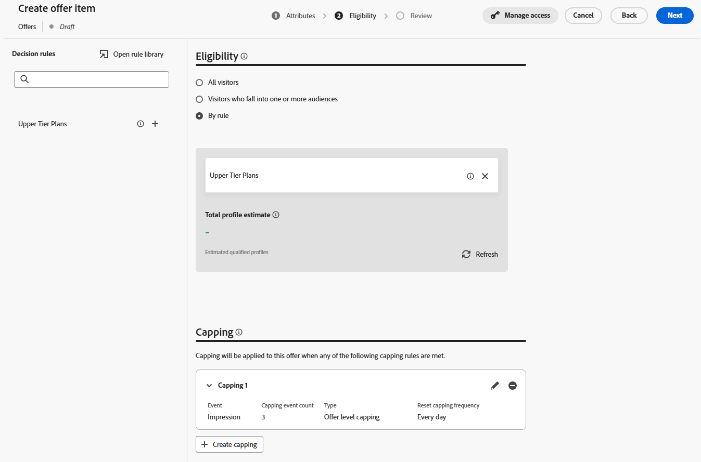

# Create offer items

## Objective

In this section, you will create the actual offer items that the Code-Based Experience (CBE) will return to the requesting client. Some of the offer items will have eligibility requirements and frequency capping, while others will not. 

## Scenario overview

Before creating the offer items, however, here are a few quick reminders about our scenario. First, there are 3 iPhone 17 tiers in our scenario: Ultra, Pro, and Base. You create 4 total offers, 1 for each tier, plus a generic fallback offer that the receiving system can use to display general information about the iPhone 17 across all the tiers. 

Second, only customers with a plan ID of 2 or 3 are eligible for the Ultra and Pro tier phones.

Next, the business has requested that each offer be shown only three times a day before the next lower-tier phone is presented.

Lastly, all things being equal, Connection 5G would prefer to sell the Ultra tier, followed by the Pro, and then the base model. As such, you see these priorities appear as you give a priority score to each offer item.

## Create default/fallback offer item

The first and easiest offer item you create is the fallback offer, which anyone can view for an unlimited period. 

1. If necessary, expand **Decisioning** in the left rail and click on **Catalogs**
2. An empty offers page is shown:

   

3. Click the blue **Create Item** button. This opens the 'Create Offer Item' page.
4. In the 'Offer name' field, enter the text **iphone:17\:generic**. Enter a description if you wish. 

   >[!NOTE]
   >
   >The all-lowercase, colon-separated naming convention is just one of our own designs that could serve as one to follow for a real customer. In practice, you can develop a different naming strategy for your offer items. Be sure that it is documented and consistent before creating offer items. This will ensure that offer items are easy to find and group together in collections. More on this later. 

5. Since this is the lowest-priority/default offer item, leave the default Priority at 1. 

   >[!NOTE]
   >
   >In Decisioning, the lower the number, the lower the priority. For example, an offer item with a priority of 100 is shown before an offer item with a priority of 1

6. Expand the **Device** item in the 'Custom Attributes' area, then enter the following information in the text boxes:
   - Tier: **Generic**
   - Model: **17**
   - Make: **iPhone** 

   These are the actual text values that both describe the offer and what can be used in sorting, ranking, and eligibility criteria. They are also the text values that can be returned to the requesting device.

   

   >[!NOTE]
   >
   >The Device area you expanded is the same "Device" parent object that was created when the 'Personalized Offer Items - Experience Decisioning' schema was updated with custom attributes in the previous section. The Tier, Model, and Make fields are the individual attributes that were added:
   >
   >

   >[!WARNING]
   >
   >The previous section mentioned the need to take great care when adding custom attributes to the system-generated 'Personalized Offer Items - Experience Decisioning' schema. Each additional custom node will appear as a possible field for every offer item moving forward. Creating unnecessary or campaign-specific attributes will clutter the offer item creation UI and may cause confusion. 

7. Click the blue **Next** button in the upper right corner to move on to the next step.
8. This offer should be available to everyone/All Visitors and not have any frequency capping, so there is no need to make changes to the 'Eligibility' or 'Capping' sections. Click the blue **Next** button again to proceed to the last step.
9. On the 'Review' step, verify that all the data is correct:

   

10. Make any necessary changes. When ready, click the blue **Save** button. 
11. Once saved, a white 'Approve' button appears where the 'Save' button used to be. Click the white **Approve** button to approve this offer item. You see a green 'Approved' indicator below the offer item title: 

   

   >[!NOTE]
   >
   >In practice, and with more complex offers, a proper approval process should be in place to ensure that the offer items have been created correctly. To save time in this lab, you simply approve every offer item you create.

12. Click the **left arrow** next to the offer item title to return to the 'Offers' page, and you see your iphone:17\:generic offer listed.

## Create base model offer item

Now that the generic offer item has been created, you can create the next priority offer item for the base model of the iPhone 17.

1. Click the blue **Create Item** button again and name the offer **iphone:17\:base**
2. Because this is the next lowest priority offer item, increase the **Priority** field to **2**
3. Expand the **Device** area and give the fields these values:
   - Tier: **Base**
   - Model: **17**
   - Make: **iPhone**

   When finished, the offer item looks like this (the red box is added to ensure the priority is correct):

   

   When everything is correct, click the blue **Next** button to proceed to the next step.

4. This offer item should be available to everyone, so there is no eligibility requirement; however, it should be capped at 3 impressions per day. Click the  '**+ Create capping'** button.
5. On the new capping rule, change the **Choose capping event** to **Impression.**
6. Change the **Capping event count** to **3**. Once finished, your capping rule looks like this:

   

   Once correct, click the blue **Create** button to save the capping rule. 

   >[!NOTE]
   >
   >Notice how you could create an additional capping rule. In practice, you may want to add more than one rule. In this case, we could have added a rule to cap this if a specific event was seen, such as a purchase event. This lab keeps it simple with a single capping rule. 
   >
   >

   >[!NOTE]
   >
   >The 'days' mentioned in frequency capping rules refer to days in the GMT timezone.  Frequency capping with days in the logic resets at midnight, GMT.  

7. Click **Next** to proceed to the review step. 
8. Ensure everything appears as expected and click the **Save** button. Once saved, click **Approve.**
9. Once approved, click the left arrow next to the title and return to the offers page. You now see two offers, each with the appropriate priority.

## Create upper tier model offer items

Now that the generic and base model offers have been created, you can move to the offer items for the pro and ultra models. These offer items also need to include an element of eligibility because only members with a certain plan level should see these offers.  

1. Following the same steps and naming patterns outlined in the above sections, create a new offer called **iphone:17\:pro** and set its priority to **3.**
2. Set the **Tier** attribute to **Pro** and the other custom attributes as you did in the other offers.
3. On the 'Eligibility' step, select the **By rule** radio button.
4. The left rail shows only one Decision rule, the one created earlier called 'Upper Tier Plans'. Click the **+** icon next to that rule to add it to the canvas. 
5. As mentioned earlier, the business has stated that non-fallback offers should have a frequency cap of 3 displays (or impressions) per day. Follow the steps in the previous section to create a capping rule for 3 Impressions per day. When finished, your page looks like this: 

   

6. Once you've verified that everything is correct, click **Next**. The final offer item config looks like this:

   

7. Once everything looks correct, **Save** and **Approve** the offer item. 
8. Return to the offers page and verify that the 3 offers are there and that they each have the proper priority.
9. Create the final offer item and name it **iphone:17\:ultra,** give it a priority of **4,** and set the other custom attributes with the same values as the other offers.
10. As with the last offer item, set the eligibility to the 'Upper Tier Plans' Decision rule and set a frequency capping of 3 impressions a day. When finished, your offer item looks like this:

   

11. Once you've verified that all of the settings are correct, save and approve this offer item. You now see all four of the offer items, each with a unique priority.

>[!NOTE]
>
>The instructions for this lab are emphatic about ensuring that the priorities are different for each offer item. In this simple use case, it's important, but there is nothing in the UI that forces you to give each offer item a unique priority. Over time, you will likely have multiple offer items with the same priority. You'll see why this is important to understand in later sections.

## Recap

You defined multiple offers for the different iPhone 17 tiers, including a generic fallback offer and tier-specific offers (base, pro, and ultra). You've also approved all four offer items with the correct priorities, eligibility, and impression capping settings so they're ready for use in your Decisioning package.
