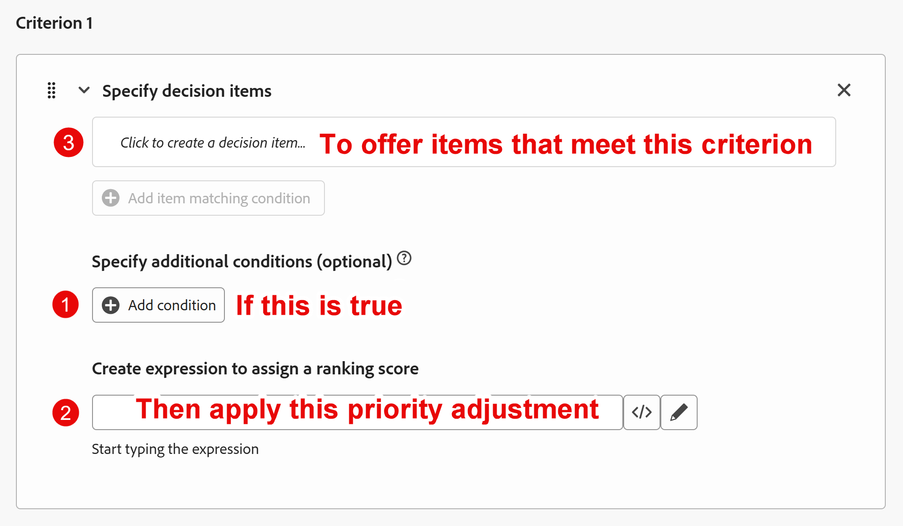
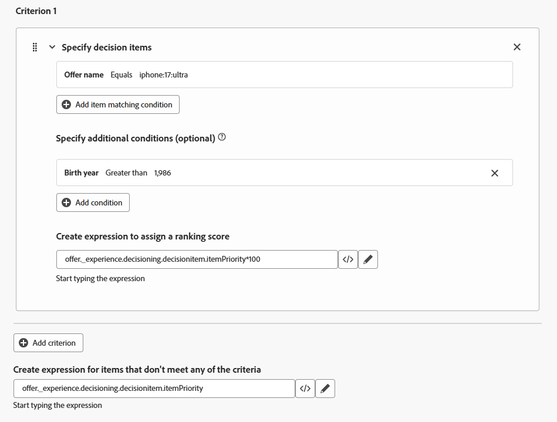

# Create ranking formula

## Objective

Now that all the offer items have been created, prioritized, had eligibility applied, and organized into a collection, we can turn our attention to determining how they will be ranked for a given profile. This is done by creating a ranking formula. 

A ranking formula dynamically boosts specific offer prioritizations so they "rise to the top," based on criteria from the profile interacting with the Web/Mobile property or the Experience Event itself. 

In this lab scenario, we'll pretend that the research marketing team for Connection 5G showed that those under age 39 would be drawn to the Ultra or Pro tiers and those 40-59 would be drawn to the base and pro tiers. And since Connection 5G would rather sell higher-tier phones, all things being equal, the ultra model would be presented first for those under 39, with the pro model being presented first for those 40-59. This section will show you how to create a ranking formula to meet those business requirements. 

## Create a ranking formula and default expression

1. If necessary, expand **Decisioning** in the left rail and click on **Strategy setup**. You land on the 'Decisioning Rules' page and see the 'Upper Tier Plans' Decision Rule that you created previously and used as eligibility requirements for the upper-tier phone offer items. 
2. Click on **Ranking formulas** under the 'Ranking methods' menu. This opens an empty page since you don't have any ranking formulas yet.

   

3. Click the blue **Create formula** button to start creating a new ranking formula
4. Name the ranking formula **iPhone 17 Ranking Formula**

   >[!NOTE]
   >
   >When an Experience Event is sent to Edge Data Collection with the required parameters to request an offer from an active Decisioning package, all offers in that package are evaluated using the ranking formula. Each offer will either keep its original priority or have its priority dynamically adjusted based on the profile that triggered the Experience Event. 

5. Scroll to the bottom of the 'Criteria' section and click the **\</>** icon of the bottom-most text box and select the **Offer priority score** variable.

The default expression is now set like this:

>[!NOTE]
>
>This bottom text box is the default expression applied to any offer item that doesn't meet any priority adjustment criteria. In this case, this is simply the priority assigned to the offer when it was created. If no default priority score is given to the collection that this ranking formula will execute on, then you'd want to assign a default score

## Create priority adjusting rules

Now that there is a default expression, you can start adding rules that dynamically adjust the priority based on the user's age. 

One way to think about priority adjustment rules is to treat them as standard if/then statements that only apply to certain offers. If the test proves true, then adjust the priority for offers that meet a given criterion. The UI does arrange these in a slightly different order, as called out in this screenshot.

>[!NOTE]
>
>The "if" is optional because one could apply a priority adjustment rule where an offer meets a specific criterion without a conditional statement first. Expanding on our example in this guide, imagine we had several offers with a phone OS attribute (Android vs. iOS). One could boost the priority of all iPhone offers where the profile's preferred OS is iOS. There is no "if." Just "adjust the score where offer attribute = profile attribute." Below is an image similar to the one above that outlines this idea without a conditional statement. 
>
>

## Create criterion 1: adjustment rule for those younger than 39

1. Start by creating the ranking rule for the Ultra tier offer item. Click into the first textbox in the **Criterion 1** section, then click on the **Select attribute** button when it appears.

   

2. When the 'Select an attribute' dialog box opens, click on **Offer name**. Once selected, click **Save.**

   >[!NOTE]
   >
   >The 'Decision attribute' refers to elements of the offer item. Since this is where you outline which offer items the criteria will apply to, the only options available to you are attributes of the offer item.
   >

3. Leave the operator set to 'Equals' and in the remaining textbox, enter the name of the ultra tier offer item, which is **iphone:17\:ultra**. After entering the text, the UI updates and reflects that the matching condition has been accepted.
4. Click **+Add Condition**, then click into the **new text box that appears** (it has the text '*Click to create a decision item...*' in it
5.  Click the now available **Select attribute** option**.**
6. When the 'Select an attribute' dialog box opens, click on **Profile attributes  > Person** (you likely need to scroll down) **> Birth Year**. Once selected, click **Save.**

   >[!NOTE]
   >
   > 'Profile attributes' refers to the user or profile that sent the Experience Event, and 'Context data' refers to elements in the Experience Event itself, such as URL, page name, or other attributes of the Experience Event payload.

7. Change the operator to **Greater than** and enter the birth year **1986** (the UI puts a comma in the year, which is expected). After entering, the UI updates to reflect that the condition has been accepted. Since the business use case is to offer the Ultra tier to anyone under 40, the priority is adjusted for anyone born after 1986.

   >[!NOTE]
   >
   >As mentioned earlier, the UI indicates that these additional conditions are 'optional.' That is true because one may want to dynamically adjust the priority on a set of offer items without any additional criteria. It may be that the same offer items could be used in a different collection and ranked with a different set of ranking rules. Since this lab uses only a single set of offer items, additional conditions are used to adjust the priority.

8. The original priority for the Ultra tier offer item is 4. To boost the priority, multiply that by 100. To do that, click the **\</>** icon next to the last text box and select the **Offer priority score** variable. Add a **\*100** after the automatically entered text. This expression multiplies the original priority (4) by 100 and gives it a new priority of 400. 

   Your rule should now look like this:

>[!NOTE]
>
>Why multiply by 100? The idea is that if you want to ensure your priorities are adjusted well above the other priorities, and 100 is just a way of doing simple math to make that happen. Ranking formulas can be complicated, as you'll see in the next section, so keeping the math simple is helpful.
>
>Additionally, while we used multiplication to increase the priority score, other mathematical expressions could have been used to decrease the priority score. Generally speaking, however, it's easier to make the wanted offers 'float to the top' than it is to make offers you don't want 'sink to the bottom.'

## Create criterion 2: adjustment rule for those 40-59

1. Immediately below the adjusting rule you just created, click the **+ Add Criterion** button.
2. Create a matching condition for where the **Offer name** does NOT equal **iphone:17\:ultra**.

   >[!WARNING]
   >
   >This rule is intended to apply to all of the other offer items. More details on why are further along on this page, but you should be very careful about using this kind of logic in practice, as it would apply to every offer in the collection that doesn't have this value. In our case, that's fine, but it may not be in other use cases.

3. Add the condition that this rule should apply to anyone with a birth year greater than **1966** (anyone younger than 60).
4. Just like the previous rule, multiply the offer item's default priority score by 100. When finished, your 'Criterion 2' rule looks like this:

>[!NOTE]
>
>Using ranking formulas and eligibility rules together can feel complex, but here's the core idea:
>
>- **Ranking formulas** dynamically adjust the priority scores and, therefore, the order of the offers.
>- **Eligibility rules** (such as decision rules and frequency caps) remove offers from the ordered list if the user isn't allowed to see them.
>
>Here's how the offers would be ordered given these examples and the ranking formula you just created:
>
>**Birth Year = 1990**
>
>- Ultra Priority becomes **400**
>- Pro = **3**, Base = **2**, Generic = **1**
>  Result: Ultra shows first (up to 3 times), then Pro, Base, and finally Generic.
>
>**Birth Year = 1970**
>
>- Ultra priority remains at **4**
>- Pro becomes **300**, Base = **200**, and Generic = **100**
>  Result: Pro shows first (3 times), then Base, then Generic. Ultra is ordered last because its priority (4) is lower than Generic (100).
>
>When eligibility is applied via decision rules and frequency capping, then
>
>- Users born in 1990 with a **plan ID = 1** will have Ultra and Pro offers removed—even though they ranked highest. The user only sees the Base and Generic offers because Ultra and Pro tiers have an additional condition: only users with **plan IDs 2 or 3** can see them.
>- Since the Generic offer has no frequency capping rules, the **1970** birth year user will never see the Ultra offer, as its priority score is lower than the Generic's boosted score.

5. With all of the rules and the default priority score in place, scroll back to the top and click the blue **Create** button in the upper right corner. 

>[!TIP]
>
>You're now taken back to the 'Strategy Setup' page, and you see the single Ranking Formula that you just created. 

> [!NOTE]
>
>What happens if two offers result in the same priority? Offers with the same priority score are chosen at random for return to the requesting system. 

## Recap

On this page, you built a ranking formula that determines how offer items are ordered dynamically for each profile. You also defined a default expression (the original priority score), and then added priority-adjustment rules that boost offer priorities based on profile criteria (such as age). This ranking logic ensures that relevant offers (like Ultra or Pro tiers for specific age ranges) rise to the top when evaluated.
