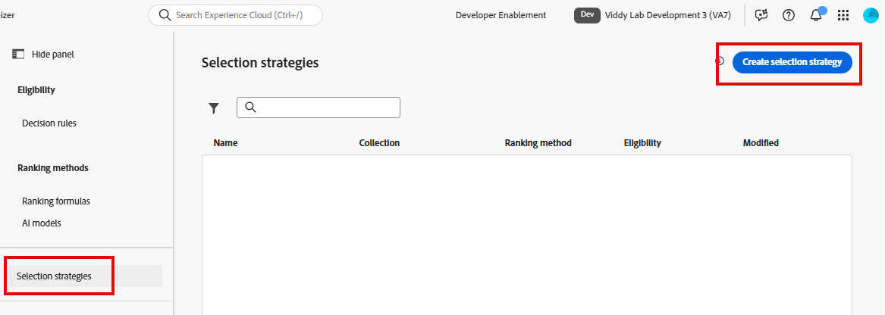

# Create Selection Strategy

## Objective

Up to this point, you've created offers, defined offer eligibility with a decision rule, gathered them into a collection, and created a formula that dynamically re-orders them based on attributes of the profile requesting the personalization. Because we're only using a single set of 4 offers for a single use case, it's tempting to think that each of these elements is related, especially when we named them similarly. However, it's important to think more abstractly when considering a long-term strategy and enterprise-sized scope. Offers could be sorted into one or many collections. Ranking formulas could be applied to any collection of offers. In actuality, the first time you actually connect these elements is when creating a Selection Strategy.

Imagine that we had hundreds of offers utilized in forty collections and a dozen or so ranking formulas. How would a decision package know which ranking formula to apply to which collection of offers? The selection strategy makes that connection. When you add Decisioning to a channel, what you are adding is one (or many) Selection Strategy(ies).

## Create the Selection Strategy

1. If necessary, expand **Decisioning** in the left rail and click on **Strategy setup**. You land on the 'Decisioning Rules' page, where you see the 'Upper Tier Plans' Decision Rule that you created previously and used as eligibility requirements for the upper-tier phone offer items. 
2. Click on **Selection Strategies** just below the 'Ranking methods' menu. With no selection strategies available, click the blue **Create selection strategy** button.

   

3. Name the selection strategy **iPhone 17 Selection Strategy**
4. You can see that a selection strategy requires 3 things. 
   - A collection of offers
   - Eligibility requirements
   - A Ranking Method

   Click the **Select Collection** button, tick the box next to the only Collection you have (**iPhone 17 Collection**), and click **Save**.

5. Leave the 'Eligibility' drop-down set to All Visitors.

   >[!NOTE]
   >
   >Eligibility can be applied at the offer level, the selection strategy level, or the Journey/Campaign level via the criteria for entering the Journey or Campaign. It all depends on the use case you are trying to realize. If you click on the **Eligibility** drop-down, you see the same Audience and Decision Rule options that you saw at the offer level. In our use case, we only wanted to limit specific offers, so it made sense to do eligibility at the offer level.

6. Set the **Ranking method** to **formula,** then click the **Select formula** button

   >[!NOTE]
   >
   >You may have noticed the 'Offer Priority' and 'AI Model' options in the Ranking method drop-down. If you truly only wanted to return offers using only their original priority, then you would choose the 'Offer Priority' option. 
   >
   >The AI Model option uses an AI model that analyzes impressions, clicks, and conversions for returned offers to determine which offer to display to the individual. We will not be using them in this lab as there are minimum data thresholds as well as two weeks required to train the models.

7. Tick the box next to the only Ranking formula you have (**iPhone 17 Ranking Formula**) and click **Save**. When finished, your selection strategy looks like this:

   

8. Once your selection strategy is correct, click the blue **Create** button.

>[!TIP]
>
>You now see your iPhone 17 Selection Strategy in the 'Selection strategy' menu

>[!NOTE]
>
>Decisioning allows for very simple or very complex offer selection and ordering. On the simple end, you could have a collection of offers with their default priority, an eligibility set to all visitors, and the Ranking method of 'Offer Priority', and all end users would see the offers in the order of their original priority scores. At the other extreme, you could have a huge collection with complex initial priority scores, a bespoke Ranking formula, and layered eligibility rules at both the offer and selection strategy level. What you built in this lab sits in the middle and was designed to demonstrate the different ways decisioning packages could be configured. 

## Recap

On this page, you created a selection strategy that ties together the core components you've built so far — the offer collection, eligibility rules, and ranking formula.
