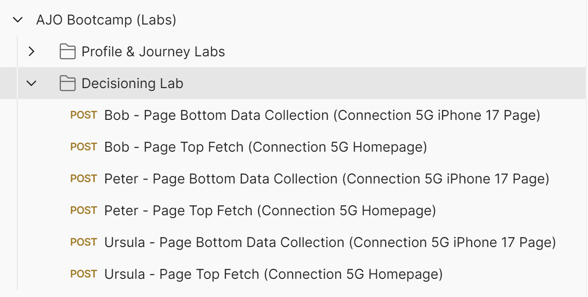
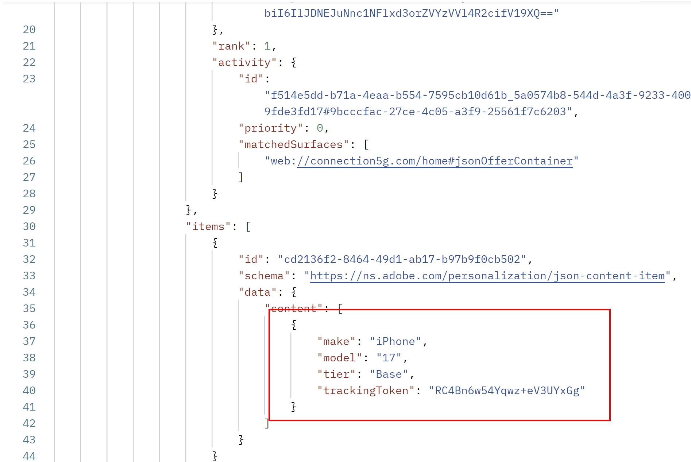

# Decisioning and CBEs in action

## Objective

Now that the Journey is live, you can start sending in Experience Events and see offers returned. Since the birth year and phone plan IDs of individual profiles affect what offer is returned, we have to send in Experience Events for preconfigured profiles with specific birth years and plan IDs. 

## Profiles and Postman setup

The three profiles that you'll use are already in your sandbox and are outlined in this table:

| First Name | Last Name    | Birth Year | Plan ID | customerID | ECID                                   | Email           |
| ---------- | ------------ | ---------- | ------- | ---------- | -------------------------------------- | --------------- |
| Bob        | Basic        | 1974      | 1       | 287415903  | 34566216966446312560595171785271630085 | bob\@dep.com    |
| Peter      | Professional | 1981      | 2       | 105946728  | 22344522145769262754334953788432801285 | peter\@dep.com  |
| Ursula     | Ultimate     | 2002      | 3       | 730682145  | 35615467908312308343036144243711275069 | ursula\@dep.com |

Locate these profiles in AEP

1. If necessary, expand the **Customer** item in the left rail and click on **Profiles**
1. Click on the **Browse** tab, and among all the profiles that were already created for you or that you created as part of previous labs, you see these three profiles. 

Find the corresponding Experience Events for each profile in the Postman collection 

1. If necessary, open Postman
1. Ensure that the **EDGE\_REGION** and **DATASTREAM\_CONFIG** environment variables are still set. If they need to be set again, review the steps in the 'Import Environment and Collection' lab.
1. Expand the **Decisioning Lab** folder. You see 2 Experience Events for each profile:

## Sending in Experience Events

> [!IMPORTANT]
>
>Do not skip the opening text explanation of this section!

Given unlimited time and resources, we'd have you build and deploy a Tags library with the AEP Web SDK on an actual website. This would demonstrate how to retrieve and report on offers. However, given the sheer breadth and depth of the content covered in these labs, we've chosen to pre-build the Experience Events needed to enter the Journey, retrieve offers, and report on those offers in a Postman collection, rather than requiring you to tag a website. When used correctly, this collection mimics how a properly tagged site (or any digital channel) would use the CBE delivery channel in a Journey.

The recommended approach for AEP Web SDK deployments is to use a two-call-per-page approach. In this pattern, the Web SDK sends a 'fetch' call at the top of the page to the Edge that requests any personalizations needed for the user. Those personalizations are returned by the Edge and then rendered by the Web SDK. A second call at the bottom of the page, typically referred to as the Data Collection call, is then sent to the Edge, and reports on what was shown to the end user, along with other data for Analytics, CJA, and other solutions. When it comes to retrieving propositions from the Edge, remember a simple mnemonic: FAR, which stands for Fetch, Apply, and Report. All propositions must be fetched, applied, or rendered (shown to the end user), and then reported on. It's critical that these offers are reported as being seen so that the frequency capping rules work. 

Adobe Target activities and the AJO Web Channel can have their responses fetched and applied automatically by the AEP Web SDK. Their reporting can also be sent with the Data collection call at the bottom of the page. However, CBEs are different. The AEP Web SDK can fetch the propositions, but it is up to the customer to both apply (render) whatever is returned and then use the AEP Web SDK to report on what was shown. A CBE typically does not use the Data collection calls to report on what was shown, so they must be passed in manually. 

In the Postman collection, you'll see that each profile has two Experience Event calls

A Page Top Fetch Experience Event

A Page Bottom Data Collection Experience Event

The page top Experience Event includes the 'jsonOfferContainer' parameter in the request, which is the 'Location on the Page' that you configured for the CBE. Additionally, this call uses Postman's scripting functionality to take the response from the Edge and then immediately send a second call to the Edge reporting that the offer was shown to the end user. There is no actual application or rendering of the offer because there is no Website for this lab. But from AJO's perspective, the offer was returned and then reported as seen. 

The page bottom data collection call is purely for the sake of generating a pageview for the iPhone 17 Overview Page. Recall that the segment for getting into the Journey itself requires 3 views of this page. Once that Experience Event has been sent in 3 times, that user will enter the Journey, and then only the Page Top Fetch Experience Event will be needed to get the offer and report that it was seen. 

Start with Bob's Profile. 

1. Click on the **Bob - Page Bottom Data Collection** request. 
2. Click on the **Body** tab and notice the parameters being passed, such as the customerID namespace in the IdentityMap, which would indicate that he's authenticated, as well as the 'web.webPageDetails.name' parameter that passes in the pagename of 'phones\:apple\:iphone 17\:overview'.

3. Click **Send** in the upper right corner to send a page view. You get a response back similar to this

4. Once you've received a proper response, click **Send** again to resend the same Page bottom event a 2nd time. Wait a few seconds, then send in a 3rd Data Collection call for the Bob profile. You have sent a total of 3, page-bottom calls.

At this point, the system is processing those hits and adding Bob to the "dep: Interested in iPhone 17" streaming segment. Once that is done, Bob is put into the Journey. Once in the Journey, it takes only a few minutes for Bob's entrance into the Journey and segment to be projected to the Edge Profile store for Bob. 

5. Return to the AJO UI and click on **Profiles** in the left rail, followed by the **Browse** tab.
6. Search for Bob's profile by using the **customerID** namespace with the value of **287415903**.

7. Click **View** to open Bob's profile (Bob's profile color may be different than is shown in the screenshot).

8. Once Bob's profile opens, click on the **Audience membership** tab, and you see that Bob is now a member of the 'dep: Interested in iPhone 17' segment, at least from AEP Hub's perspective. 
9. Click on **Attributes,** then select the **Edge** radio button to switch to the Edge view.

>[!WARNING]
>
>There is an unfortunate UI bug that requires you to click the attributes tab to switch the radio button to Edge.

10. Click again on **Audience membership,** and if you did those steps quickly enough, you see that the Edge is selected and shows that Bob has no Audience membership

11. In a new browser tab, navigate to the Journey you created and click into it. You see that one profile has entered the Journey and is now on the CBE node.

At this point, Bob has entered the Journey and the Edge projection is currently assembling a projection that updates Bob's profile on the Edge. 

12. Switch back to Postman and click on the second of Bob's Experience Event calls, **Bob - Page Top Fetch.**
13. Click **Send**. What should happen?
    - If Bob's Edge Profile hasn't been updated yet, then you get a very similar response to what you got from the Data Collection call. If this is the case, wait another minute or two and then try sending in Bob's Page Top Fetch call again.
    - If Bob's Edge profile was updated, then you get a response with the JSON that was configured earlier, along with additional information used for reporting. But before moving on, what iPhone 17 offer should Bob be offered?

      Bob was born in 1974, which is greater than 1966, so he would have qualified for the 2nd ranking formula criterion, and his Generic, Base, and Pro offer priority scores would have been multiplied by 100, giving those offers scores of 100, 200, and 300, respectively. However, Bob Basic has a plan ID 1, so he's not eligible for the Ultra or Pro tier offers thanks to the Decision rule. Therefore, the Base tier offer, which has a score of 200, would be shown. You can see that in the response (you likely have to scroll down):

14. Remember that this Postman request automatically sends a display notification for this offer, so AJO has already recorded at least one impression for this offer. Click **Send** again to send a second impression. Verify that the base offer was again returned.
15. Recall that a frequency cap of 3 impressions applies to the Base, Pro, and Ultra tier models. Click **Send** a 3rd time to get a 3rd response with the Base tier and to record another impression. 
16. Click **Send** a fourth time, and what should happen? The frequency cap for the Base tier offer is reached, and you receive the Generic offer in the response:

17. Click **Send** again, and you see the Generic tier offer. You could click Send 100 more times, and you get the same offer back until the next day when the frequency capping is reset.

>[!WARNING]
>
>Remember that in AJO, the day resets at Midnight GMT. If you were to send in another Fetch call after Midnight GMT, you'd see the Base tier offer return instead.

18. Return to the Journey Orchestration UI and click into the **iPhone 17 Abandon Browse** Journey you created. Because the Journey is live and published, you start seeing stats. You see that 1 profile has entered the Journey and is currently at the CBE node.

>[!NOTE]
>
>At this point, you may be wondering why the profile isn't at the wait node. Once it hit the CBE node and projected the updates to Bob's Edge profile, should he be at the wait node? The short answer is that it could be, but... one might also make the argument that since the CBE is being actively returned, then that's where Bob is on this Journey. But after 3 days, the Journey will show that the profile has completed the Journey without ever really being in the wait node.

## Send in Experience Events for other profiles

Now that you've seen the Journey working for Bob's profile, there are two other profiles to test. 

1. Return to Postman and locate the Experience events for Peter and Ursula.
2. Execute the "Page Bottom Data Collection" event 3 times for each profile, remembering to give 1-3 seconds between each Send/Data collection request.
3. Wait a couple of minutes for the three profiles to qualify for the Streaming segment, enter the Journey, and then have the CBE projected to their Edge Profiles. 
4. Send in the Page Top Fetch call as many times as needed to verify that the Decisioning rules and Ranking formulas are working as expected.

**Decisioning Profiles: Expected behavior**

| First Name | Last Name    | 1st Offer | 2nd Offer | 3rd Offer | 4th Offer |
| ---------- | ------------ | --------- | --------- | --------- | --------- |
| Bob        | Basic        | Base      | Generic   | Generic   | Generic   |
| Peter      | Professional | Pro       | Base      | Generic   | Generic   |
| Ursula     | Ultimate     | Ultra     | Pro       | Base      | Generic   |

5. Once finished, return to the Journey. You see that all 3 profiles have entered the Journey and are at the CBE node.

>[!NOTE]
>
>If you were to wait 3 days and re-send the Top of Page Fetch, you'd find that no offer was returned and that all three profiles had finished the Journey

## Recap

On this final page of the lab, you moved into the execution phase, where you tested your decision setup using experience events and a Code-Based Experience (CBE) channel. You used Postman to send simulated experience events to Adobe Journey Optimizer so that:

- Profiles entered the journey you created because they met the streaming segment criteria. 
- The CBE channel was invoked with fetch events to get offer decisions based on profile data (birth year, phone plan, etc.). 
- Offers were returned and counted against frequency caps as configured, showing how different rules and ranking logic affected which offer was delivered. 
- You verified that frequency capping and eligibility worked as expected by repeatedly sending offer fetch calls. 

You have executed real decisioning calls and validated that your eligibility rules, ranking formula, and offer setup behave correctly when profiles interact with the decisioning engine.
