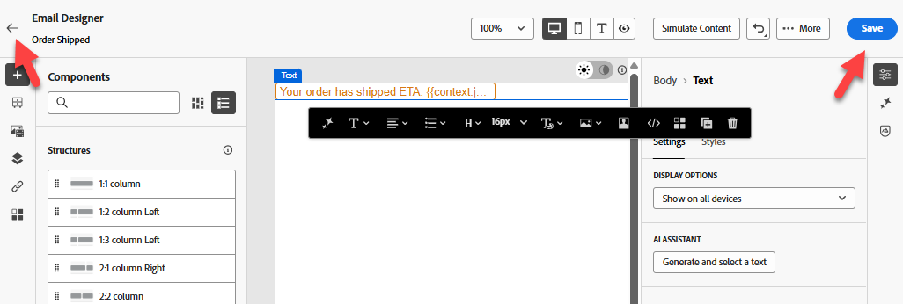

# Build journey

## Learning objective

Create a unitary journey that begins with the configured Order Shipped event, gets the ETA from an external service and sends an email.

## Create journey

Go to **Journeys** and click **Create Journey - Create from scratch**


## Journey properties

1. Update the Journey Properties in the right rail with the following:
   - **Name**: `Order Shipped Journey`
   - **Description**: `Notify customer that order has shipped. Include shipping details.`
   - **Tags**: `Default`
   - **Journey metrics**: *leave blank*

      >[!NOTE]
      >
      >**Empty Drop Down?**
      >
      >Don't worry and move on. The very first journey created in a sandbox needs to "prime the pump".  Once we publish the journey, this drop down will have options to choose from.

   - **Allow reentrance**: `checked`

   - **Reentrance wait period:**  `5 minutes`

   - **Access labels**: *leave blank*

   - **Time Zone**: `Your Local timezone`

   - **Use Profile time zone in waits and conditions**: `NOT checked`

   - **Start/End Date**: *leave blank*

   - **Timeout or error**: `30`

   - **Capping rules:** *leave blank*

   - **Priority**: `0`


2. If everything looks good click the **Save** button


## Journey canvas

### Add a unitary event

From the left pane under the **Events menu** drag 'n drop the **orderShipped** event onto the canvas as shown below


### Add a custom action

1. If the left pane expand the **Actions menu** and then drag 'n drop onto the canvas the action you built named **GetShippingDetails** after the orderShipped event


2. In the right rail, under Access and privacy configuration --> Marketing Action drop-down ensure the value is set to **None**


3. Under the Endpoint configuration --> Query Parameters menu click on the **Pencil icon** next to orderid


4. In the modal that appears expand **Context** -> **orderShipped** -> **Order** and then select **Order ID (orderID)** and click **OK**


5. Back in the right rail, ensure the option for Timeout or error is **unchecked** and then click the **Save button**


### Add email action

1. Under the Actions menu drag 'n drop the **Action** action onto the canvas after the GetShippingDetails action


2. Select **Email** for the marketing action, then **Add**.


3. In the right rail, click **Configure action**


4. set **Email channel Configuration** to `Profile-Email` and then click on **Edit Content**


### Add email body content

For content, you are going to keep things simple. Like stupid simple.

1. Update the Subject line to `Order Shipped` and then click on the **Edit email body button**


2. In the top bar click on the **Design from Scratch** content block


3. From the left bar under the Structure container drag 'n drop the **1:1 Column** onto the canvas


4. Then under the Contents container drag 'n drop the **Text** component into your **1:1 Column**


5. Click into the Text component and **delete the current text** and then click the **Add Personalization** icon


6. In the left rail click on the **Contextual Attributes** folder and then navigate thru **Journey Orchestration** -> **Actions** and select **GetShippingDetails**


7. In the main body of the email now **copy & paste** the below JSON into the Personalization **editor**

```json
{{profile.person.name.firstName}}, your order has shipped
ETA: 
Tracking Number: 
```

8. Add the personalization fields as follows (**click the plus '+' sign next to the field on the left rail**):
   - **ETA:** `eta`
   - **Tracking Number:**  `tracking_number`


>[!NOTE]
>
>Click the **+ symbol** to add personalization attributes from the rail to the canvas.  It will place them where your cursor is so ensure you are "lined up" appropriately

>[!NOTE]
>
>Your email will use a combination of context attributes (ETA & tracking number) and Profile attributes (first Name). If you wanted to add other Profile attributes, you can click on the Profile Attributes tab and select anything you see.
>
>

9. On the bottom of the screen click the **Validate** button and ensure you have no errors


10. If everything looks good click the **Save button** in the top right
11. Then click the **Save** button again in the top right and click the **\<- left arrow** in the top left



12. Finally, click the **\< Back icon** in top left to get back to the Journey Canvas


>[!TIP]
>
>And then click the **Back** button again... Kidding! That's the last back button...in this section 😜


### Override email parameters

Back on the main Journey Canvas, on the Email node, make sure you can see the read-only fields (you may need to click on the **Show read-only fields** icon)


1. Scroll down to **Email Parameters** and click on the **Enable parameter override** icon


2. Click in the empty text box and then in the left rail drill down into **Context** -> **orderShipped** -> **\_dep** and click on the **personalEmail** field.  Then click the **OK button**


>[!WARNING]
>
>This is a dangerous thing to do so avoid using it unless you need to in a production setting.  This will override the default location that Journeys looks for on the profile to execute messages.


3. Click the **Save button** in the top right and then click the **back arrow** \<- in the top left to **close** the Journey


## Recap

A published journey capable of responding to the Order Shipped event trigger, get the ETA from an external service and send an email.
