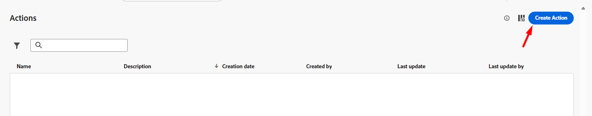
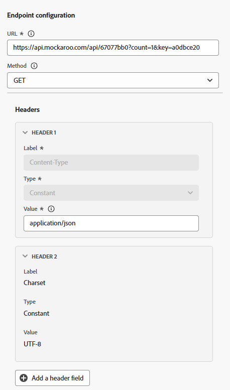
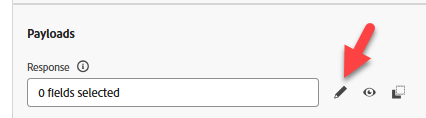

# Configure custom action

## Learning objective

Create a custom action that defines how the journey will communicate with an external endpoint or service to get an ETA for when the package will arrive.

## Navigate to actions

In the left rail under the  Administration menu click to **Configurations** and then on the Actions tile click the **Manage** button


## Configure the action

### Action name & details

1. In the upper right click on the **Create Action** button



2. In the configuration panel that appears update the following basic values as shown below:
   - **Name**: `GetShippingDetails`
   - **Description**: `Call third party to get Shipping ETA and Tracking Number`
   - **Action Type**: `Custom`
   - **Channel**: `Email`
   - **Required marketing Action**: `Email Targeting`


### Endpoint details

In the Endpoint configuration area provide the following details:

- **Endpoint URL**: `https://api.mockaroo.com/api/67077bb0?count=1&key=a0dbce20`
- **Method**: `GET`
- **Headers:** *leave as-is*
- **Query parameters:**
  - **Name**: `orderid`
  - **Type**: `variable`

>[!NOTE]
>
>A variable allows for us to pass in a value during a journey vs having a static value for all journeys

- **Authentication Type**: `No Authentication`




### Response payload details

Now you need to provide a sample payload so the action knows what the response payload should look like.

1. In the Payloads area click on the **Pencil icon** to open the Field configuration screen




2. **Copy and paste** the below payload into the Payload box

```json
{
    "eta": "11/19/2025",
    "tracking_number": "072000326"
}
```

>[!NOTE]
>
>This is the same JSON structure that the Mockaroo endpoint above should return:


3. The response payload will display. Click the **Save** button.


>[!NOTE]
>
>You can leave everything as a string but in real-life you would probably want to update this to match the data type


### Test the action

1. Click the **Send test request** button in the bottom right rail to validate you didn't mess anything up 😀


2. Click on the **Query parameters** tab and update the value for `orderId` to **123**


3. Click the **Send button** and if all works out well you should see a response code of 200 and a Preview of the payload as shown below...


Preview

```json
{
  "eta": "12/26/2025",
  "tracking_number": "063112249"
}
```

>[!WARNING]
>
>If you are not seeing a 200 response or a Preview do not continue. Raise your ✋to get some help.


4. Click the **Cancel** button to go back to the Action screen and then scroll back up in top right rail and click the **Save** button

>[!TIP]
>
>Congrats! Your Custom Action is live, thanks to your expert-level Ctrl+C, Ctrl+V skills.

## Recap

A reusable custom action configured in Adobe Journey Optimizer that takes an Order ID and returns the ETA and Tracking Number.
