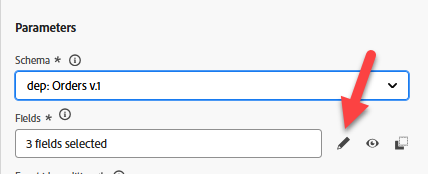
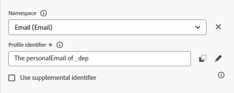

# Configure event

## Learning objective

Create and configure an event that will trigger a customer journey when the post-purchase action (order shipped) occurs.

## Navigate to Journey Optimizer

In the upper right hand corner of your browser click on the **Cube** and then select **Journey Optimizer**

## Configure order shipped event

In order to create a Journey that uses a Unitary Event, we need to first configure the event.

1. In the left rail under the  Administration menu click to **Configurations** and then on the Events tile click the **Manage** button

   

2. In the upper right click the **Create Event** button

   

3. Update the settings of the event as follows:
   - **Name** = `orderShipped`
   - **Type** = `Unitary`
   - **Event Id type** = `Rule based`
   - **Schema** = `dep: Orders v.1`

   

4. In the `Fields` input box click on the **Pencil icon**

   

5. Select the following fields to add to the event and when done click the **OK** button
   - `Event Type (eventType)`
   - `Order ID (orderID)`

   

   >[!NOTE]
   >
   >Ensure you only select the Order ID field and not all the fields in the Order 😁

6. In the `Event Id condition input`, click on the **Pencil icon**

   

7. **Drag** the `Event Type` field onto the canvas

   

8. In the selection box that appears look for and check the value titled **orders.shipped.** Then click the **OK** button.

   

9. Next update the last two values of Namespace and Profile Identifier with the values shown below:
   - **Namespace** --> `Email`
   - **Profile Identifier** --> `personalEmail`

>[!NOTE]
>
>**What is the Namespace and Profile Identifier used for?**
>
>For any journey that uses an event you must specify for that event what identity namespace and associated profile identifier should be used to lookup the profile. It's important to understand that choosing one identity over another can impact how the journey will work.
>
>*Quick Example:*
>
>Event payload is a page view containing identities like so:  ECID (primary identity) & Customer ID (optional)
>
>- ECID chosen --> it's likely this is the first time identity service has seen this relationship so when a journey receives this event it will attempt to lookup the profile using the ECID and fail to find a profile.  Why? The relationship doesn't exist yet between ECID and Customer ID and the traits of the profile are likely stored against the known identifier Customer ID
>- Customer ID chosen -->  this identity is not required to be populated and it's likely on most page views it would be empty.  Therefore, if this identity was chosen the only time a Journey would fire is when there is an authenticated page view where the Customer ID is set.
>
>Short answer: there is no right answer, just tradeoffs you need to make based on the use case 😃

## Final orderShipped event configuration

Verify your final event configuration matches below.  If everything looks good click the **Save** button

>[!TIP]
>
>You've configured your first AJO event. High-five yourself!

## Recap

A configured order shipped event in Adobe Journey Optimizer that can be used as the entry point for a journey
