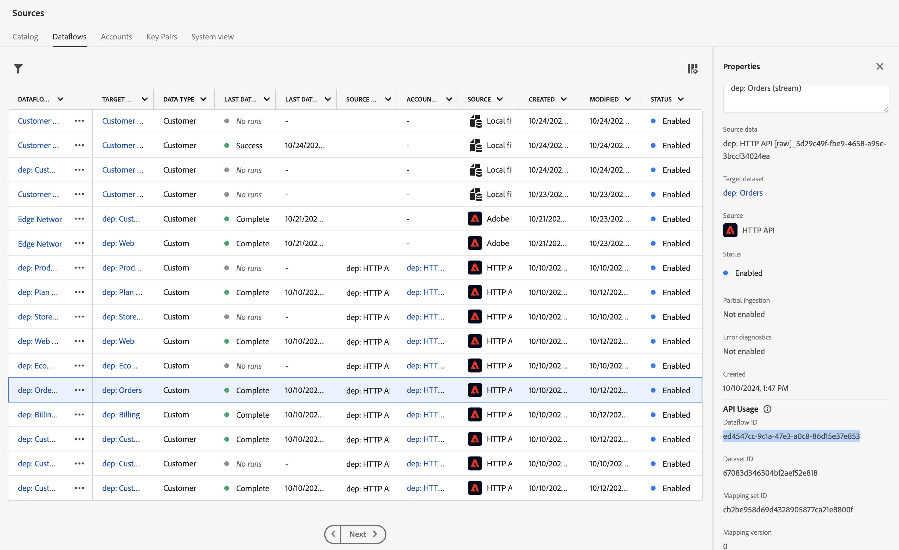

# Send an event

## Learning objective

Send a simulated Order Shipped event to trigger the journey using Postman

## Streaming to Hub vs Edge

Earlier, we sent in an Event to the Edge.  There are some use cases where we may have a back-end system that wants to stream in an event, but does not need to send it to the Edge.  This lab shows how to do that by **streaming in an Order Shipped event to the Hub** (aka server to server, e.g. Commerce Server to AEP signaling an order has shipped).

## Validate event is not in Profile

1. Go over to your **Profiles** and lookup the Profile.
   - **Identity namespace** -> `email`
   - **Identity value** -> `henry.creel@emailsim.io`
1. Click on **Events** tab.
   - There should be **no** `orders.shipped` events

## Modify API request

To create the API request, you need to fill in the following pieces in the body of the API request.

Start by gathering the following values:

### Find account streaming endpoint

1. Navigate to **Sources** in the left rail and then click on **Accounts** in the top nav
1. Search for **dep: HTTP API \[raw]**, highlight the row and copy and save the value of the **Streaming Endpoint** somewhere you can reference later

![dep: HTTP API [raw] account row highlighted with Streaming Endpoint value](assets/send-an-event-streaming-endpoint-account-row.png "dep: HTTP API \[raw]")

### Find dataflow ID

1. Click on **dep: HTTP API \[raw]**
1. Find the record for **dep: Orders (stream)** click on the dataflows link
1. In the right rail copy and save the **Dataflow ID** values somewhere you can reference later

> [!WARNING]
>
>Click in an empty space on the row.  DO NOT click on the blue links!

### Open Postman

Launch Postman on your computer and navigate to the following API call:

- **Postman Left Sidebar**  --> `Collections`
- **Collection** --> `AJO Bootcamp (Labs)`
- **Folder** --> `Profile & Journey Labs`
- **API Request** --> `Ship Order Event`

### Create final API request

1. Copy the values you saved in the previous steps into the places highlighted below.  
1. Click on **Headers** and paste in these values (remove any trailing spaces):
   - **Red** --> `Streaming Endpoint URL`
   - **Green** --> `Dataflow ID`
     - Value looks like a GUID (does not start with http)

> [!CAUTION]
>
>DO NOT EXECUTE YET!

## Execute the API

1. Save your API call by clicking the **Save** button
1. Execute your request by clicking the **Send** button

A successful call should result in the following response...

## Recap

A Ship Order event is successfully sent to the platform
