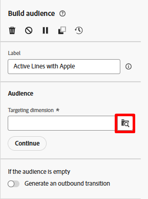
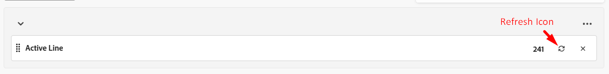
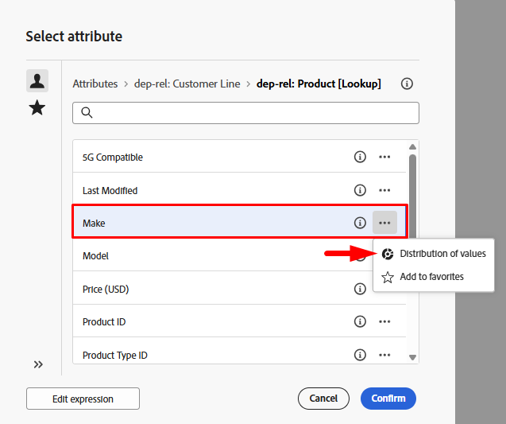

# Build an audience

## Objective

In next few steps you will be creating the audience you want to target for the campaign, which is all the active line holders who have a make that matches the flagship phone that is launching.  The goal being this is the group you want to target with an SMS message nudging them to upgrade their phones.

## Add Build Audience activity

1. On the canvas click the **+ symbol** and then select the **Build audience** activity to add it to the workflow

2. In the right rail you see the Build audience properties. Update the Label to state the following: `Active Lines with Apple`

## Select targeting dimension

The next step is to select the **Targeting dimension** (i.e. what table you want to query). Do the following steps:

1. Click on the **search icon** in the Targeting dimension box

2. On the popup, search for and select the table named **dep-rel: Customer Line** and then click the **Confirm** button.

>[!NOTE]
>
>Always remember the **targeting dimension** of each audience you create. You’ll learn its significance in the next steps.

>[!NOTE]
>
>if you ever select an Adobe created schema you note the schema starts with -> *(caas)*. This is just a namespace applied to the tables within the relational store and stands for Campaign as a Service :)

## Create audience

Now that you have selected your targeting dimension (what relational schema you are going to query) you can start creating your definition.

1. In the right rail click on the **Create Audience** button

2. Next click on the **Add condition** button

## Create condition(s)

Now its time to write the logic of the audience using the attributes found in the schema. The goal is to find all customer lines who are active and using a make of Apple.

### Create condition #1 

1. Set the condition using the following information:
   - **Attribute**:  `Active Line`
   - **Value**:  `true`

2. Click **Refresh** icon to view the qualifying counts on the condition. 

>[!TIP]
>
>You see a result of 241 if you've built the condition correctly

### Create condition #2 

1. Click the **Add condition** button and select the **dep-rel:** **Product \[Lookup]** schema by clicking on the **>** icon

![Select the dep-rel: Product [Lookup] schema by clicking the > icon](assets/build-an-audience-select-product-lookup-schema.png)

2. Look for the field named **Make** and click on the three dots and select **Distribution of values**

3. Note the various values. You only want `Apple` and thankfully it doesn't have 100 different spellings. Click on the **Apple field** to select it and then click the **Select attribute and value button** in the upper right.

>[!NOTE]
>
>This is a prime example of where the data architect should have designed the schema with enumerations.  This way a marketer doesn't have to manually select/type in the value.  Shame on the data architect!

4. The `Make` field is automatically added along with conditions shown below.
   - **Operator:**  `Equal to`
   - **Value:**  `Apple`
   - **Case sensitive:**  `Enabled`

5. Click on the **calculate icon** and you see 85 as the result.

>[!NOTE]
>
>Note the use of the AND operator in the group. Whether you build this in a single group like shown or multiple groups the AND is important because it tells Orchestrated Campaigns both conditions must be true.

## Verify counts

1. Click on the **Calculate icon** found in the right rail under the heading Profiles targeted to get an exact estimate of the audience size. You see **65** as the **final count**.

>[!NOTE]
>
>Notice how each individual condition returned a different number (condition #1 --> 241 and condition #2 --> 85) but the final audience size was the lesser of the two conditions.  This is because of that AND operator.

2. If you see final count of **65** click the **Confirm** button in the top right of the screen and then click the **Save** button in the top right to save your work.

## Challenge

Assume for a moment you had typed in the last condition such that `Make` was equal to `apple` (lowercased) and you had left the configuration option for `Case sensitive` toggled `on`.  This would make that conditions record count equal to 0.  So you would have 241 active lines and 0 where the make is apple.

**What would be the final audience size in this case?**

## Answer

It's zero. Do you know why?

## Recap

You have successfully created your first audience and should now see how easy it is to develop and validate your counts within the Build Audience activity.

