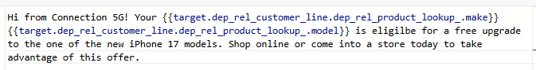

# Compose the SMS

## Objective

In the next few steps you are going to compose a VERY simple SMS message.  You'll see how you can easily add some content at an EXTREMELY basic level and personalize the message based on the data in the relational store.


## Navigate to content

Click the **Edit content** button, or navigate directly to the **Content** tab


## Create the message

1. Click on the **Personalization** button to create your message.


>[!NOTE]
>
>The "magic wand" option uses AI to help you write a message. Check it out if you'd like but we won't be covering it in this lab.


2. Copy and paste the text below into the SMS message body.

```none
Hi from Connection 5G! Your phone_make phone_model is eligible for a free upgrade to one of the new iPhone 17 models. Shop online or come into a store today to take advantage of this offer.
```

>[!NOTE]
>
>Be sure to turn Word wrap to **On** in the message editor.  You can find in the lower right pane of the window.


3. Update the two fields in the message called **phone\_make** and **phone\_model** below using the **Target attributes** option in the left rail.  When done your message should match the screenshot. 



>[!NOTE]
>
>Why are you doing this?  Well you want to personalize the message with the customers phone make and model and this information lives within the Customer Line table in the relational store.  This demonstrates how you can use data from Orchestrated Campaigns to personalize messages.


4. Click the **Validate** on the editor and make sure there are no validation errors and if good click the **Save** button


5. Click on the **back arrow (\<-)** when you are done to return to the workflow canvas


## Recap

You just created a message and hopefully are now a bit more familiar with how the message editor works.  Remember you can personalize using data from the Relational Store but you can also personalize using data from the Real-Time Customer Profile too!

>[!NOTE]
>
>If you use the Real-Time Customer Profile attributes to personalize messages in Orchestrated Campaigns just remember it's pulling from the Profile Snapshot dataset in the data lake so attributes can be up to 24 hours old. The Profile Snapshot is only updated once a day after the daily batch segmentation job.
