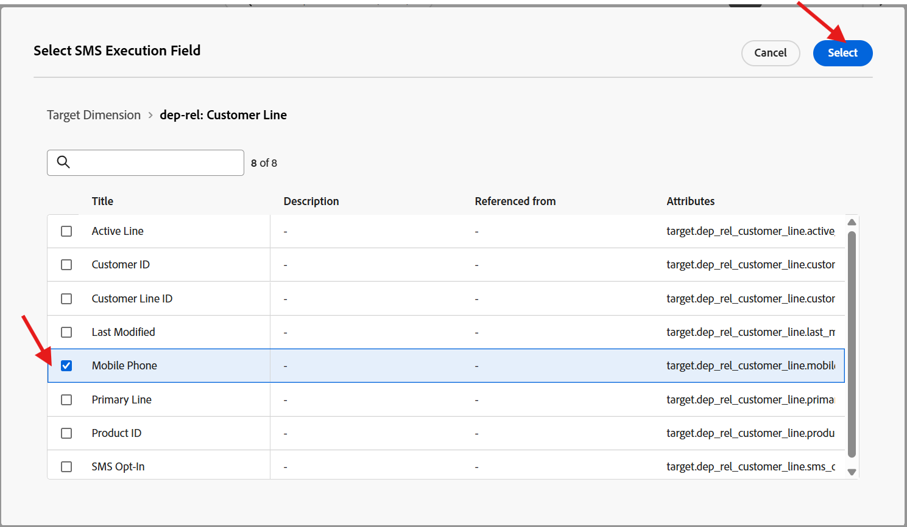
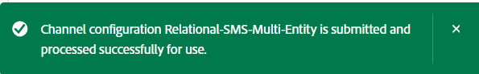
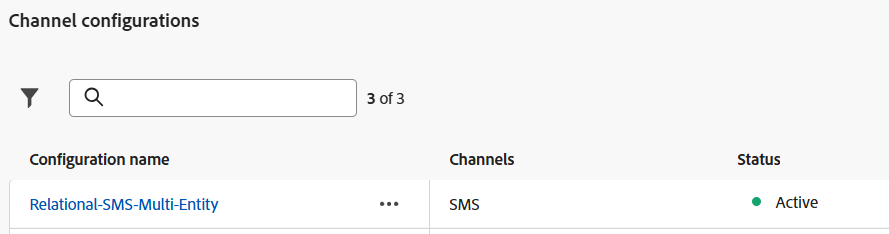

# Configure SMS channel

## Objective

In the next set of steps you will configure the SMS channel. This is required so that you can send messages to individual line holders later on when you are building your campaign.

## Navigate to channels

1. In Adobe Journey Optimizer, go to the **Administration** -> **Channels** menu. 
1. Select **SMS Settings** → **API credentials**. 
1. Click **Create API credential**. 

## Define the SMS API credentials

You will start by creating the API connector that AJO will use to send outbound SMS requests.

1. Under SMS Vendor choose **Twilio**. 
1. Enter the following API credential details, using your own [Twilio trial account](https://www.twilio.com/try-twilio):
   - **Name:**  `DEP SMS`
   - **Account SID:**  Found on your Twilio Console dashboard
   - **Auth Token:**  Found on your Twilio Console dashboard (click **View** to reveal it)
1. Click **Submit** to register the API credential 

>[!NOTE]
>
>You'll need a free Twilio trial account with a verified phone number before starting this step. Sign up at [twilio.com/try-twilio](https://www.twilio.com/try-twilio), then find your Account SID and Auth Token on the Twilio Console dashboard. See Twilio's [getting started guide](https://www.twilio.com/docs/usage/tutorials/how-to-use-your-free-trial-account) for a full walkthrough.

## Create SMS channel configuration

Now you will map this API credential to a channel configuration that journeys and campaigns can use.

1. Navigate to **Channels** → **General Settings** → **Channel configurations**. 

   

2. Click **Create channel configuration**. 

   

3. Fill in SMS Channel Configuration Settings with the following values:
   - **Name:**  `Relational-SMS-Multi-Entity`
   - **Channel:**  `Mobile Message`
   - **Marketing Action:**  `SMS Targeting`

>[!NOTE]
>
>If you get an error stating the user does not have permission, ignore it and continue.

## SMS settings

On selecting Channel as Mobile Message, a new section called SMS settings shows up. Fill it in with the following details:

- **Mobile message type:**  `Marketing`
- **Mobile message configuration:**  `DEP SMS`
- **Sender number:**  `01234567890`
- **Subdomain:**  `leave blank`
- **Opt-out number:** `leave blank`

## Execution details

1. Under Execution details, click the tab **Orchestrated campaign**

   

2. Ensure the **Enabled** checkbox is checked

   

3. Next under the sub-section **Execution dimension** ensure the following are set up as follows:
   - **Deliver on message per:** `Target + Secondary Dimension`
   - **Profile Target Dimension:**  `dep-rel: Customer Account - customer_id`
   - **Secondary Dimension:**  `Customer Line`

   

   

   >[!NOTE]
   >
   >This is telling Orchestrated Campaigns that when it sends messages, it should deliver one message per record that matches to the Profile Target Dimension.

4. Under Execution Address heading ensure you select the radio button for **Secondary Dimension** and then click the edit button on the **SMS Execution Field**

   

5. On the pop-up, click into the schema **dep-rel: Customer Line** and select **Mobile Phone**.

   

   

6. Confirm the final Execution details section matches below

## Submit and review

1. You can click the **Submit** button to complete the configuration and see a success message appear

   

2. On the channel configurations inventory page ensure the status shows as **Active** before moving on

   

   >[!CAUTION]
   >
   >Wait until the status turns **Active** otherwise future lab steps will fail miserably for you

3. When the status turns Active you are complete!

>[!TIP]
>
>🚀 Booyah! Your SMS channel is now live and ready for action!

## Recap

You have now seen how to successfully configure an SMS channel.  Note this is an API-based SMS so depending on your provider they may use alternative methods for authentication.

You can read more [here ](https://experienceleague.adobe.com/en/docs/journey-optimizer/using/channels/sms/configure-sms/sms-configuration) if you are interested.
