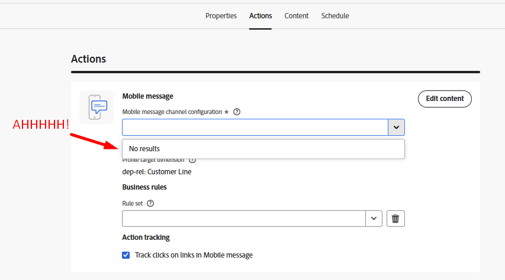
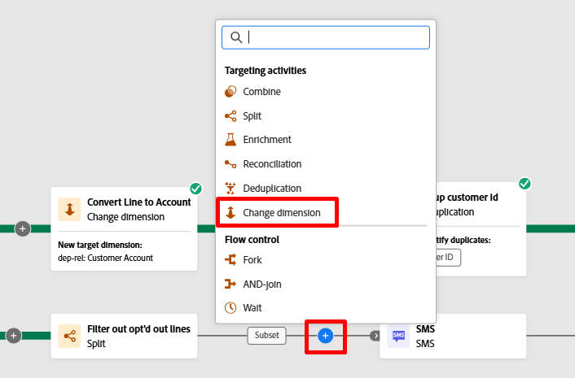
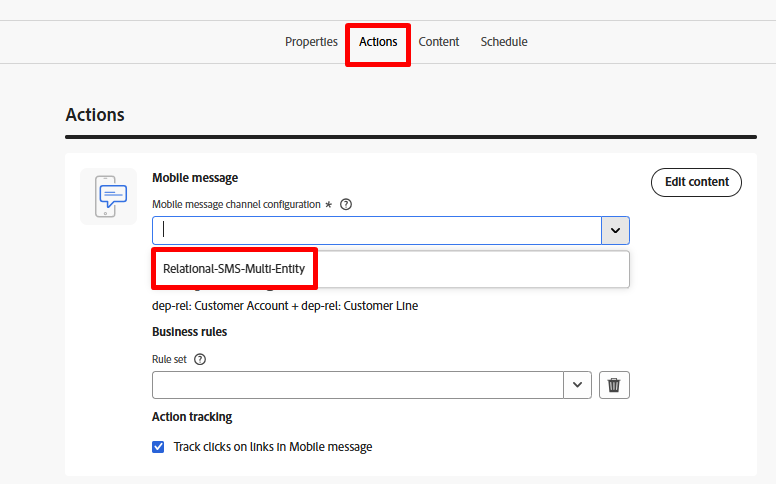

# Filter the lines

## Objective

In the next set of steps you are going to filter out all the lines that are actually not allowed to be targeted with an SMS message due to their opting out at the line level.  You can not rely here on Profile consent because this is a line level target.

## Set up Split activity

1. Click the **+** icon on the bottom transition of the Fork activity and select the **Split** activity on the popup. 

2. In the right rail update the Label to state the following:  `Filter out opt'd out lines`

3. In the right rail expand the default segment **Subset** section and click the **Create filter** button

4. Add a condition to ensure that you remove all Customer Lines that are opt'd out of SMS messaging and then click **Confirm**.

>[!NOTE]
>
>You need to figure out how to create the condition but the final result matches the screenshot above.  You got this!

5. Click the Save button in the upper right to save your work.  Your canvas looks like so now\...

## Add the SMS activity

1. On the workflow canvas, click the **+** icon after the split condition you added and select the **SMS Activity**

2. In the right rail click on the Edit SMS button to start configuration of the SMS message

3. In the top nav click on the Actions menu item and then from the SMS configuration drop-down select the channel you previously created.

>[!CAUTION]
>
>Oh no 🫨!  Why are you getting No results?  Didn't you set up your SMS channel already?  Is the product broken?
>
>FREAK OUT!!!!!!!!!

## Freak out moment

The transition of the fork currently has a targeting dimension of Customer Line (i.e., what table the current result relates to in the Relational Store).  What is unique with Orchestrated Campaigns though is you always join back to the Real-Time Customer Profile at send time so delivery and tracking information from messages is attributed to a profile.  This join was pre-built for you from the Customer Account table. 

The channel configuration for SMS was already set up for you beforehand and it currently looks like so...

**How you read this is as follows:**

- Deliver one message per the target dimension (i.e. Customer Account) on the number of related records found in the secondary dimension (i.e. Customer Line)
- Execute each SMS delivery using the mobile phone number found in the secondary dimension (i.e. Customer Line)

This unique ability to send many messages to one profile is one of the primary features of Orchestrated Campaigns that makes it different from Journeys.

So how do you get this to work?  Add a change dimension 😀

## Add Change Dimension

1. Click the back button on the SMS edit screen

2. On the workflow canvas, click the **+** **icon** between the Filter and SMS activities and select **Change Dimension**. 

3. In the right update the change dimension with the following information:
   - **Label:**  `Convert Line to Account`
   - **New target dimension:**`dep-rel: Customer Account`

4. Click the **Save** button in the upper right of the canvas to save your work. When done, your workflow now looks like this...

## SMS message configuration

Now that you've fixed the workflow, reconfigure the SMS.

1. Click on the SMS activity in the workflow canvas and then, in the left rail, click on the **Edit SMS** button

>[!NOTE]
>
>This screen takes a while to load.  I know it's annoying, trust me it's being fixed

2. In the top nav click on the **Actions** menu item and then from the SMS configuration drop-down select the channel you previously created.

>[!TIP]
>
>Feels good doesn't it 😮‍💨

## Recap

You made it through this one and hopefully learned two very important things:

1. Your final results targeting dimension has to match the channel configuration you want to use
1. The Change dimension activity is likely going to become your best friend for ensuring this happens
