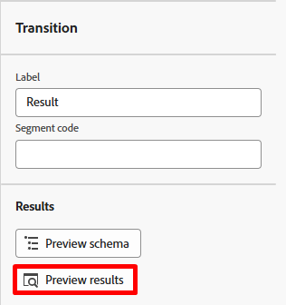

# Run the workflow

## Objective

In the next few steps you will learn how to test your workflow and more importantly your SMS activity using test mode. 

## Verify workflow

1. The final workflow looks something like the following when you are done. Double check everything looks good. You see:

2. If you haven't already stopped your workflow ensure you do so now by clicking the **Stop** button in the upper right.

>[!NOTE]
>
>Optionally you can try clicking on the Restart button but it's likely you'll see an error since you've added activities after the workflow was created, and its cache is no longer valid.

3. Next click the **Start** button to execute and test the workflow end to end

4. Review the result coming into the SMS activity by clicking on **Result** (there are two Results so use the left one as shown below) and then in the left rail clicking on **Preview results** button.

5. You see **33 records** and the targeting dimension matches the Customer ID (the join key if you will to profile)

## Test the SMS activity

1. Close out of the previous window and click on the **SMS activity** and then click the **Run test** button in the right rail

2. Almost immediately, a new button appears labeled **View report**.  Click the **View report** button to launch into the report screen.

>[!NOTE]
>
>This screen will not be populated initially as it takes some time to execute the test run. You may need to refresh a few times before you see results.

3. When you get results, you see 100% were targeted!

*Wait, a minute...the incoming result was 33 records so where did the 4 go?*

4. Go back to the workflow canvas and click on the transition **Result** coming into the SMS activity and then click on **Preview results** in the right rail.

5. In the Preview results screen scroll all the way to bottom of the table and you notice that **4 records** have a **blank Targeting dimension**.

## Explanation

So here is what happened.

- You had 33 customer lines that you wanted to send a SMS message
- After the change dimension activity 4 of those customer lines had no associated customer account
- The join to the Real-Time Customer Profile requires you have a Customer ID and since there is none on those 4 records there is no way to lookup a profile or create a new one on the fly

Result --> Orchestrated Campaigns drops those 4 records on message execution 

>[!NOTE]
>
>There is an enhancement coming to help address this issue in two ways:
>
>1. Make sure an exclusion log is created for records that are missing a targeting dimension on send
>2. Update the Change dimension activity to do an inner join vs. external join which would drop those 4 records up front

>[!TIP]
>
>Congratulations! You are now officially certified to unleash your very own Orchestrated Campaigns and broadcast messages to the world—responsibly, we hope. Go forth and market like a majestic digital wizard!

## Publishing the workflow

You are not going to do this in the lab, but for context here is what happens at publication time:

1. Scheduler kicks in if the campaign has a schedule set
1. Save Audience activities create the audience shell within in the Audience Portal and the qualified profiles start ingesting
1. Message execution starts for the first message activity in the workflow
   - Profile lookups occur against the Profile snapshot
     - Matching profiles honor the consent found on the profile
     - Non-matching profiles are created on the fly
   - Delivery logs are created in the `AJO Message Feedback Event Dataset`
