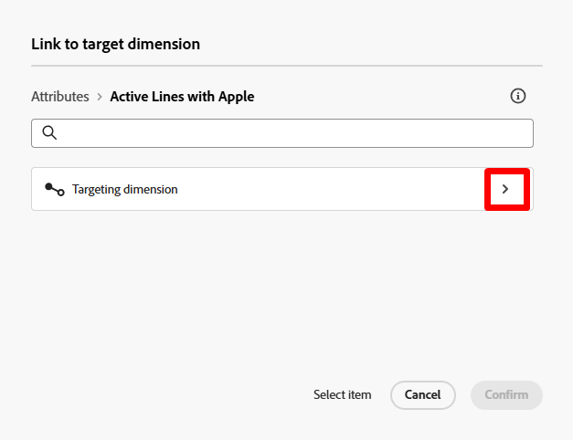
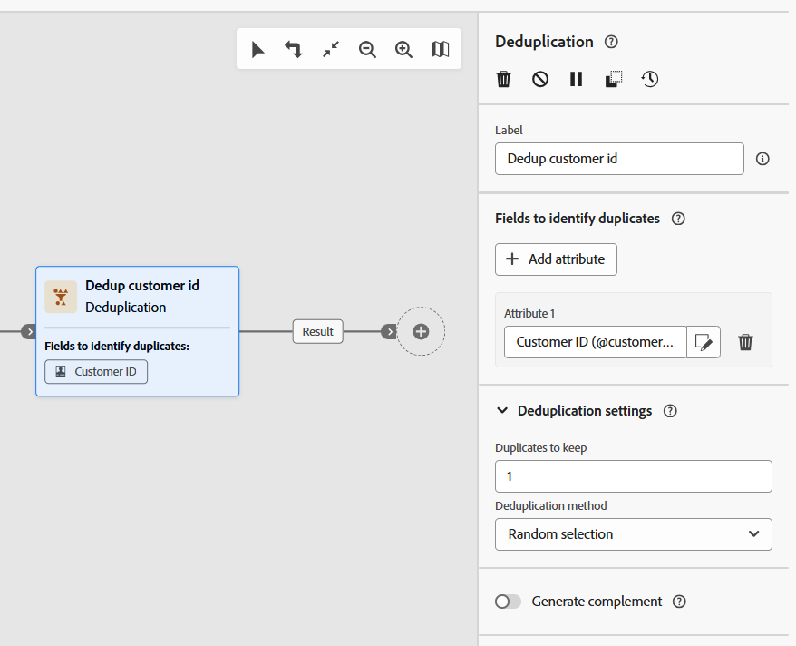
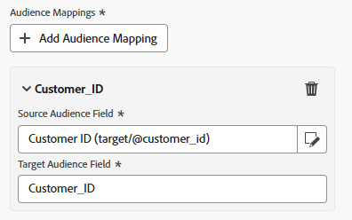
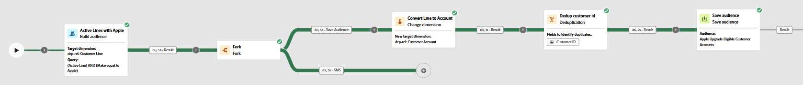

# Save the audience

## Objective

In the next set of steps you will be saving the audience you created back to the Audience Portal so other solutions across Adobe Experience Platform and its applications can leverage it for their own use cases.

## Change the dimension

1. On the workflow canvas, click the **+** **icon** on **Save Audience** branch and from the list of activities, select the **Change Dimension** activity

2. Update the properties of the change dimension as outlined below:
   - **Label:**  `Convert Line to Account`
   - **New target dimension:**  `dep-rel: Customer Account`

>[!NOTE]
>
>**Why are you doing this you ask?**  Remember that to join to the Real-Time Customer Profile (which is where you save audiences to) you have to use the Profile Target Mapping you configured which only joins from the dep-rel: Customer Account schema.

3. When done, this is what your canvas looks like.  Save your work!

## Deduplicate the result

1. Click the **+** **icon** after the Change Dimension activity and from the list of activities select the **Deduplication** activity

2. Update the label of the Deduplication activity to `Dedup customer id`

3. Now click the **+ Add attribute** button and select the field from the schema titled **Customer ID**

4. Under the Deduplication settings, ensure you have the following set:
   - **Duplicates to keep:**  `1`
   - **Deduplication method:**  `Random selection`

>[!NOTE]
>
>The other options for deduplication allow you to specify your own custom logic.  Most of the time if you need to deduplicate you'll be doing it using the primary key of the table.

5. When you are done, your canvas looks like this. Click the **Save** button in the upper right before moving on.

## Add Save Audience activity

1. Click the **+** icon after the Deduplication activity and select the **Save Audience** activity

2. In the right rail set the properties of the activity to the following:
   - **Audience Label**:  `Apple Upgrade Eligible Customer Accounts`
   - **Profile mapping field**:  `dep-rel: Customer Account - customer id`

>[!NOTE]
>
>The "Profile mapping field" is what you set up previously so that the Relational Store can join to the Real-Time Customer Profile.  The profile has been modeled as a Customer Account level so you want to save the audience in the same.  Hence the need for the change dimension and the deduplication.

## Audience field mappings

By default the primary key of the targeting dimension (i.e., Customer ID) is added to the audience as a field. You can see this if you look in the right and expand the field.  Two things to note:

- **Source Audience Field** --> refers to the field coming from the relational schema
- **Target Audience Field** --> the name of the field that will be created as part of the audience save

>[!NOTE]
>
>Note how terribly the Target Audience Field is named `Dep_rel_customer_account_Customer_id`.  You should always change this to something more legible to a marketer, no excuses.

## Fix default Audience Field

1. Rename the default Target Audience Field to **Customer\_ID** like shown below:

>[!TIP]
>
>Now you have a human legible field name 🎉

2. Click the **Start** button to run your workflow. Your workflow now looks like this, and you see the counts as follows:
   - Build audience: `65`
   - Convert Line to Account:  `65`
   - Dedup customer id:  `46`

>[!NOTE]
>
>The save audience activity will only create the audience when the workflow is published, not when it is simply started. When the audience is created, it will include all the attributes you added to it and will join to the Real-Time Customer Profile during the next scheduled daily run of the segmentation service job.

>[!CAUTION]
>
>DO NOT PUBLISH YOUR WORKFLOW!

## Challenge

What happens if you do not deduplicate before saving the audience?  Will the audience store all 65 records or only the 46?

## Answer

The audience will store all 65 records, but a read audience activity will dedup them on import based on the join condition 😁

## Recap

You should now have a good understanding of how the Save Audience works and why deduplication matters.  Remember that you always need to have the Profile Target Mapping defined because the Relational Store data has to know how to join to the Real-Time Customer Profile.  The Profile Target Mapping is the join condition 🙂
