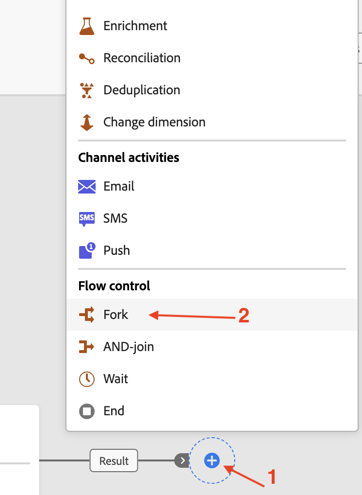

# Add fork activity

## Objective

In the next set of steps you will add the Fork activity to the campaign and create identical branches of the data.

## Fork activity

The canvas with the configured **Build audience** is presented. Click on the **+** at the end of the flow and add a **Fork** activity from the Flow control section

>[!NOTE]
>
>By default a fork activity always creates two branches

## Recap

You have now seen how easy it is to use the Fork activity in the campaign canvas to create identical branches of the same data flowing in. The branches of the Fork activity will be used in the next step.

You can read more [here](https://experienceleague.adobe.com/en/docs/journey-optimizer/using/campaigns/orchestrated-campaigns/design-campaigns/fork) if you are interested.
