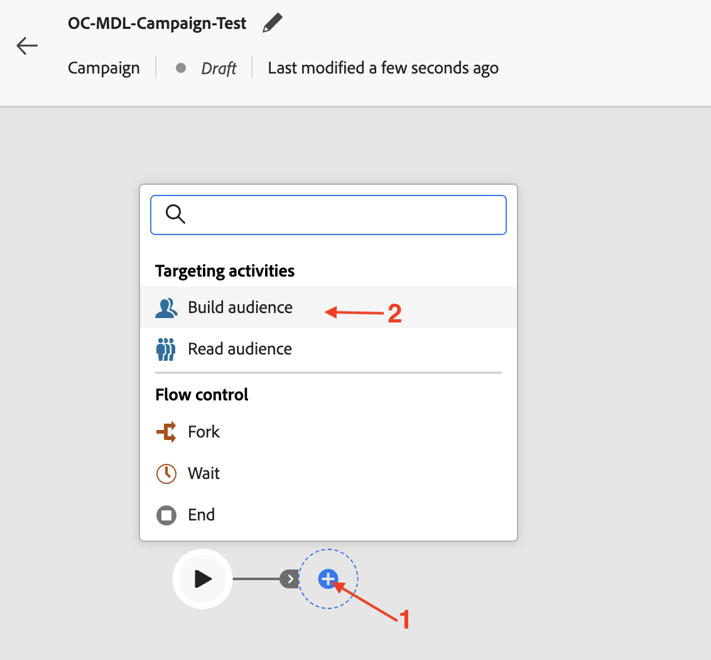
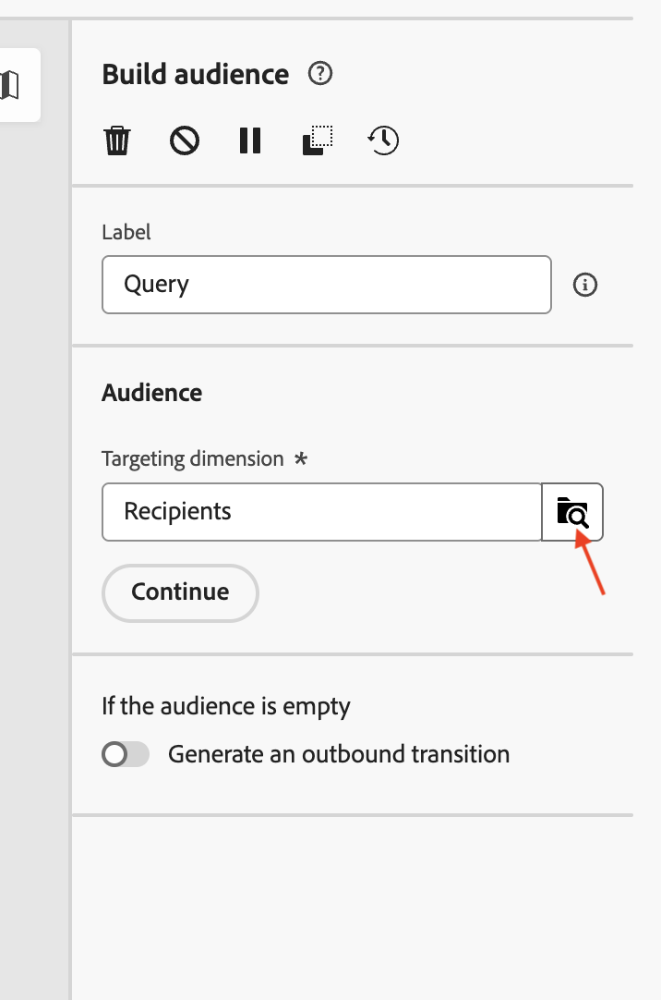

# Build an audience

## Objective

In the next set of steps you will build an audience from the relational schema by selecting the right Targeting dimension and setting the appropriate conditions. You will also use the refresh option to check the expected number of row counts.

## Build audience

1. Once the campaign is rendered, click on the **+** within the canvas to open the options menu and then select **Build audience** from the **Targeting activities**

   

2. The **Build audience** activity opens the details pane on the right, click on the Search icon to select the **Targeting dimension**. 

   

3. Select `dep-rel: Customer Account` from the list and click on **Confirm**

   

4. Once the **Targeting dimension** is configured, click on Create audience to start the process of building the audience from the relational schema

   

5. The Create audience details pane opens, click on **Add condition** 

   

6. Scroll down and expand the `dep-rel: Plan Lookup` by clicking on the **>** next to it

   

7. Select `dep-rel: Plan Name` and click on **Confirm**

   

8. In the Custom condition panel, leave the operator as "equal to" and for Value, select Basic from the drop down.

   

   >[!NOTE]
   >
   >Notice that all the distinct values available for the selected column show up in the drop down, making it easy to create the custom conditions.

9. With the Custom condition configure, click on the Refresh icon to calculate and view the count. There are two locations to help with calculating the results

   

   >[!NOTE]
   >
   >The Refresh operation evaluates the condition against the relational data and displays the expected results. This operation typically just takes a few seconds and is extremely useful for fine-tuning the criteria and ensuring it meets expectations. 

10. The counts (**38**) indicate the number of rows in the relational store that match the specified condition. Click on **Confirm** to exit the **Create audience** pane

>[!NOTE]
>
>There are options under the Rule properties section to get more details. Click on **View results** to see the actual results returned. Use the **Code view** option to see the query being executed. 

## Recap

You have now seen how easy it is to use the Build Audience activity in the campaign by choosing the right Targeting dimension from the relational schema. You then added a condition to  refine the audience building criteria and used the refresh option to check the expected number of rows. 

You can read more [here](https://experienceleague.adobe.com/en/docs/journey-optimizer/using/campaigns/orchestrated-campaigns/design-campaigns/build-audience) if you are interested.
