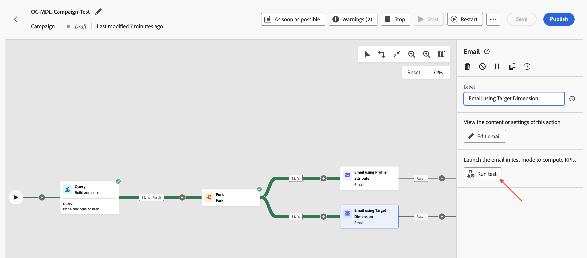
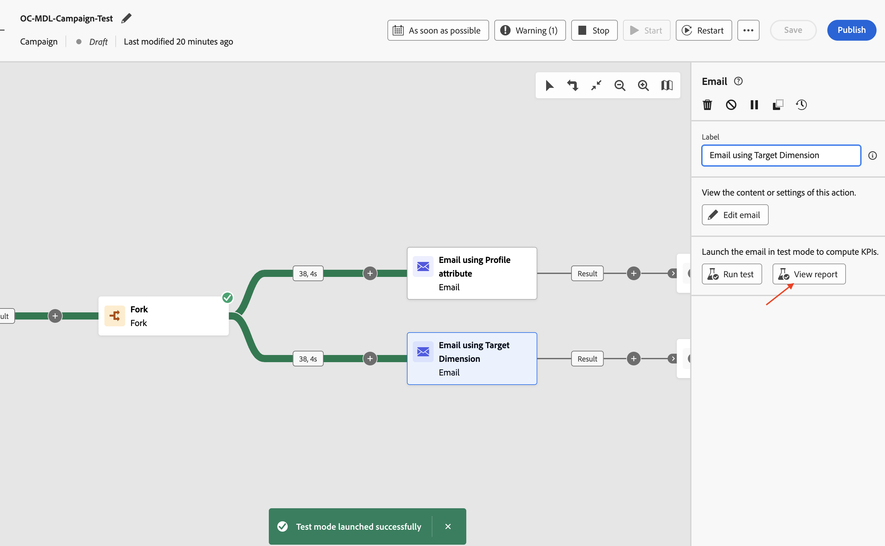

# Test the campaign

## Objective

In the next set of steps you will run the campaign in test mode to confirm the campaign functions as expected before publishing the campaign. In this case, test mode does not actually send emails, but it helps verify the entire flow and identify issues early.

## Start the workflow

1. Once the two Email flows have been configured, the Campaign looks like the following. Click on **Start** button to run the campaign in **Test mode**

>[!NOTE]
>
>As mentioned in the previous lab, Test mode enables you to validate the campaign execution and the outcomes of the various activities. Each activity is executed sequentially until the end of the flow is reached.

2. The test execution of all the campaign activities starts, verify the results

## Email report #1

1. To test the Email delivery, click on the **Email using Profile attribute** activity and in the right hand pane, click on **Run test**

2. Wait for the confirmation message and then click on **View report** to see details of the Email test

3. The Email report page is presented with Campaign statistics and the execution status. The Email test is a verification of the activity to ensure there are no errors and does not send emails. It typically takes about \~**5** minutes to complete.

>[!NOTE]
>
>You may need to refresh the page a few times to see the final test result.

4. Once the Email test is complete, the results are presented. There is some percentage of errors; click on **View more** to know the reason.

5. The reason states `Email address not found in profile`

>[!NOTE]
>
>Since the **Delivery address** configured for the Email activity, **Email using Profile attribute**, was configured to use the  Profile attribute `personalEmail.address`, it created a dependency on the **AEP Profile**. 
>
>Of the **38** qualified customer IDs from the relational schema, the system could find only **7** corresponding AEP Profiles. For the remaining **31** of them, AEP Profiles did not exist which resulted in the `Email address not found in profile` error message. 
>
>It is important to remember that data in the datalake and the relational store are kept **consistent** when using AEP Profile attributes in orchestrated campaigns.

## Email report #2

1. Repeat the same process for the **Email using Target Dimension** activity

2. Wait for the confirmation message and then click on **View report** to see details of the Email test

3. Once the Email test is complete, the results are presented. In this case, there will be no errors

>[!NOTE]
>
>Since the **Delivery address** for the Email activity **Email using Target Dimension**, was configured to use the `dep_rel_customer_account.email`, from the Relational schema, there was no dependency on AEP Profiles or its attributes.
>
>All **38** qualified customer IDs were found to have corresponding emails in the Relational store and could be targeted successfully without any errors.

## Stop the workflow

Click on the **Stop** button to stop the **Test mode** for the campaign

>[!TIP]
>
>Both email channel configurations were tested within the same campaign, and differences were observed between using an AEP Profile attribute and using the Target Dimension in the Email channel configuration.
>
>Congratulations, this concludes the Message Delivery lab.

## Recap

You have now seen how to test the campaign created to understand the flow and behavior. Here the nuances of using the different settings for Email channel configuration was well understood during the test flow execution.

You can read more about the campaign test mode [here](https://experienceleague.adobe.com/en/docs/journey-optimizer/using/campaigns/orchestrated-campaigns/launch/start-monitor-campaigns), if you are interested.
