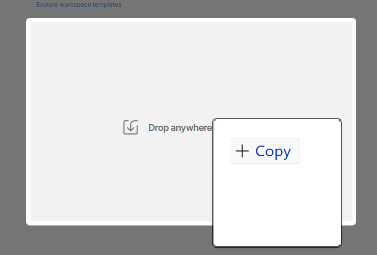
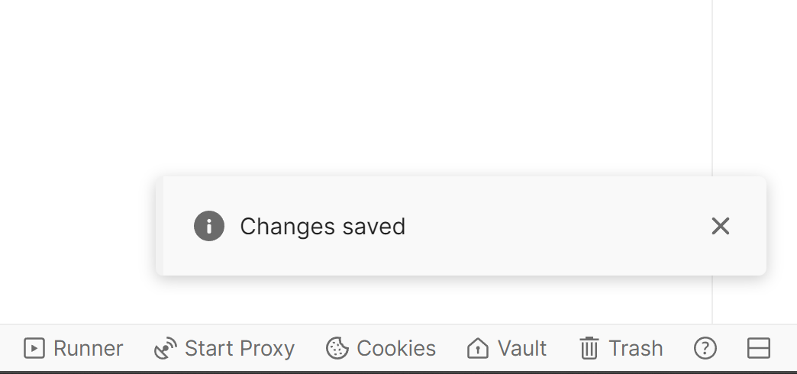

# Import environment file

## Objective

On this page, you will import the Postman Environment File.  This file contains a number of global variables that will be utilized within various API calls you will make during other labs throughout the bootcamp.

## Import environment file

1. Download the **AJO Bootcamp.postman\_environment.json** file:

   Download File — [AJO Bootcamp.postman_environment.json](assets/ajo-bootcamp.postman_environment.json)

2. Launch Postman on your local machine.
3. If necessary, switch to the Workspace you are using for these labs (if you're using a Workspace at all) and click on the **Import** button.

   

4. Paste the local URL of the **AJO Bootcamp.postman\_environment.json** file into the import modal text box or drop it into the import dialog box.  This should trigger an automatic import

   

   

5. Once imported, validate that the environment exists by clicking on the **Environments** tab in the left sidebar. You see that the AJO Bootcamp environment is now available to you. 

## Set environment variables

Postman was designed for testing and interacting with APIs. However, we're using it to simulate AEP Web SDK hits from a browser or for server-side real-time data collection calls. While these are still API calls in the strictest sense of the term, they aren't typical API calls that require things like authorization tokens in the header. The environment variables in these labs are mainly used for variables in URL paths (with one being used in a header). 

1. If necessary, click on the **Environments** tab in the left sidebar of Postman
2. Click on the **AJO Bootcamp** environment file. You see some values that you need to fill in

   

3. Skip the DATASTREAM\_CONFIG value for now. You will create a datastream configuration in a later lab.
4. Update the **EDGE\_REGION** field with the region code that is closest to where you are physically located for this bootcamp, using the table below as a look-up.

   | **Region** | **Region Code** |
   | ---------- | --------------- |
   | Western US | or2             |
   | Eastern US | va6             |
   | Europe     | irl1            |
   | Australia  | aus3            |
   | Japan      | jpn3            |
   | Asia       | spg3            |

   When done, your environment file should look similar to this:

   

5. You now need to save your environment variables; however, there is no save button in the Postman UI. Use the Windows or Mac hot keys for saving (ctrl+s on Windows, for example). You know your changes have been saved when you see a **Changes saved** message in the lower-right-hand side of the Postman UI:

>[!TIP]
>
>Congratulations! You have completed your Postman Environment file
