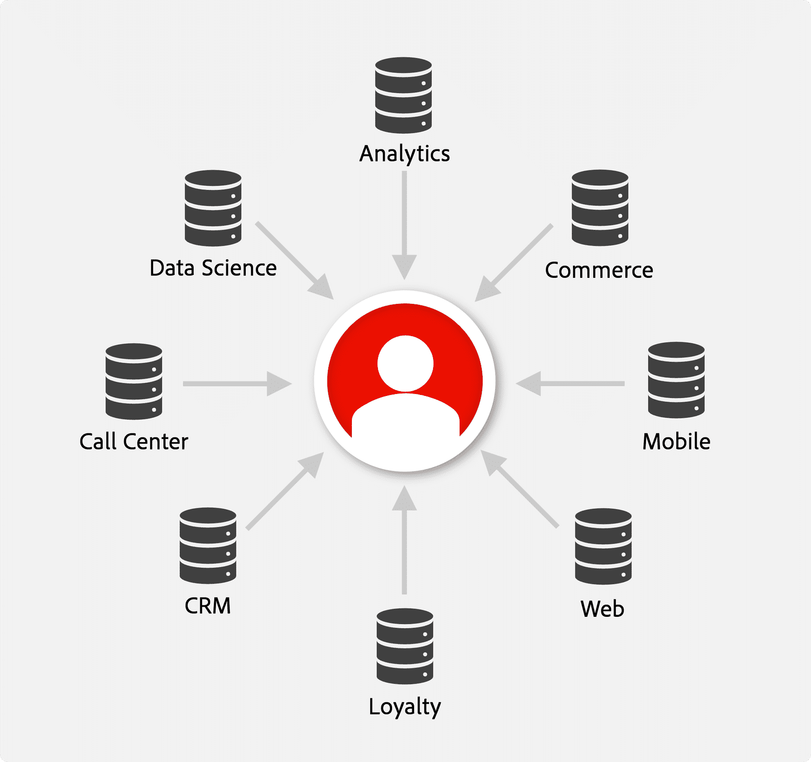

---
title: Identity Service Overview
description: Identity Service Overview
doc-type: article
exl-id: 5109706f-275d-4a42-b63e-08a9e048be76
---

Simply put, Identity Service is **purpose-built **to help marketing teams manage and unify customer identities from various cross-channel data sources. 

*Three key things to know about Identity Service are:*

1. It's built on graph database technology
2. It's used for creating person-based identity graphs
3. It's a key service of Adobe Experience Platform and Applications

